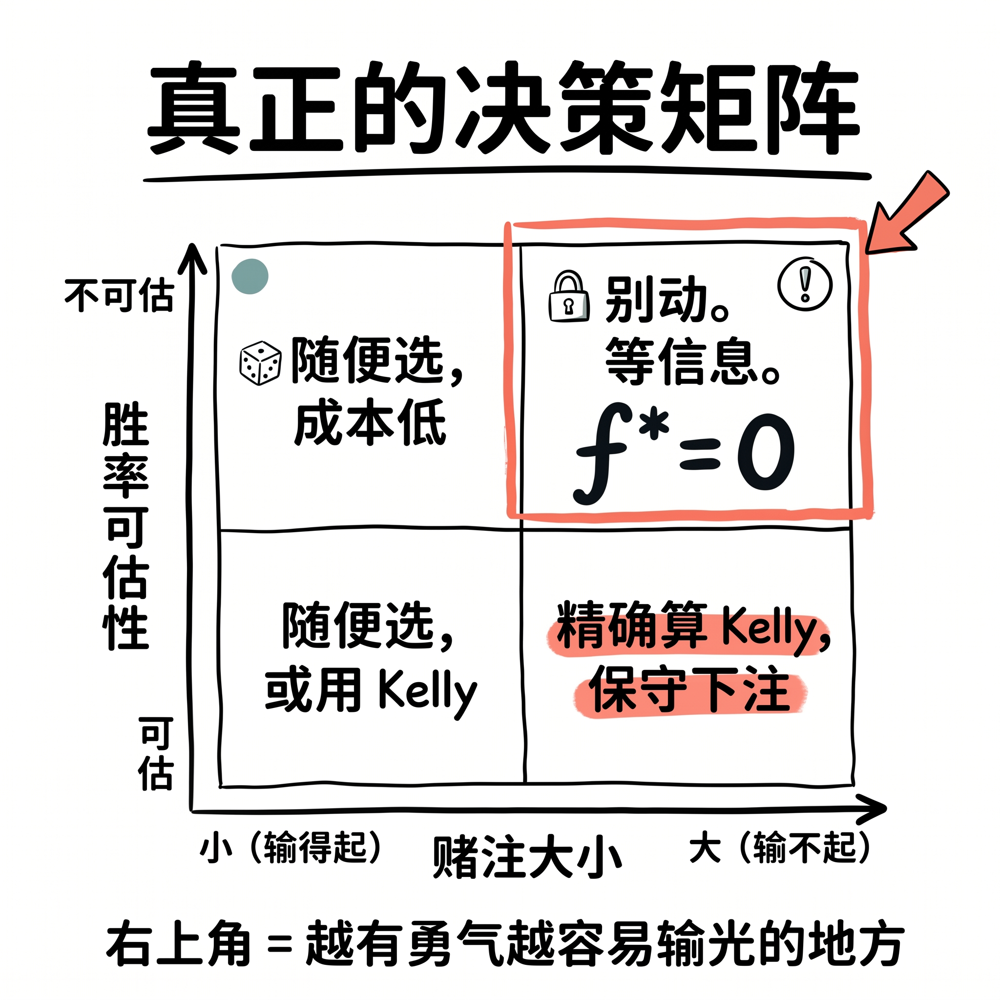
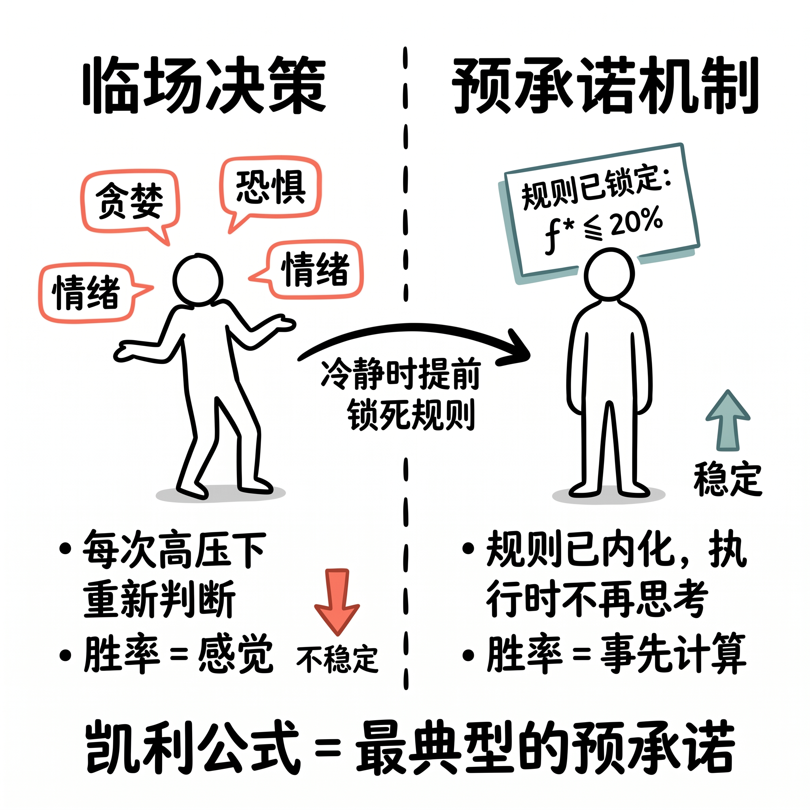

<!-- 预估字数：580 字（正文）| 配图：1 张决策矩阵结构图 | 发布时机：工作日 7:30-8:30 或 21:00-22:30 -->

---
##
人们以为做决定需要的是勇气。有一类决策，越敢下手的人，输得越惨。

那一刻真正出的错，不是选错了——是不应该在那个时刻做任何选择。

**凯利公式早就给了答案。**

$$f^* = p - \frac{q}{b}$$

$p$ 胜率，$q$ 败率，$b$ 赔率。这个公式算的是每次交易的最优仓位。

把它拿来当决策框架，会发现一件事：**当胜率没法估算时，$f^*$ 根本算不出来——公式给的答案，不是「谨慎下注」，是「别下注」。**

---

**决策真正的维度**

安妮杜克把决策分成大事、小事、难事。这个分法有个裂缝：三个词不是同一维度，混在一起没法用。

有用的是两件事：赌注有多大（输了能不能恢复）× 胜率能不能估（有没有信息优势）。

|  | 赌注小 | 赌注大 |
|---|---|---|
| **胜率可估** | 随便选，或用 Kelly | 精确算，保守下注 |
| **胜率不可估** | 随便选，成本低 | **别动。等信息。** |

---
右上角，是「越有勇气越容易输光」的人聚集的地方。没做过尽调的 all in 创业，情绪最激烈时候的满仓，暴跌中的加仓冲动——全在这格。

---

**预承诺比临场判断管用**

哈耶克说，决策需要的信息是分散的、局部的、隐性的，没法被整合进一套实时运行的规则。我们能做的，是**预承诺**——在冷静时提前锁死规则，贪婪和恐惧来临时不需要重新决定。

你在开盘前就承诺好仓位上限，就不用在涨停板面前再做那个最难的问题了。

---

---

**拒绝下注也是一种决定**

弃权不是情绪失控，是数学推导出来的最优解。

身处第四象限时，停止做决定，开始等待——等胜率和赌注大小更加明晰，再做定夺。

你最近有没有在情绪最高的时候做过一个后来后悔的重大决定？

---

**学术文献**
- Kelly, J. L. (1956). A New Interpretation of Information Rate. *Bell System Technical Journal*, 35(4): 917-926.
- Hayek, F. A. (1945). The Use of Knowledge in Society. *American Economic Review*, 35(4): 519-530.
- Duke, A. (2018). *Thinking in Bets*. Portfolio/Penguin.（中译：《对赌》）

**配图建议**
决策矩阵 2×2 表格（深色底，突出右下角「别动/等信息」格）。Python 生成或 Canva 排版均可。封面用大字「$f^* = 0$」+ 副标题「当你算不出胜率时」。
