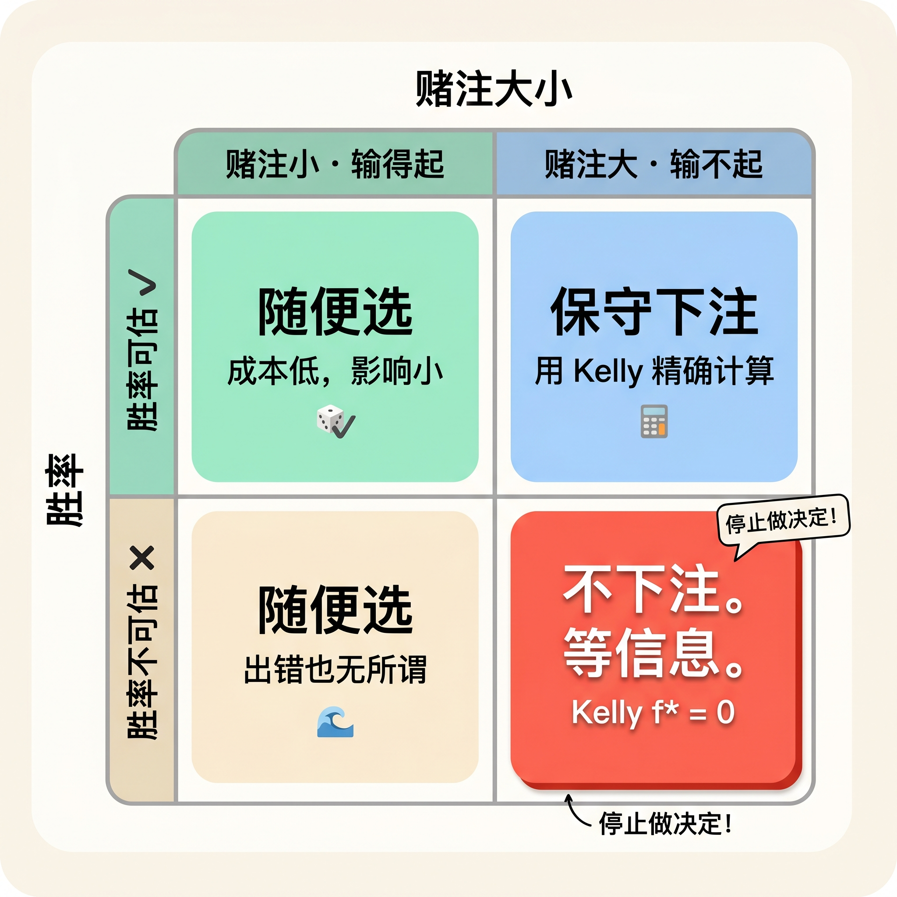

## 

上周有个朋友找我，说有个项目，让我两天内表态，「机会稍纵即逝，犹豫的人最后都踏空了」。

我说：等一下。

他急了：「你搞量化的，不是最讲数据吗？你在等什么？」

我说：我在等一个能算出来的胜率。

--

做量化这几年，有一条铁律叫凯利公式，它告诉你每次该押多少仓。公式有个前提：**胜率必须能被估算**。

胜率算不出来，公式给的答案就是零。数学在告诉你，现在不是时候。

---

---

那个项目我没进。朋友说我太保守。也许吧。后来也没跟进它涨没涨，不知道结果。

但我不是判断它不好——是我根本判断不了。

**胜率算不出来的时候，停止做决定，开始等待。** 等信息更多，等你真的能算出个数字，再动。

拒绝决定，也是最优解。

--

>  大号之前发过一张决策矩阵，什么情况该下注、什么情况该等，感兴趣也可以去看看。

---

## 制作备注

### 标题候选（3 个）

1. 停止做决定！开始等待！
2. 量化告诉我：有一种勇气叫"我不做决定"
3. 被催着 all in？凯利公式说，不该下注就是零

### 配图建议

- **封面**：深色底 + 白色大字「停止做决定！开始等待！」，副标题「凯利公式的隐藏结论」，风格：低饱和、笔记感
- **内页图 1**：2×2 决策矩阵表格（胜率可估 / 不可估 × 赌注小 / 大），第四象限高亮红色，标注「不下注。等信息。」
- **内页图 2**（可选）：金句卡片「拒绝决定，是数学证明的最优解」

### 预估字数

正文约 **220 字**，符合小号 200–400 字规范。

### 发布时机建议

- 工作日 **11:30–12:00**（收盘饭点，契合账号人设「11 点半收盘吃饭」）
- 备选：周一早盘前 **9:00–9:30**（开盘焦虑情绪高，反常识选题共鸣强）
