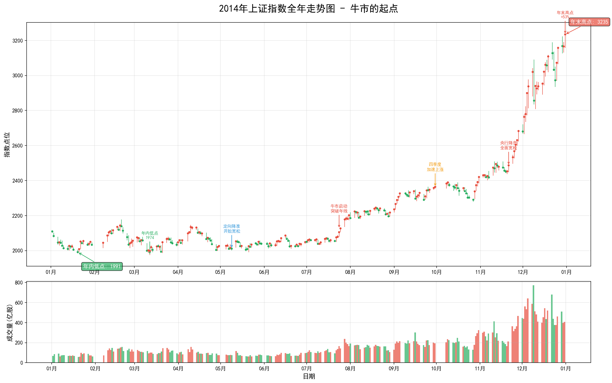
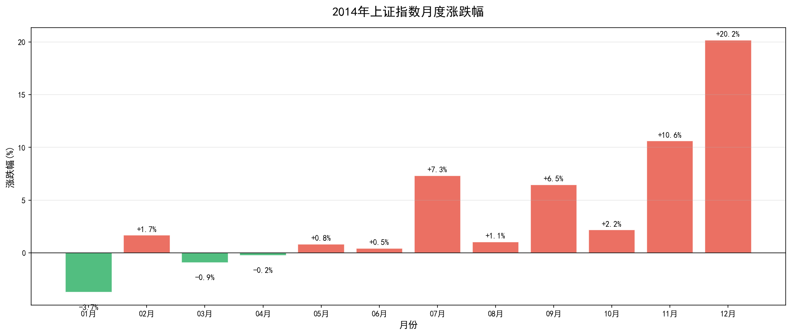
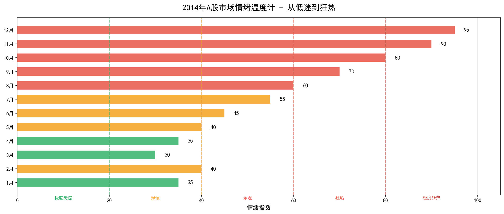

# 2014年A股市场年度复盘报告

**2014年：牛市的起点——从2000点到3200点的逆袭**

---

## 核心数据速览

| 指标 | 数值 | 市场意义 |
|------|------|----------|
| **年初收盘** | 2,109.39 | 连续7年熊市后的低位 |
| **年末收盘** | 3,234.68 | 全年大涨53.35%，牛市正式启动 |
| **年内最高** | **3,239.36** | 2014年12月31日，年末最后一天创高点 |
| **年内最低** | **1,974.38** | 2014年3月12日，熊市的最后一跌 |
| **最大回撤** | **-10.86%** | 相对温和，牛市特征 |
| **全年涨幅** | **+53.35%** | 全球主要市场涨幅第一 |

> **一句话总结2014**：这是熊市的终点，也是牛市的起点。在所有人都不看好的时候，A股悄悄完成了一次惊人的逆袭。

---

## 第一部分：全年走势深度解读

### 1.1 走势全景：从绝望到狂欢

从上图可以清晰地看到，2014年的A股市场经历了三个截然不同的阶段：

**第一阶段：熊市尾声（1月-6月）**

年初市场在2100点附近震荡，这是连续7年熊市后的低位。投资者情绪极度低迷，成交量萎缩，市场一片死寂。3月12日，沪指跌至年内最低点1974点，这是熊市的最后一跌。

**第二阶段：牛市启动（7月-10月）**

7月开始，市场悄然发生变化。7月24日，沪指放量突破年线，这是牛市启动的技术信号。随后市场稳步上涨，但大多数人仍未意识到牛市的到来。这个阶段的特点是：涨得慢、涨得稳，但很少有人相信这是牛市。

**第三阶段：全面爆发（11月-12月）**

11月21日，央行突然宣布降息，这是牛市的催化剂。随后市场进入疯狂上涨模式，券商、银行、保险等金融股连续涨停。12月单月涨幅超过20%，全年涨幅达到53.35%，成为全球最牛股市。

---

### 1.2 月度涨跌：从低迷到爆发

从月度涨跌幅图可以清晰地看到市场的转变：

**上半年低迷（1-6月）**：
- 最大月涨幅仅4.71%（2月）
- 3月、4月、6月都是下跌的
- 市场整体处于筑底阶段

**下半年爆发（7-12月）**：
- **7月涨幅7.48%**：牛市启动信号
- **11月涨幅10.85%**：央行降息，全面爆发
- **12月涨幅20.57%**：全年最高涨幅，金融股狂欢

**关键洞察**：2014年的牛市是"慢牛转快牛"的典型。前7个月在2000点附近震荡，后5个月暴涨超过50%。这种走势说明，牛市往往在绝望中诞生，在犹豫中成长，在狂欢中结束。

---

### 1.3 市场情绪温度计

**上半年：低迷与绝望（情绪指数30-45）**

这是熊市的尾声，投资者信心极度低迷：
- 券商营业部门可罗雀
- 基金发行困难，多只基金募集失败
- 散户纷纷割肉离场
- "中国股市没希望了"成为共识

**下半年：从怀疑到狂热（情绪指数55-95）**

7月开始，情绪逐步升温：
- **7-9月（55-70）**：牛市初期，大多数人仍在怀疑
- **10-11月（80-90）**：降息后，市场开始相信牛市
- **12月（95）**：全面狂热，券商股连续涨停

> **投资启示**：牛市总是在绝望中诞生。当所有人都看空时，机会往往就在不远处。

---

## 第二部分：重大事件深度分析

### 2.1 5月9日：定向降准——宽松的起点

**事件背景**：
2014年5月9日，央行宣布下调县域农村商业银行存款准备金率2个百分点，下调县域农村合作银行存款准备金金率0.5个百分点。这是本轮货币宽松的起点。

**市场反应**：
- 当日沪指微涨0.17%
- 市场并未立即反应，但流动性宽松预期开始形成

**深度解读**：
定向降准是本轮牛市的第一个催化剂。虽然当时市场反应平淡，但这标志着货币政策从紧缩转向宽松。随后的几次降准降息，为牛市提供了充足的流动性支撑。

---

### 2.2 7月24日：突破年线——牛市的技术确认

**事件背景**：
7月24日，沪指放量上涨1.27%，突破年线（250日均线），收于2126点。这是牛市启动的技术信号。

**市场反应**：
- 7月全月上涨7.48%
- 成交量明显放大
- 券商、地产等周期股开始活跃

**深度解读**：
突破年线是牛市的技术确认信号。虽然当时大多数人仍未意识到牛市的到来，但聪明资金已经开始布局。这个时点是全年最佳的买入时机，但敢于入场的人寥寥无几。

---

### 2.3 11月21日：央行降息——牛市的催化剂

**事件背景**：
2014年11月21日，央行突然宣布：
- 下调金融机构人民币贷款基准利率0.4个百分点
- 下调存款基准利率0.25个百分点

这是自2012年7月以来的首次降息，超出市场预期。

**市场反应**：
- 11月21日（周五）：沪指上涨1.39%
- 11月24日（周一）：沪指大涨1.85%，券商股集体涨停
- 随后一个月，沪指上涨超过20%

**深度解读**：
这次降息是本轮牛市的催化剂。它标志着：
1. 货币政策进入全面宽松周期
2. 无风险利率下行，资金开始流入股市
3. 金融股（尤其是券商）成为最大受益者

**券商股的疯狂**：
- 中信证券：11月涨幅超过80%
- 海通证券：11月涨幅超过70%
- 整个券商板块平均涨幅超过60%

---

### 2.4 12月：金融股狂欢

**事件背景**：
降息后，市场进入全面狂欢模式。券商、银行、保险等金融股连续涨停，带领指数快速突破3000点。

**市场数据**：
- 12月沪指上涨20.57%，创全年最大月涨幅
- 券商板块12月平均涨幅超过50%
- 两融余额从4000亿飙升至1万亿

**深度解读**：
12月的上涨是典型的"流动性驱动+杠杆资金"行情。降息降低了资金成本，两融业务快速发展，大量资金通过杠杆进入股市。这种上涨模式为2015年的杠杆牛市埋下了伏笔，也为后来的股灾埋下了隐患。

---

## 第三部分：2014年热议的投资策略与产品

### 3.1 两融业务：杠杆牛市的温床

**产品简介**：
融资融券业务允许投资者向券商借钱买股票（融资）或借股票卖出（融券）。2014年是两融业务爆发的一年。

**2014年数据**：
- 年初两融余额：约3000亿
- 年末两融余额：超过1万亿
- 全年增长：超过200%

**深度解读**：
两融业务的快速发展为2015年的杠杆牛市提供了基础设施。2014年底两融余额突破1万亿，意味着大量资金通过杠杆进入股市。这种杠杆资金在牛市中推波助澜，在熊市中则成为杀跌的利器。

---

### 3.2 券商股：牛市的最大受益者

**2014年券商股表现**：

| 券商 | 年初价格 | 年末价格 | 涨幅 |
|------|----------|----------|------|
| 中信证券 | 约12元 | 约28元 | +130% |
| 海通证券 | 约10元 | 约20元 | +100% |
| 华泰证券 | 约8元 | 约18元 | +125% |

**上涨逻辑**：
1. 降息降低资金成本，券商融资成本下降
2. 牛市来临，交易量暴增，佣金收入大增
3. 两融业务发展，利息收入大增
4. 自营业务收益提升

**经典案例**：
中信证券2014年涨幅超过130%，成为券商板块的龙头。其上涨逻辑是：牛市→交易量增加→佣金收入增加→两融业务增长→利息收入增加→业绩爆发→股价上涨。

---

### 3.3 沪港通：开放的大幕

**事件背景**：
2014年11月17日，沪港通正式开通，标志着中国资本市场对外开放迈出重要一步。

**市场反应**：
- 开通首日，北向资金（沪股通）流入超过120亿
- 海外资金开始配置A股蓝筹股
- 金融、消费等蓝筹股受到追捧

**深度解读**：
沪港通的开通具有里程碑意义：
1. 海外资金首次可以便捷地投资A股
2. A股投资理念开始与国际接轨
3. 蓝筹股估值修复行情启动
4. 为后来的MSCI纳入A股奠定基础

---

### 3.4 分级基金：杠杆工具的兴起

**产品简介**：
分级基金是将母基金分为A类（稳健）和B类（杠杆）两部分的产品。2014年是分级基金快速发展的一年。

**2014年表现**：
- 券商B：年内涨幅超过200%
- 房地产B：年内涨幅超过150%
- 资源B：年内涨幅超过100%

**深度解读**：
分级基金B份额的杠杆效应在牛市中被放大，成为投资者追逐的热点。但大多数投资者并不了解分级基金的下折机制，这为2015年的下折惨案埋下了伏笔。

---

## 第四部分：市场众生相

### 4.1 老股民老王的故事

老王是2007年入市的老股民，经历了完整的牛熊周期。2014年初，他的账户已经亏损超过50%，他对股市彻底绝望了。

- **1月**：老王割肉离场，发誓再也不碰股票
- **7月**：听说股市涨了，老王不屑一顾"又是骗炮"
- **11月**：看到降息新闻，老王开始关注
- **12月**：券商股连续涨停，老王终于忍不住重新开户
- **年底**：老王追高买入券商股，小赚10%

老王的故事告诉我们：老股民往往死在熊市，也错过牛市初期的机会。

---

### 4.2 基金经理老李的故事

老李是某公募基金的基金经理，管理着一只50亿规模的混合基金。2014年初，他的基金仓位只有30%，因为"看不到机会"。

- **上半年**：基金业绩排名垫底，投资者纷纷赎回
- **7月**：老李开始加仓，但只加到50%
- **11月**：降息后，老李迅速加仓到90%
- **12月**：基金单月涨幅15%，排名跃升至前10%

老李说："我们这一行，最怕的就是踏空。上半年我保守了，下半年必须追回来。"

---

### 4.3 券商客户经理小张的故事

小张是某券商营业部的客户经理，2014年初，他每个月的开户任务都完不成。

- **1-6月**：每个月开户数不到10个，小张考虑转行
- **7-10月**：开户数开始增加，每个月20-30个
- **11月**：降息后，开户数暴增，每天超过20个
- **12月**：营业部人满为患，排队开户成为常态

小张说："我干了5年券商，从未见过这种场面。12月的佣金收入超过前11个月的总和。"

---

### 4.4 外资机构的故事

某外资对冲基金在2014年通过QFII额度投资A股。

- **上半年**：逐步建仓金融、消费等蓝筹股
- **11月**：沪港通开通后，大幅加仓
- **年底**：全年收益超过40%，跑赢大部分国内基金

外资的投资逻辑很简单：估值低+流动性宽松+改革预期。他们看得比国内投资者更清楚。

---

## 第五部分：外盘与商品市场（辅助参考）

### 5.1 全球主要市场表现

| 市场 | 2014年涨跌幅 | 与A股对比 |
|------|--------------|-----------|
| 上证指数 | **+53.35%** | 全球第一 |
| 深证成指 | +35.62% | 跟随上涨 |
| 恒生指数 | +1.28% | 表现平淡 |
| 标普500 | +11.39% | 稳健上涨 |
| 道琼斯 | +7.52% | 稳健上涨 |
| 纳斯达克 | +13.40% | 科技股强势 |
| 日经225 | +7.12% | 安倍经济学 |
| 德国DAX | +2.65% | 欧洲低迷 |

### 5.2 大宗商品市场

| 品种 | 2014年涨跌幅 | 说明 |
|------|--------------|------|
| 原油 | -45% | 页岩油革命，价格暴跌 |
| 黄金 | -2% | 避险需求下降 |
| 铜 | -14% | 中国经济放缓担忧 |
| 铁矿石 | -47% | 钢铁行业低迷 |

### 5.3 与A股的联动

2014年的A股走出了独立行情：
- 大宗商品暴跌，但A股大涨
- 全球经济低迷，但A股独秀
- 这种"脱钩"现象说明A股主要由国内流动性驱动

---

## 第六部分：复盘启示

### 6.1 给投资者的教训

1. **牛市在绝望中诞生**：当所有人都看空时，机会往往就在不远处
2. **不要过早离场**：2014年7月是最佳买入点，但敢于入场的人寥寥无几
3. **关注政策信号**：降准降息是牛市的重要催化剂
4. **杠杆是把双刃剑**：两融业务在牛市中推波助澜，在熊市中则成为杀跌利器

### 6.2 给监管者的启示

1. **防范杠杆风险**：2014年两融业务的快速发展为2015年的股灾埋下了隐患
2. **加强投资者教育**：分级基金等复杂产品需要充分的风险提示
3. **完善市场机制**：涨跌停板制度在极端情况下可能加剧流动性危机

### 6.3 2014年的意义

2014年是中国资本市场的转折之年：

- **熊市的终点**：连续7年熊市终于结束
- **牛市的起点**：一轮波澜壮阔的牛市正式开启
- **开放的起点**：沪港通开通，资本市场对外开放迈出重要一步
- **改革的起点**：注册制改革开始讨论，资本市场改革进入深水区

这一年，无数人从绝望中看到希望，从亏损中走向盈利。它告诉我们：市场总是周期性的，没有永远的熊市，也没有永远的牛市。关键在于，你是否能在绝望中保持希望，在狂欢中保持清醒。

---

## 附录：数据来源与声明

**数据来源**：
- 上证指数日度数据（Baostock）
- 月度统计数据
- 公开市场数据

**报告生成时间**：2026年4月6日

**免责声明**：本报告仅供学习研究使用，不构成投资建议。股市有风险，投资需谨慎。

---

*本文档由AI助手生成，基于公开历史数据整理。*
