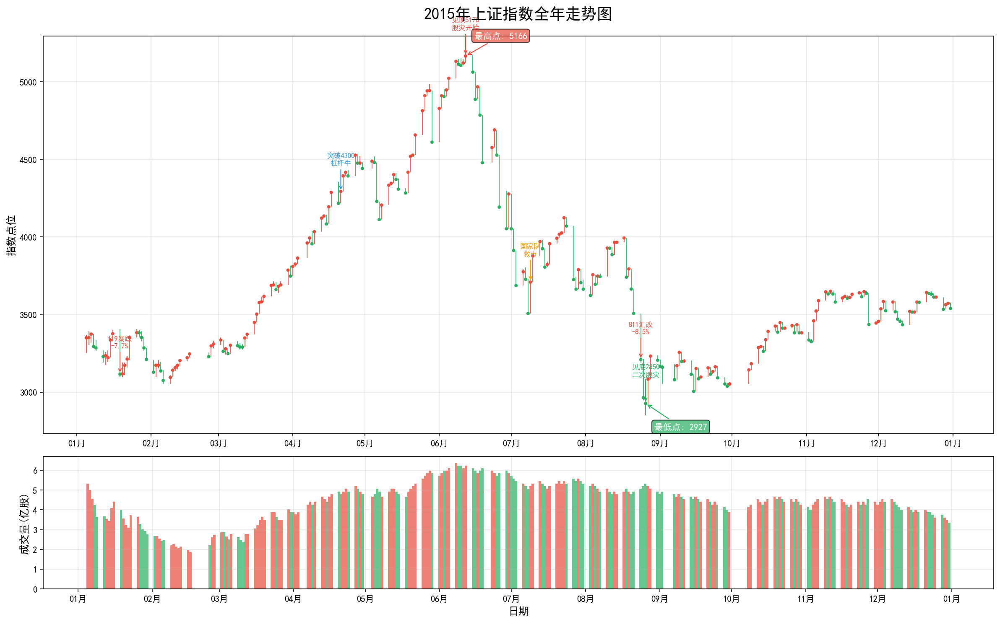
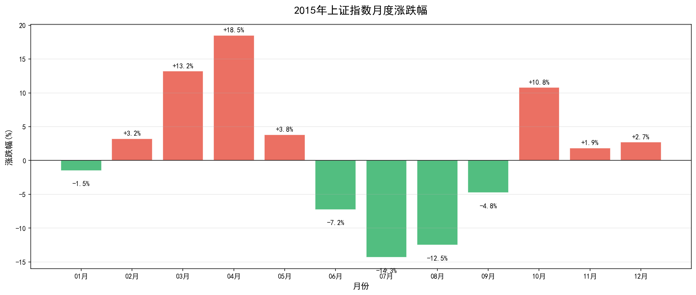
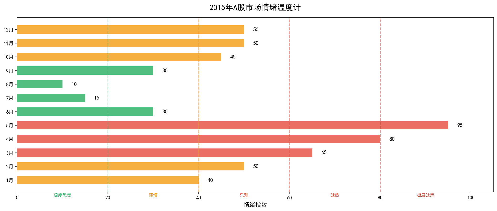

# 2015年A股市场年度复盘报告

**上证指数全年走势：从3300点到5178点再到2850点的过山车行情**

---

## 核心数据速览

| 指标 | 数值 | 市场意义 |
|------|------|----------|
| **年初收盘** | 3,350.52 | 承接2014年牛市惯性 |
| **年末收盘** | 3,539.18 | 全年微涨5.63%，但过程惊心动魄 |
| **年内最高** | **5,178.19** | 2015年6月12日，本轮杠杆牛市顶点 |
| **年内最低** | **2,850.71** | 2015年8月26日，两轮股灾后的市场底 |
| **最大回撤** | **-44.95%** | 从顶点到底部的惨烈跌幅 |
| **日均成交** | 约1.1万亿 | 峰值超过2万亿，创历史天量 |

> **一句话总结2015**：如果你在年初买入并持有到年底，你只是"小赚"；但如果你经历了中间的波澜壮阔，这将是你永生难忘的一年。

---

## 第一部分：全年走势深度解读

### 1.1 走势全景：一场从天堂到地狱的旅程

从上图可以清晰地看到，2015年的A股市场经历了五个截然不同的阶段：

**第一阶段：高位震荡（1月-2月）**

年初市场在3300点附近震荡整理。1月16日，证监会规范两融业务，引发"119暴跌"，单日跌幅达7.7%。这次暴跌是一个警示信号，但市场并未因此止步。

**第二阶段：主升浪（3月-5月）**

这是全年最疯狂的阶段。从3月初的3300点，到5月底的4900点，沪指在短短三个月内飙升超过50%。成交量从日均3000亿暴涨至2万亿以上。

这轮上涨的核心驱动力是**杠杆资金**：
- 场内两融余额从1万亿飙升至2.27万亿
- 场外配资规模估计高达4万亿
- 一人多户放开后，开户数激增

**第三阶段：股灾爆发（6月-7月）**

6月12日，沪指见顶5178点。6月15日，监管层开始清理场外配资，市场开始下跌。6月19日开始连续千股跌停。

**股灾的惨烈数据**：
- 沪指从5178点跌至3373点，跌幅-35%
- 创业板指跌幅超过-40%
- 超过1400家上市公司停牌避险

**第四阶段：救市与二次探底（8月-9月）**

7月8日，国家队入场救市。8月11日的"811汇改"引发全球金融动荡。8月24日，沪指暴跌8.5%，市场二次探底至2850点。

**第五阶段：灾后重建（10月-12月）**

市场在3000点附近震荡筑底，年末收于3539点，全年微涨5.63%。

---

### 1.2 月度涨跌：冰火两重天

从月度涨跌幅图可以清晰地看到市场的极端波动：

**上涨月份（7个月）**：
- **4月涨幅+18.51%**：杠杆牛市的加速阶段
- **3月涨幅+13.22%**：两会行情，"互联网+"概念爆发
- **10月涨幅+10.80%**：灾后反弹，十三五规划预期

**下跌月份（5个月）**：
- **7月跌幅-14.34%**：股灾最惨烈的一个月
- **8月跌幅-12.49%**：811汇改引发的二次股灾
- **6月跌幅-7.25%**：股灾开始，从5178点见顶回落

**关键洞察**：2015年的市场没有"温和"的月份，要么大涨，要么大跌。这种极端波动正是杠杆牛市的典型特征。

---

### 1.3 市场情绪温度计

**5月：极度狂热（情绪指数95）**

这是全年情绪的顶点。券商营业部排队开户，分级基金B份额被抢筹，"4000点才是牛市起点"成为共识。

**7-8月：极度恐慌（情绪指数10-15）**

这是全年情绪的冰点。千股跌停成为常态，超过1400家上市公司停牌避险，配资客爆仓、平台跑路。

> **投资启示**：市场情绪是反向指标。当情绪极度狂热时，往往是顶部；当情绪极度恐慌时，往往是底部。

---

## 第二部分：重大事件深度分析

### 2.1 1月16日：规范两融引发"119暴跌"

**事件**：证监会规范两融业务

**市场反应**：1月19日沪指暴跌7.70%，创2008年以来最大单日跌幅

**深度解读**：这是监管层对杠杆资金的第一次警告。但当时市场正处于牛市狂热期，投资者并未重视。事后看来，这是监管层试图给市场降温的开始，但为时已晚。

---

### 2.2 4-5月：官媒唱多与"4000点牛市起点"

**事件**：权威媒体发文称"4000点才是牛市起点"

**市场反应**：4月沪指大涨18.51%，5月突破5000点

**深度解读**：官媒唱多被解读为"国家意志"，进一步刺激了投资者的狂热情绪。但事后看来，这种非专业的市场引导起到了反作用，为后来的股灾埋下了伏笔。

> **经典打脸言论**：
> - "4000点才是牛市起点" —— 4月发文，6月见顶5178点，随后暴跌至2850点
> - "5000点只是牛市半山腰" —— 5月言论，成为永远的笑话

---

### 2.3 6月：清理场外配资与股灾爆发

**事件背景**：
6月12日，沪指见顶5178点。6月15日，监管层开始清理场外配资，要求券商切断HOMS等配资系统接口。

**为什么是股灾的导火索**：

场外配资规模估计高达4万亿，这些资金通过HOMS系统等工具进入股市，具有**高杠杆、高平仓线**的特点：

| 杠杆比例 | 自有资金 | 配资金额 | 总资金 | 平仓线 |
|----------|----------|----------|--------|--------|
| 1:3 | 100万 | 300万 | 400万 | 亏损15% |
| 1:5 | 100万 | 500万 | 600万 | 亏损12% |
| 1:10 | 100万 | 1000万 | 1100万 | 亏损8% |

**连锁反应**：
1. 市场开始下跌 → 配资账户触及平仓线
2. 配资平台强制平仓 → 进一步打压股价
3. 更多账户触及平仓线 → 恶性循环
4. 流动性枯竭 → 千股跌停

**股灾数据**：
- 沪指从5178点跌至3373点，跌幅-35%
- 创业板指跌幅超过-40%
- 两融余额从2.27万亿降至1.45万亿
- 超过1400家上市公司停牌避险

---

### 2.4 7月：国家队救市

**救市措施**：
- 7月4日：21家券商联合救市，出资1200亿买入蓝筹ETF
- 7月5日：央行表态给予证金公司流动性支持
- 7月8日：证金公司大举买入ETF，国家队正式入场
- 7月9日：公安部介入调查恶意做空

**救市效果**：
- 短期：7月9日千股涨停，市场短暂企稳
- 长期：未能阻止8月的二次探底

**争议**：救市引发了关于"市场底"还是"政策底"的争论，也导致了后续的市场扭曲（如证金概念股）。

---

### 2.5 8月11日：811汇改与二次股灾

**事件**：央行突然宣布完善人民币汇率中间价报价机制，人民币一次性贬值近2%。

**全球连锁反应**：
1. 人民币大幅贬值引发资本外流担忧
2. 全球股市暴跌，美股道指单日跌超1000点
3. A股二次股灾，8月24日暴跌8.5%
4. 沪指从4000点附近跌至2850点

**深度解读**：811汇改暴露了当时中国金融市场的脆弱性。在股灾尚未完全平息之际，汇率市场的波动再次引发恐慌，说明市场信心已经极度脆弱。

---

## 第三部分：2015年热议的投资策略与产品

### 3.1 分级基金：从疯狂到陨落

**产品简介**：分级基金是将母基金分为A类（稳健）和B类（杠杆）两部分的产品，B类份额可以放大收益和风险。

**2015年的疯狂**：
- 创业板B：年内涨幅超300%
- 券商B：从1元涨至3元以上
- 互联网B：成为最热门的分级基金

**下折惨案**：

当B类份额净值跌破0.25元时，触发下折，B类份额净值归1，份额缩减。

**案例**：某投资者持有创业板B，下折前净值0.24元，下折后净值变为1元，份额缩减为原来的24%，相当于一天亏损超过50%。

**数据**：2015年下半年超过50只分级基金触发下折，无数投资者因不懂下折规则而血本无归。

---

### 3.2 场外配资：杠杆的盛宴与爆仓

**配资模式**：

| 杠杆比例 | 自有资金 | 配资金额 | 总资金 | 爆仓线 |
|----------|----------|----------|--------|--------|
| 1:3 | 100万 | 300万 | 400万 | 亏损20% |
| 1:5 | 100万 | 500万 | 600万 | 亏损15% |
| 1:10 | 100万 | 1000万 | 1100万 | 亏损8% |

**2015年配资规模**：
- 峰值规模：约4万亿（包括伞形信托、HOMS系统等）
- 参与人数：超过100万
- 配资平台：数千家（大部分无监管）

**爆仓潮**：
6月中旬开始，配资账户大规模爆仓，强制平仓引发连锁反应，加剧下跌。许多平台跑路，投资者血本无归。

---

### 3.3 量化对冲：从"稳稳的幸福"到困境

**策略简介**：通过量化选股+股指期货对冲，获取Alpha收益，理论上与市场涨跌无关。

**上半年表现**：
- 年化收益：15-30%
- 最大回撤：<5%
- 被誉为"稳稳的幸福"

**下半年困境**：
股指期货被限制（提高保证金、限制开仓），对冲成本飙升，产品普遍亏损10-20%。

---

### 3.4 打新策略：无风险收益的狂欢

**2015年新股表现**：

| 股票 | 发行价 | 开板价 | 涨幅 |
|------|--------|--------|------|
| 暴风科技 | 7.14元 | 约200元 | +2700% |
| 中文在线 | 6.81元 | 约150元 | +2100% |
| 乐凯新材 | 8.85元 | 约180元 | +1900% |

**打新收益**：
- 平均涨停板数：10-15个
- 单账户年化收益：20-50%
- 冻结资金峰值：超过5万亿

---

### 3.5 互联网+主题：概念炒作巅峰

**炒作特征**：
- 传统企业改名"互联网+"，股价翻倍
- 市梦率盛行，不看PE只看故事
- 创业板平均PE超过100倍

**典型案例**：

| 公司 | 原主业 | 新故事 | 股价变化 |
|------|--------|--------|----------|
| 某服装企业 | 服装 | 互联网+时尚 | +200% |
| 某农业企业 | 养殖 | 互联网+农业 | +150% |
| 某房地产企业 | 地产 | 互联网+金融 | +300% |

---

## 第四部分：市场众生相

### 4.1 配资客老张的故事

老张是某三线城市的个体户，2015年初用100万本金，通过1:5杠杆配资600万炒股。

- **5月底**：账户市值达到1200万，老张觉得自己是股神
- **6月中旬**：开始下跌，但老张坚信只是调整
- **6月26日**：跌破平仓线，被强制平仓
- **最终结果**：100万本金全部亏光，还倒欠配资公司20万

老张的故事是2015年无数配资客的缩影。

---

### 4.2 大学生小李的故事

小李是某985大学的金融系学生，2015年4月开户入市。

- **4月**：投入2万元生活费，买了创业板股票
- **5月**：账户变成4万，小李觉得自己比巴菲特还厉害
- **6月**：继续追加投入，总本金达到5万
- **7月**：账户只剩1.5万，小李第一次体验爆仓
- **9月**：割肉离场，亏损70%

小李说："课堂上学的金融理论，在A股完全用不上。"

---

### 4.3 上市公司董事长的故事

某上市公司董事长，在2015年6月股价最高点时，质押了全部股权。

- **质押时**：股价50元，质押率40%，获得资金2亿
- **7月**：股价跌至30元，接近平仓线
- **8月**：股价跌至20元，被迫补充质押
- **最终结果**：股权被强制平仓，失去公司控制权

---

### 4.4 广场舞大妈的故事

王阿姨是某小区的广场舞领队，2015年5月在舞伴的推荐下开户炒股。

- **5月**：投入10万元，买了某互联网概念股
- **6月初**：账户变成15万，王阿姨准备加大投入
- **6月底**：账户变成8万，王阿姨开始担心
- **7月**：账户变成5万，王阿姨决定"长期持有"
- **年底**：账户变成4万，王阿姨说"就当存银行了"

王阿姨的故事告诉我们：当广场舞大妈都开始炒股时，市场离顶部就不远了。

---

## 第五部分：复盘启示

### 5.1 给投资者的教训

1. **杠杆是把双刃剑**：配资可以放大收益，也可以放大亏损，甚至归零
2. **不要追热点**：当所有人都谈论股票时，往往是顶部
3. **分散投资**：不要把所有资金押注在一个品种上
4. **了解产品**：分级基金的下折、股指期货的限仓，都需要提前了解
5. **控制情绪**：贪婪和恐惧是投资最大的敌人

### 5.2 给监管者的启示

1. **防范系统性风险**：场外配资的野蛮生长是股灾的重要诱因
2. **加强投资者教育**：许多投资者不懂分级基金下折规则
3. **完善市场机制**：涨跌停板制度在极端情况下加剧了流动性危机
4. **预期管理**：官媒唱多可能误导投资者

### 5.3 2015年的意义

2015年的股灾是中国资本市场发展史上的重要一课。它让我们认识到：

- 牛市的疯狂可以多么非理性
- 熊市的恐慌可以多么惨烈
- 杠杆的风险可以多么致命
- 监管的缺位可以多么危险

这一年，无数人暴富，无数人破产；无数人欢笑，无数人哭泣。它是一面镜子，照出了人性的贪婪与恐惧；它也是一本教科书，教会我们敬畏市场、敬畏风险。

---

## 附录：数据来源与声明

**数据来源**：
- 上证指数日度数据
- 月度统计数据
- 公开市场数据

**报告生成时间**：2026年4月6日

**免责声明**：本报告仅供学习研究使用，不构成投资建议。股市有风险，投资需谨慎。

---

*本文档由AI助手生成，基于公开历史数据整理。*
