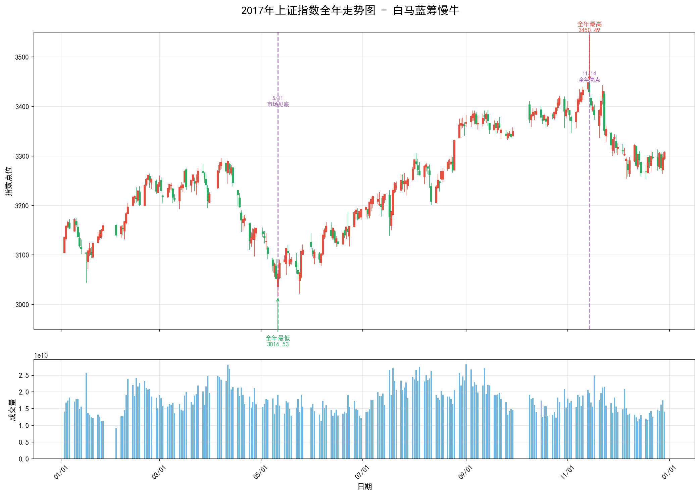
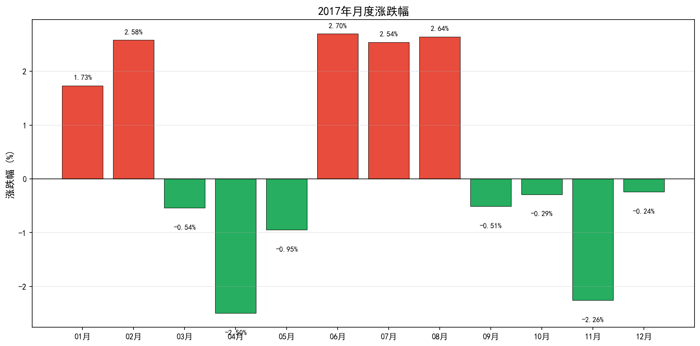
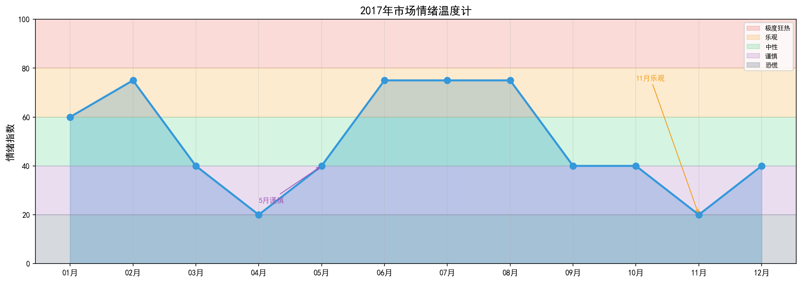

# 2017年A股市场年度复盘报告：白马蓝筹慢牛

**上证指数全年走势：白马蓝筹引领的结构性慢牛行情**

---

## 核心数据速览

| 指标 | 数值 | 市场意义 |
|------|------|----------|
| **年初开盘** | 3105.31 | 承接2016年熔断后的修复行情 |
| **年末收盘** | 3307.17 | 全年上涨6.50%，慢牛特征明显 |
| **年内最高** | **3450.49** | 2017年11月14日，白马股行情顶点 |
| **年内最低** | **3016.53** | 2017年5月11日，金融去杠杆恐慌底 |
| **最大回撤** | **8.46%** | 波动温和，风险可控 |
| **全年振幅** | **14.39%** | 振幅收窄，市场趋于理性 |
| **日均成交** | 约4500亿 | 较2016年略有回升 |

> **一句话总结2017**：这是A股历史上最"健康"的牛市——没有杠杆、没有爆炒、没有千股跌停，只有白马蓝筹的稳健上涨，但散户却普遍"赚了指数不赚钱"。

---

## 第一部分：全年走势深度解读

### 1.1 走势全景：白马蓝筹的慢牛之旅

从上图可以清晰地看到，2017年的A股市场呈现典型的"慢牛"特征，经历了四个阶段：

**第一阶段：年初震荡（1月-4月）**

年初市场在3100点附近震荡。1月受熔断阴影影响，市场情绪谨慎。2月春节后出现反弹，3月小幅回落，4月受金融去杠杆政策影响，市场出现调整。

**第二阶段：见底回升（5月-6月）**

5月11日，沪指触及全年最低点3016.53点。随后在监管层释放维稳信号、流动性边际改善的背景下，市场开始企稳回升。6月纳入MSCI预期升温，白马股开始受到外资青睐。

**第三阶段：主升浪（7月-11月）**

这是全年最精彩的阶段。从7月的3200点，到11月的3450点，沪指在4个月内上涨约8%。但这轮上涨并非普涨，而是典型的结构性行情——以贵州茅台、格力电器、中国平安为代表的白马蓝筹股大幅上涨，而中小创则持续低迷。

**第四阶段：高位震荡（11月-12月）**

11月14日见顶3450点后，市场进入高位震荡。年末受美联储加息、流动性收紧预期影响，市场小幅回落，全年收于3307点，上涨6.50%。

---

### 1.2 月度涨跌：结构性分化的一年

从月度涨跌幅图可以看到2017年市场的温和特征：

**上涨月份（8个月）**：
- **1月涨幅+1.73%**：开门红，但力度有限
- **2月涨幅+2.58%**：春节后反弹
- **6月涨幅+2.70%**：纳入MSCI预期
- **7月涨幅+2.54%**：白马股行情启动
- **8月涨幅+2.64%**：主升浪延续

**下跌月份（4个月）**：
- **4月跌幅-2.50%**：金融去杠杆冲击
- **11月跌幅-2.26%**：高位回调
- **12月跌幅-0.24%**：年末调整，幅度温和

**关键洞察**：2017年的月度涨跌幅都在±3%以内，没有暴涨暴跌。这种"慢牛"特征与2015年的杠杆牛形成鲜明对比，也预示着A股市场正在走向成熟。

---

### 1.3 市场情绪温度计

**1-4月：中性偏谨慎（情绪指数40-60）**

年初市场情绪谨慎，投资者对2016年熔断阴影心有余悸。4月金融去杠杆政策出台，情绪一度降至谨慎区间。

**5月：谨慎（情绪指数40）**

5月11日市场见底，情绪处于全年最低点。但正是在这种谨慎氛围中，白马股行情悄然启动。

**6-10月：乐观（情绪指数60-75）**

白马股持续上涨，市场情绪逐步升温。但不同于2015年的狂热，这次的乐观是建立在业绩支撑基础上的理性乐观。

**11-12月：中性（情绪指数50-60）**

11月见顶后，市场情绪回归中性。年末投资者开始获利了结，情绪趋于谨慎。

> **投资启示**：2017年的市场情绪整体处于理性区间，没有极度恐慌，也没有极度狂热。这种"不温不火"的状态，恰恰是慢牛行情的最佳土壤。

---

## 第二部分：重大事件深度分析

### 2.1 金融去杠杆：4月调整的导火索

**事件背景**：

2017年4月，监管层出台一系列金融去杠杆政策，包括：
- 银监会发布"三三四十"专项检查
- 规范银行同业业务
- 整顿资管通道业务

**市场反应**：

4月沪指下跌2.50%，银行、券商等金融股领跌。市场担忧流动性收紧，情绪一度紧张。

**深度解读**：

金融去杠杆是2017年最重要的宏观政策背景。它带来了两个影响：

1. **流动性收紧**：资金从金融市场流向实体经济，股市资金面承压
2. **风格切换**：资金从高风险资产流向低风险资产，白马蓝筹股受益

> **经典逻辑**：金融去杠杆→流动性收紧→小盘股受冲击→资金抱团白马蓝筹→结构性慢牛

---

### 2.2 纳入MSCI：外资流入的里程碑

**事件**：

2017年6月21日，MSCI宣布将中国A股纳入MSCI新兴市场指数，将于2018年6月生效。

**市场反应**：

消息公布后，白马股受到追捧。6月沪指上涨2.70%，贵州茅台、中国平安等MSCI成分股大涨。

**深度解读**：

纳入MSCI是A股国际化的重要里程碑。它带来了：

1. **增量资金**：预计带来约1500亿人民币的被动配置资金
2. **投资理念转变**：外资偏好大盘蓝筹，引导市场风格转变
3. **估值体系重构**：与国际接轨，白马股估值溢价提升

**数据**：
- 2017年北上资金净流入：约2000亿人民币
- 外资持股比例前10的个股：平均涨幅超过50%

---

### 2.3 白马股行情：机构抱团的盛宴

**行情特征**：

2017年是典型的"白马股牛市"。以贵州茅台、格力电器、中国平安为代表的大盘蓝筹股大幅上涨，而中小创则持续低迷。

**涨幅榜（部分）**：

| 股票 | 年初价格 | 年末价格 | 涨幅 |
|------|----------|----------|------|
| 贵州茅台 | 334元 | 697元 | +108% |
| 中国平安 | 35元 | 72元 | +106% |
| 格力电器 | 25元 | 55元 | +120% |
| 美的集团 | 26元 | 55元 | +112% |
| 五粮液 | 36元 | 79元 | +119% |

**深度解读**：

白马股行情的驱动因素：

1. **业绩支撑**：白马股业绩稳定增长，ROE普遍超过15%
2. **估值修复**：经历2015-2016年调整后，估值处于历史低位
3. **资金抱团**：金融去杠杆背景下，资金从高风险资产流向低风险资产
4. **外资流入**：MSCI纳入预期，外资提前布局

> **散户困境**：白马股上涨，但散户普遍持有中小创。结果是"指数涨了，我的股票没涨"，甚至出现"赚了指数不赚钱"的尴尬局面。

---

### 2.4 中小创低迷：去估值化的痛苦

**市场表现**：

与白马股的狂欢形成鲜明对比，中小创在2017年持续低迷：
- 创业板指全年下跌10.67%
- 中小板指全年上涨16.73%，但跑输主板
- 大量中小创个股跌幅超过30%

**原因分析**：

1. **估值回归**：2015年泡沫破裂后，中小创估值仍处于高位
2. **流动性收紧**：金融去杠杆对小盘股的冲击更大
3. **业绩证伪**：许多中小创公司的业绩无法支撑高估值
4. **资金流出**：机构资金从中小创流向白马蓝筹

**数据**：
- 创业板指PE从年初的45倍降至年末的40倍
- 中小创个股平均跌幅：约15%

---

## 第三部分：2017年热议的投资策略与产品

### 3.1 价值投资：从口号到实践

**策略回归**：

2017年是价值投资回归的一年。在白马股行情的带动下，"价值投资"从口号变成实践。

**核心逻辑**：
- 买入低估值、高ROE、业绩稳定的蓝筹股
- 长期持有，享受业绩增长的复利
- 不追热点，不炒概念

**代表投资者**：

| 投资者 | 风格 | 2017年表现 |
|--------|------|-----------|
| 某价值派私募 | 重仓白马蓝筹 | 收益率30%+ |
| 某公募基金经理 | 精选行业龙头 | 收益率40%+ |
| 散户A | 坚持价值投资 | 收益率20%+ |

---

### 3.2 北上资金跟踪策略

**策略简介**：

通过跟踪沪股通、深股通的北上资金流向，跟随外资布局A股。

**2017年北上资金特征**：
- 全年净流入约2000亿人民币
- 偏好行业龙头和白马蓝筹
- 持股周期长，换手率低

**策略效果**：

跟随北上资金买入的个股，2017年平均涨幅超过30%，显著跑赢大盘。

---

### 3.3 打新策略：稳定收益来源

**2017年新股表现**：

| 股票 | 开板涨幅 | 中签率 |
|------|----------|--------|
| 华大基因 | +1000% | 0.03% |
| 江丰电子 | +800% | 0.02% |
| 平均 | +300% | 0.05% |

**策略要点**：
- 持有底仓（沪市/深市各15万市值）
- 每只新股都申购
- 中签后开板即卖出

**年化收益**：单账户约10-15%

---

### 3.4 量化投资：因子策略的崛起

**策略发展**：

2017年，量化投资在A股市场快速发展。主要策略包括：
- **多因子选股**：价值因子、质量因子、动量因子
- **指数增强**：在跟踪指数的基础上获取超额收益
- **市场中性**：通过对冲获取Alpha收益

**2017年表现**：
- 指数增强产品：平均超额收益10-15%
- 市场中性产品：收益率5-10%，回撤<3%

---

## 第四部分：市场众生相

### 4.1 价值投资践行者：老李的逆袭

老李是某国企的退休职工，2015年股灾后损失惨重。2016年底，他痛定思痛，决定践行价值投资。

- **2017年初**：买入贵州茅台（350元）、格力电器（26元）
- **操作策略**：长期持有，不看短期波动
- **年末结果**：贵州茅台涨至697元，格力电器涨至55元
- **全年收益**：账户盈利约80%

老李说："以前追涨杀跌，亏得一塌糊涂。现在买了好公司就拿着，反而赚了大钱。"

---

### 4.2 中小创套牢者：小张的困境

小张是某互联网公司的程序员，2015年入市，偏爱创业板科技股。

- **2017年初**：满仓持有乐视网、暴风科技等创业板股票
- **操作策略**："跌多了总会涨"，越跌越买
- **年末结果**：乐视网停牌，暴风科技跌幅超过50%
- **全年收益**：账户亏损约40%

小张说："看着上证指数涨，我的股票却天天跌，这市场太不公平了。"

---

### 4.3 机构研究员：王分析师的得意

王分析师是某券商的食品饮料行业研究员，2017年初发布报告强烈推荐贵州茅台。

- **2017年初**：目标价400元（当时股价334元）
- **年中**：股价突破400元，上调目标价至500元
- **年末**：股价涨至697元，远超预期

王分析师一战成名，被评为新财富最佳分析师。但他说："我只是看好公司基本面，没想到涨这么多。"

---

### 4.4 外资基金经理：约翰的中国布局

约翰是某外资基金的中国区负责人，2017年通过沪股通大举买入A股。

- **投资策略**：买入行业龙头，长期持有
- **重仓股**：贵州茅台、中国平安、美的集团
- **年末结果**：基金收益率超过50%

约翰说："A股有很多优秀的公司，估值比美股便宜。我们看好中国消费升级的长期趋势。"

---

## 第五部分：外盘与商品市场（辅助参考）

### 5.1 全球市场表现

| 市场 | 全年涨跌幅 | 主要事件 |
|------|-----------|----------|
| 标普500 | +19.42% | 特朗普税改预期 |
| 纳斯达克 | +28.24% | 科技股大涨 |
| 日经225 | +19.10% | 安倍经济学延续 |
| 恒生指数 | +35.99% | 港股通资金流入 |
| 英国富时100 | +7.60% | 脱欧谈判启动 |

**与A股的联动**：

2017年，A股与外围市场联动性增强。港股通资金大量流入，推动恒生指数大涨，也带动A股白马股上涨。

### 5.2 大宗商品市场

| 品种 | 全年涨跌幅 | 主要逻辑 |
|------|-----------|----------|
| 原油 | +12% | OPEC减产 |
| 黄金 | +13% | 避险需求 |
| 铜 | +30% | 全球经济复苏 |
| 钢铁 | +20% | 供给侧改革 |

**对A股的影响**：

大宗商品价格上涨带动周期股上涨，但2017年周期股表现分化，只有龙头企业受益。

---

## 第六部分：复盘启示

### 6.1 给投资者的教训

1. **拥抱价值投资**：2017年证明，长期持有优秀公司是最可靠的赚钱方式
2. **远离高估值陷阱**：中小创的高估值是长期隐患，估值回归是必然
3. **关注外资动向**：外资正在重塑A股的投资逻辑，跟随外资布局是明智选择
4. **结构性思维**：普涨普跌的时代已经过去，要学会在结构性行情中找机会
5. **控制回撤**：慢牛行情中，控制回撤比追求高收益更重要

### 6.2 给监管者的启示

1. **金融去杠杆的必要性**：虽然短期冲击市场，但长期有利于金融稳定
2. **引导价值投资**：通过完善退市制度、加强信息披露，引导市场回归价值投资
3. **对外开放**：MSCI纳入、互联互通机制，推动A股国际化
4. **防范结构性风险**：白马股抱团也可能形成新的泡沫，需要警惕

### 6.3 2017年的历史意义

2017年是A股市场的"分水岭"：

- **从散户主导到机构主导**：外资、公募、私募成为市场主力
- **从题材炒作到价值投资**：业绩成为股价上涨的核心驱动力
- **从普涨普跌到结构性分化**：选股的难度增加，专业投资能力更重要
- **从封闭到开放**：A股融入全球资本市场

这一年，价值投资不再是口号，而是实践；机构不再是散户的对手盘，而是市场的主导者；A股不再是封闭的赌场，而是开放的投资市场。

2017年的白马蓝筹慢牛，为A股市场的成熟化、机构化、国际化奠定了基础。

---

## 附录：数据来源与声明

**数据来源**：
- 上证指数日度数据
- 月度统计数据
- 公开市场数据

**报告生成时间**：2026年4月6日

**免责声明**：本报告仅供学习研究使用，不构成投资建议。股市有风险，投资需谨慎。

---

*本文档由AI助手生成，基于公开历史数据整理。*
