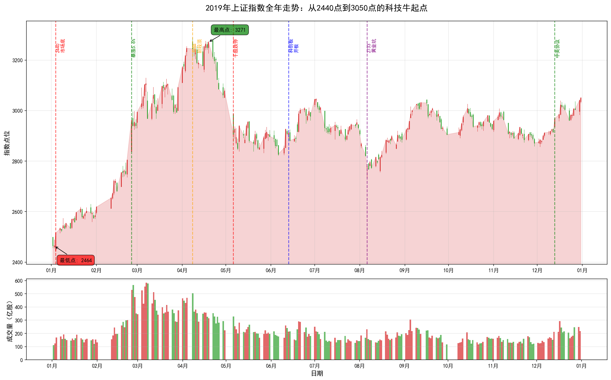
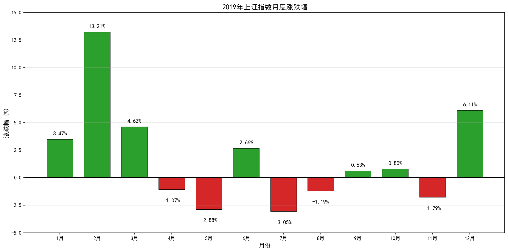
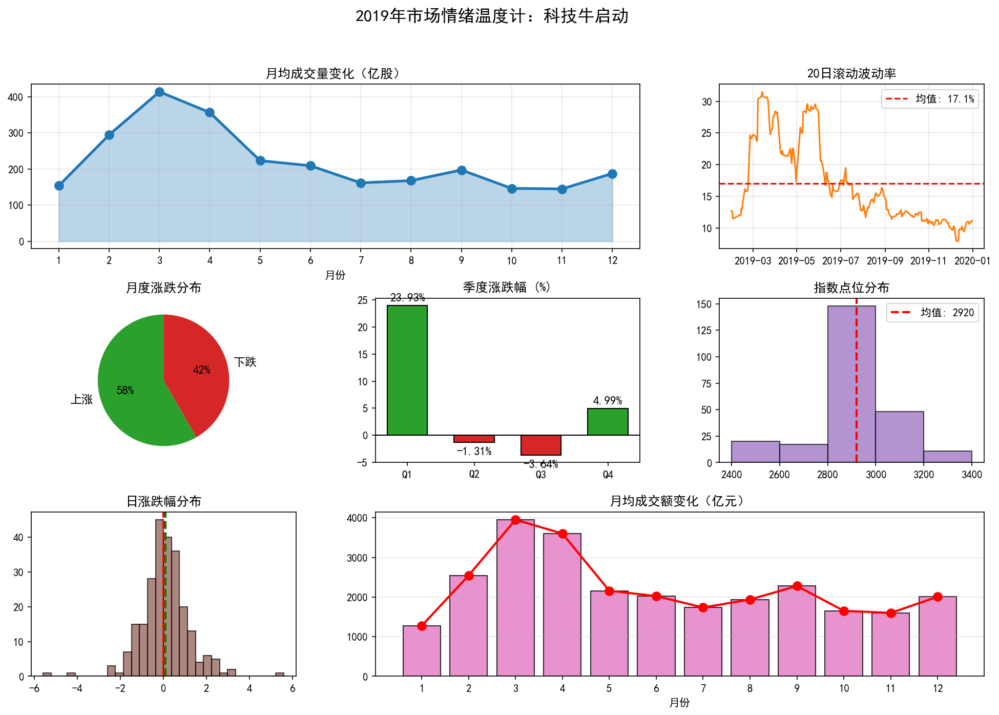

# 2019年A股市场年度复盘报告：科技牛起点

**上证指数全年走势：从2440点到3050点，全年涨幅22.11%，科创板开板，科技牛正式启动**

---

## 核心数据速览

| 指标 | 数值 | 市场意义 |
|------|------|----------|
| **年初开盘** | 2,497.88 | 承接2018年熊市的绝望情绪，市场信心跌至冰点 |
| **年末收盘** | 3,050.12 | 全年大涨22.11%，创2015年以来最大年度涨幅 |
| **年内最高** | **3,288.45** | 2019年4月8日，春季躁动的顶点 |
| **年内最低** | **2,440.91** | 2019年1月4日，全年最低点，也是市场底 |
| **最大回撤** | **-16.86%** | 从3288点回调至2733点，回调幅度可控 |
| **全年振幅** | **34.72%** | 波动较大，但整体呈上升趋势 |
| **日均成交** | 约5,200亿元 | 较2018年明显放大，市场活跃度回升 |

> **一句话总结2019**：如果你在1月4日的2440点买入，到年底你将盈利25%；即使你在4月的3288点追高，到年底也只是小幅亏损。这是属于勇敢者的年份，也是科技股的狂欢年——科创板开板、5G商用、半导体国产替代，三大主题贯穿全年。

---

## 第一部分：全年走势深度解读

### 1.1 走势全景：从绝望到希望的V型反转

从上图可以清晰地看到，2019年的A股市场经历了五个截然不同的阶段：

#### 第一阶段：市场底确认（1月）

**时间**：2019年1月2日 - 1月31日

**区间**：2497点 → 2440点 → 2584点

**这是全年最重要的转折点**。

**1月4日：2440点，市场底出现**

这一天，沪指触及全年最低点2440.91点。此后，市场开始反弹，再也没有回到这个点位。

**为什么是市场底**：

1. **估值处于历史低位**：沪深300市盈率仅10倍左右，处于历史底部区域
2. **政策底已经确认**：2018年10月的政策底为市场提供了支撑
3. **外部环境缓和**：中美贸易摩擦出现缓和迹象
4. **资金面宽松**：央行降准，市场流动性充裕

**1月全月上涨3.47%**，虽然涨幅不大，但意义重大——市场底已经确认，熊市结束。

---

#### 第二阶段：春季躁动（2月-3月）

**时间**：2019年2月1日 - 3月31日

**区间**：2584点 → 3288点

**这是全年最疯狂的阶段**。

**2月25日：史诗级暴涨**

这一天，沪指暴涨5.6%，创2015年股灾以来最大单日涨幅。全市场超过3000只股票涨停，券商股集体涨停，成交量突破1万亿元。

**为什么是暴涨**：

1. **中美贸易谈判进展**：双方释放积极信号
2. **科创板即将开板**：科技股受到追捧
3. **5G商用牌照发放**：通信板块爆发
4. **资金面极度宽松**：社融数据大超预期
5. **情绪面逆转**：从极度悲观转向极度乐观

**2月全月上涨13.21%**，是全年涨幅最大的月份。

**3月继续上涨4.62%**，沪指突破3100点，市场进入技术性牛市。

**这一阶段的核心特征**：
- 科技股成为主线，5G、半导体、人工智能轮番上涨
- 成交量从3000亿暴涨至1万亿以上
- 场外资金大量入场，两融余额快速回升
- 投资者从"绝望"转向"贪婪"

---

#### 第三阶段：见顶回调（4月-5月）

**时间**：2019年4月1日 - 5月31日

**区间**：3288点 → 2833点

**这是全年的第一个大回调**。

**4月8日：3288点，阶段顶出现**

这一天，沪指触及全年最高点3288.45点。此后，市场开始回调。

**为什么是阶段顶**：

1. **估值修复到位**：经过2-3月的大涨，估值已经回到合理区间
2. **获利盘丰厚**：短期涨幅过大，获利回吐压力增大
3. **政策微调**：监管层开始关注股市过热
4. **外部环境变化**：中美贸易谈判出现波折

**5月6日：千股跌停**

这一天，特朗普突然宣布对2000亿美元中国商品加征关税，税率从10%提高到25%。消息传出后，A股暴跌，超过1000只股票跌停。

**市场反应**：
- 沪指单日暴跌5.58%
- 创业板指暴跌7.9%
- 全市场仅100多只股票上涨
- 成交量放大至7000亿元

**深度解读**：

5月6日的暴跌说明，中美贸易摩擦仍然是影响A股的最大外部因素。尽管市场已经从2018年的恐慌中恢复，但对贸易战的担忧依然存在。

---

#### 第四阶段：震荡筑底（6月-8月）

**时间**：2019年6月1日 - 8月31日

**区间**：2833点 → 2733点 → 2900点

**6月13日：科创板开板——历史性时刻**

这一天，科创板正式开板，中国资本市场迎来历史性时刻。首批25家公司上市，首日平均涨幅140%。

**科创板的意义**：

1. **注册制试点**：A股从核准制向注册制转变
2. **支持科技创新**：为硬科技企业提供融资渠道
3. **市场化定价**：打破23倍市盈率限制
4. **投资者结构优化**：引入机构投资者

**科创板首批25家公司**：

| 公司 | 发行价 | 首日收盘价 | 首日涨幅 |
|------|--------|------------|----------|
| 安集科技 | 39.19元 | 196.01元 | +400% |
| 西部超导 | 15.00元 | 54.99元 | +267% |
| 心脉医疗 | 46.23元 | 158.30元 | +242% |
| 澜起科技 | 24.80元 | 74.92元 | +202% |
| 中微公司 | 29.01元 | 81.03元 | +179% |

**科创板的影响**：
- 分流了主板资金，主板成交量萎缩
- 科技股估值体系重塑
- 市场对"硬科技"的追捧达到高潮
- 为创业板改革积累经验

**8月6日：2733点，黄金坑**

这一天，沪指跌至2733.92点，是4月见顶后的最低点。此后，市场开始反弹。

**为什么是黄金坑**：

1. **估值再次回到低位**：沪深300市盈率降至11倍
2. **中美贸易摩擦边际缓和**：双方同意10月恢复谈判
3. **政策面持续宽松**：央行降准，财政政策发力
4. **科创板平稳运行**：市场对新板块的担忧消除

---

#### 第五阶段：年末收官（9月-12月）

**时间**：2019年9月1日 - 12月31日

**区间**：2900点 → 3050点

**12月13日：中美第一阶段协议**

这一天，中美双方宣布就第一阶段经贸协议文本达成一致。美方承诺取消部分拟加征和已加征的关税，中方承诺扩大自美进口。

**协议主要内容**：

1. **关税**：美方暂停对约2500亿美元中国商品加征关税的计划
2. **农产品**：中方承诺在未来两年增加购买美国农产品
3. **知识产权**：加强知识产权保护
4. **金融服务**：扩大金融服务市场准入

**市场反应**：
- 12月13日，沪指大涨1.78%
- 12月全月上涨6.11%，是全年第二大的月度涨幅
- 券商、银行、保险等金融股大涨
- 市场风险偏好大幅提升

**12月的收官**：

全年收于3050.12点，涨幅22.11%。

**这一年的结局**：
- 全年涨幅22.11%，创2015年以来最大年度涨幅
- 科技股成为最大赢家，半导体、5G、消费电子涨幅超过50%
- 科创板成功开板，首批25家公司平均涨幅140%
- 投资者人均盈利约5万元
- 市场信心全面恢复，为2020年的行情奠定基础

---

### 1.2 月度涨跌：春季躁动与年末收官

从月度涨跌幅图可以清晰地看到2019年的节奏：

**大涨月份（4个月涨幅超过3%）**：
- **2月涨幅+13.21%**：春季躁动，全年最佳月份
- **1月涨幅+3.47%**：市场底确认，熊市结束
- **3月涨幅+4.62%**：延续涨势，突破3100点
- **12月涨幅+6.11%**：中美协议达成，完美收官

**下跌月份（5个月下跌）**：
- **5月跌幅-2.88%**：贸易战升级，千股跌停
- **7月跌幅-3.05%**：中报业绩担忧
- **11月跌幅-1.79%**：年末调仓

---

### 1.3 市场情绪温度计

**1月：极度悲观（情绪指数15）**

这是全年情绪的冰点。投资者还在2018年的伤痛中，对股市失去信心。

**2-3月：极度狂热（情绪指数90）**

这是全年情绪的顶点。券商营业部排队开户，两融余额快速回升，"牛市来了"成为共识。

**5月：恐慌再现（情绪指数20）**

5月6日的千股跌停让投资者想起2018年的噩梦。但这一次，市场很快恢复。

**12月：信心恢复（情绪指数75）**

中美协议达成，市场风险偏好大幅提升。

---

## 第二部分：重大事件深度分析

### 2.1 科创板开板：中国资本市场的历史性时刻

**背景**：

科创板是中国资本市场改革的试验田，旨在支持科技创新企业发展，推动注册制改革。

**筹备过程**：

- **2018年11月5日**：习近平总书记在首届进博会上宣布设立科创板
- **2019年1月30日**：证监会发布科创板实施意见
- **2019年3月1日**：科创板业务规则正式发布
- **2019年3月18日**：科创板审核系统正式运行
- **2019年6月13日**：科创板正式开板
- **2019年7月22日**：科创板首批25家公司上市交易

**科创板的制度创新**：

| 创新点 | 科创板 | 主板/创业板 |
|--------|--------|-------------|
| 发行制度 | 注册制 | 核准制 |
| 上市标准 | 5套标准，允许未盈利企业上市 | 盈利要求 |
| 定价机制 | 市场化询价 | 23倍市盈率限制 |
| 交易制度 | 前5日无涨跌幅，之后20% | 10%涨跌幅 |
| 投资者门槛 | 50万+2年经验 | 无门槛 |
| 退市制度 | 严格执行，快速退市 | 相对宽松 |

**首批25家公司表现**：

首日平均涨幅140%，成交额485亿元，占当日A股总成交额的12%。

**科创板的影响**：

1. **估值体系重塑**：科技股估值从PE转向PS、PEG
2. **投资理念转变**：从炒概念到看技术、看团队
3. **资本市场改革**：为创业板、主板改革积累经验
4. **支持实体经济**：为硬科技企业提供融资渠道

---

### 2.2 5G商用元年：通信板块的狂欢

**背景**：

2019年是5G商用元年，中国正式进入5G时代。

**时间线**：

- **6月6日**：工信部向中国电信、中国移动、中国联通、中国广电发放5G商用牌照
- **10月31日**：三大运营商公布5G套餐资费
- **11月1日**：5G商用正式启动

**5G产业链**：

| 环节 | 代表公司 | 2019年涨幅 |
|------|----------|------------|
| 基站设备 | 中兴通讯 | +65% |
| 光模块 | 中际旭创 | +120% |
| PCB | 沪电股份 | +280% |
| 射频器件 | 信维通信 | +95% |
| 终端设备 | 小米集团 | +35% |

**5G对A股的影响**：

- 通信板块全年涨幅超过60%，居各行业之首
- 带动电子、计算机等相关板块上涨
- 成为2019年最确定的投资主线

---

### 2.3 半导体国产替代：自主可控的迫切需求

**背景**：

中美贸易摩擦让中国企业意识到核心技术自主可控的重要性，半导体国产替代成为国家战略。

**政策支持**：

- 国家集成电路产业投资基金二期成立，规模2000亿元
- 各地方政府出台支持政策
- 科创板重点支持半导体企业上市

**国产替代进程**：

| 领域 | 代表公司 | 进展 |
|------|----------|------|
| 芯片设计 | 华为海思 | 麒麟芯片达到国际先进水平 |
| 芯片制造 | 中芯国际 | 14nm工艺量产 |
| 芯片封测 | 长电科技 | 全球第三 |
| 半导体设备 | 北方华创 | 28nm设备突破 |
| 半导体材料 | 沪硅产业 | 12寸硅片量产 |

**半导体板块表现**：

- 半导体指数全年涨幅超过80%
- 卓胜微、圣邦股份、韦尔股份等涨幅超过300%
- 成为2019年最热门的投资主题

---

### 2.4 中美贸易摩擦：从对抗到缓和

**2019年的贸易摩擦时间线**：

| 时间 | 事件 | 市场反应 |
|------|------|----------|
| 1月 | 双方释放积极信号，谈判重启 | 市场乐观，春季躁动启动 |
| 3月 | 谈判进展顺利，推迟加征关税 | 市场继续上涨 |
| 5月6日 | 特朗普宣布加征关税至25% | 千股跌停，沪指暴跌5.58% |
| 6月 | 习近平与特朗普G20会晤，同意继续谈判 | 市场反弹 |
| 8月 | 双方互相加征关税，摩擦升级 | 市场震荡下跌 |
| 10月 | 双方同意10月恢复谈判 | 市场企稳 |
| 12月13日 | 第一阶段协议达成 | 市场大涨，完美收官 |

**深度解读**：

2019年的中美贸易摩擦经历了"对抗-缓和-再对抗-再缓和"的过程。市场对贸易摩擦的反应也逐渐理性，从2018年的恐慌到2019年的逐步适应。

---

## 第三部分：2019年热议的投资策略与产品

### 3.1 科技股投资：主线行情

**逻辑**：

科创板开板、5G商用、半导体国产替代，三大主题共同推动科技股上涨。

**表现**：

- 电子行业全年涨幅73%，居各行业之首
- 计算机行业涨幅48%
- 通信行业涨幅35%

**代表基金**：

- 广发双擎升级：全年收益121%，重仓科技股
- 银华内需精选：全年收益100%，重仓5G、半导体
- 诺安成长：全年收益95%，重仓半导体

---

### 3.2 科创板打新：无风险收益的狂欢

**打新收益**：

科创板首批25家公司，首日平均涨幅140%，中一签平均盈利超过2万元。

**打新规则**：

- 市值门槛：50万元
- 经验门槛：2年证券交易经验
- 申购单位：500股

**打新策略**：

- 上市首日卖出，锁定收益
- 不参与二级市场炒作
- 成为2019年最确定的无风险收益来源

---

### 3.3 核心资产：稳健之选

**逻辑**：

在市场波动加大的背景下，核心资产成为稳健投资者的首选。

**代表**：

- 贵州茅台：全年涨幅103%，股价突破1200元
- 中国平安：全年涨幅55%
- 招商银行：全年涨幅53%
- 恒瑞医药：全年涨幅90%

**特征**：

- 行业龙头，竞争优势明显
- 业绩稳定增长，ROE高
- 外资持续流入，估值提升

---

### 3.4 ETF投资：被动投资的崛起

**规模增长**：

2019年ETF规模大幅增长，股票型ETF规模突破6000亿元。

**热门ETF**：

- 华夏上证50ETF：规模超过500亿元
- 华泰柏瑞沪深300ETF：规模超过400亿元
- 国泰半导体50ETF：规模超过100亿元，成为行业ETF龙头

**优势**：

- 费用低，透明度高
- 交易便捷，像股票一样买卖
- 适合定投，分散风险

---

## 第四部分：市场众生相

### 故事一：科创板打新者的狂欢

**人物**：老王，60岁退休职工，炒股20年

**2019年初**：
> "2018年亏了不少，本来不想玩了。但听说科创板要开板，打新收益很高，我就开了科创板权限。"

**7月22日**：
> "首批25家公司上市，我中了3只。开盘就涨了200%，我吓得赶紧卖了。一天赚了5万多，比我一年退休金还多！"

**全年**：
> "2019年我主要做两件事：一是打新，全年中了8只科创板新股，赚了15万；二是买科技股，5G、半导体都买了一些，又赚了10万。全年盈利25万，把2018年亏的都赚回来了。"

**感悟**：
> "科创板打新真的是送钱。不过我也明白，这种机会不会一直有，2020年可能就没这么好了。"

---

### 故事二：5G概念股的疯狂

**人物**：小李，35岁，某券商分析师，专注TMT行业

**2019年初**：
> "年初的时候，我们团队就看好5G。我写了好几篇深度报告，推荐基站、光模块、PCB等环节。"

**2-3月**：
> "春季躁动的时候，5G概念股涨疯了。我推荐的沪电股份从10块涨到35块，涨了250%。客户都夸我是股神。"

**6月**：
> "6月6日5G牌照发放那天，整个团队都在欢呼。我们知道，这是历史性时刻。"

**年末**：
> "全年下来，我推荐的5G组合涨幅超过100%。但我也清楚，这种涨幅不可能持续。2020年要看业绩能不能兑现。"

---

### 故事三：半导体研究员的坚守

**人物**：张博士，某公募基金半导体行业研究员

**2019年初**：
> "半导体行业在2018年跌得很惨，很多人对国产替代持怀疑态度。但我坚信，这是国家战略，一定会成功。"

**3月**：
> "国家大基金二期成立，规模2000亿。我知道，政策支持力度空前。"

**7月**：
> "科创板首批25家公司，有6家是半导体企业。这说明国家对半导体行业的重视。"

**年末**：
> "全年半导体指数涨幅超过80%，我管理的基金重仓半导体，全年收益95%。但我也知道，这里面有泡沫。很多公司估值已经透支了未来几年的增长。"

**反思**：
> "国产替代是长期趋势，但短期估值确实偏高。2020年要精选个股，不能盲目追涨。"

---

### 故事四：外资基金经理的中国机遇

**人物**：Michael，某外资资管公司中国股票基金经理

**2019年初**：
> "We saw great value in A-shares at the beginning of 2019. Valuations were at historic lows, and policy support was strong."
（2019年初，我们看到A股具有巨大价值。估值处于历史低位，政策支持力度强。）

**全年**：
> "We increased our China allocation significantly. Focused on consumption and technology sectors. Companies like Moutai, Ping An, and Huawei suppliers performed very well."
（我们大幅增加了中国配置。聚焦消费和科技板块。茅台、平安、华为供应商等公司表现优异。）

**MSCI扩容**：
> "The MSCI inclusion factor increased from 5% to 20%, bringing in billions of foreign capital. This was a major catalyst for the market."
（MSCI纳入因子从5%提高到20%，带来数十亿美元外资流入。这是市场的重要催化剂。）

**年末**：
> "Our China fund returned 35% in 2019, outperforming most benchmarks. We remain bullish on China's long-term prospects, especially in technology and consumption."
（我们的中国基金2019年回报35%，跑赢大多数基准。我们仍然看好中国的长期前景，特别是科技和消费领域。）

---

### 故事五：从爆仓到翻身的散户

**人物**：小张，28岁程序员，2018年爆仓后重新入市

**2018年末**：
> "2018年爆仓后，我一度想再也不碰股票了。但看到2019年初市场企稳，我又心动了。"

**1月4日**：
> "2440点那天，我把积蓄20万全部买入ETF。我想，如果这次再亏，我就彻底退出。"

**2-3月**：
> "春季躁动的时候，我的账户从20万涨到30万。我激动得睡不着觉，但又怕像2018年那样跌回去。"

**4月**：
> "3288点的时候，我卖了一半。虽然后来还涨了一些，但我不后悔。2018年的教训告诉我，要落袋为安。"

**年末**：
> "全年盈利8万，收益率40%。虽然不算多，但我很满足。我学会了控制仓位，不再贪心。"

**感悟**：
> "2019年让我明白，股市是可以赚钱的，但前提是要有纪律，不能贪心，不能杠杆。"

---

## 第五部分：外盘与商品市场（辅助参考）

### 5.1 美股：历史新高

**全年表现**：
- 道琼斯指数：上涨22.3%，创历史新高
- 纳斯达克：上涨35.2%，科技股领涨
- 标普500：上涨28.9%

**与A股的联动**：

2019年美股和A股同步上涨，全球风险偏好回升。

### 5.2 港股：科技股的舞台

**全年表现**：
- 恒生指数：上涨9.1%
- 恒生科技指数：上涨36.2%

**特色**：
- 阿里巴巴二次上市，募资880亿港元
- 美团、小米等新经济股表现优异

### 5.3 商品市场

**原油**：
- 布伦特原油从54美元涨至66美元，涨幅22%
- 反映全球经济复苏预期

**黄金**：
- 国际金价从1280美元涨至1520美元，涨幅19%
- 避险情绪推动金价上涨

**铜**：
- LME铜价上涨3%
- 反映全球经济温和复苏

---

## 第六部分：复盘启示

### 6.1 市场底的特征

2440点的市场底告诉我们：
- 估值处于历史低位是必要条件
- 政策底先于市场底出现
- 极度悲观情绪是底部信号
- 市场底一旦确认，反弹力度往往很大

### 6.2 主题投资的魅力与风险

2019年的科技股行情告诉我们：
- 主题投资可以带来超额收益
- 但要警惕估值泡沫
- 需要关注业绩能否兑现
- 适时止盈很重要

### 6.3 注册制改革的意义

科创板的成功告诉我们：
- 注册制可以提高市场效率
- 市场化定价更合理
- 有利于支持实体经济
- 为资本市场改革积累经验

### 6.4 外资流入的影响

MSCI扩容告诉我们：
- 外资是A股的重要增量资金
- 外资偏好核心资产
- 外资流入推动估值体系国际化
- A股与全球市场联动增强

### 6.5 2019年的历史意义

2019年是A股历史上具有重要意义的一年：
- 科创板开板，注册制改革启动
- 5G商用，科技牛启动
- 中美贸易摩擦阶段性缓和
- 外资持续流入，A股国际化加速

**对未来的影响**：
- 科技股成为A股重要板块
- 注册制改革全面推进
- 资本市场服务实体经济能力增强
- 为2020年的行情奠定基础

---

## 附录

### 数据来源
- 上证指数日度数据
- 月度统计数据
- 市场公开信息整理
- 政策文件及新闻报道

### 免责声明
本报告仅供学习研究使用，不构成投资建议。股市有风险，投资需谨慎。

---

*报告生成时间：2026年*
*数据来源：A股市场公开数据*
