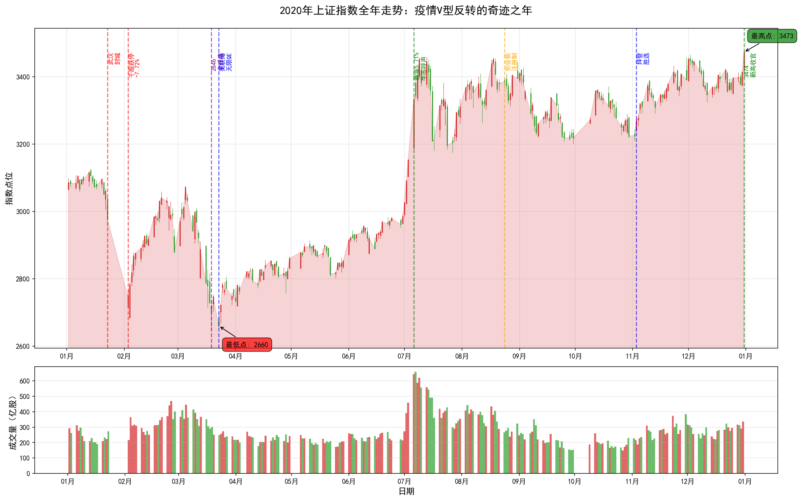
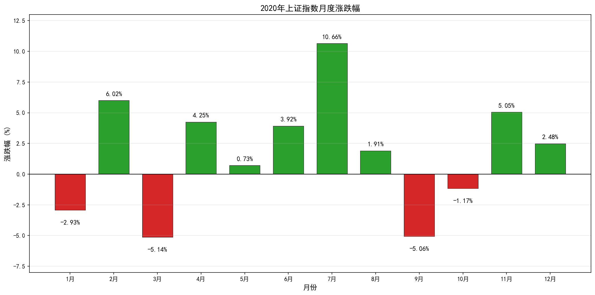
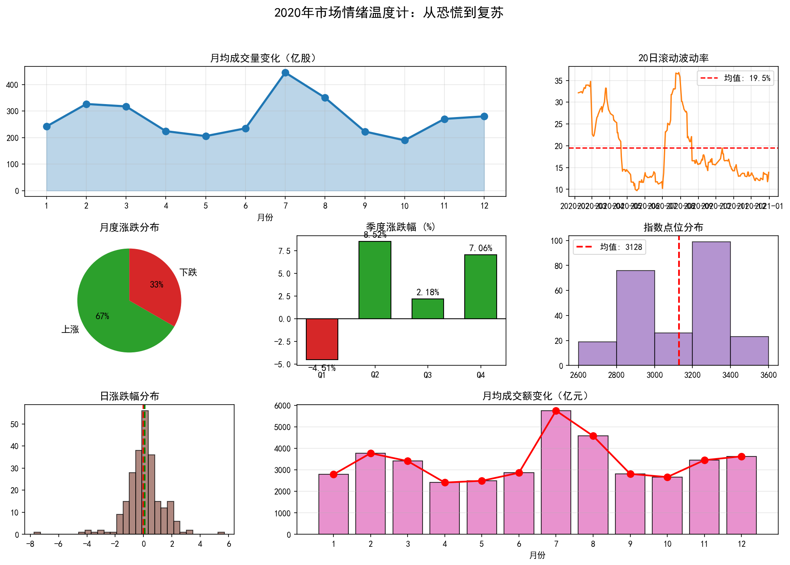

# 2020年A股年度复盘报告：疫情V型反转

> **报告期**：2020年1月1日 - 2020年12月31日  
> **报告主题**：疫情V型反转  
> **核心指数**：上证指数（000001.SH）  
> **撰写日期**：2026年4月6日

---

## 一、全年概览

### 1.1 核心数据速览

| 指标 | 数值 | 市场意义 |
|------|------|----------|
| **年初开盘** | 3066.34点 | 承接2019年科技牛行情 |
| **年末收盘** | 3473.07点 | 创2018年以来新高 |
| **全年涨幅** | **+13.26%** | 全球主要市场最佳表现之一 |
| **全年振幅** | 31.29% | 从2646点到3474点的剧烈波动 |
| **最高点** | 3474.92点（12月31日） | 年末收官新高 |
| **最低点** | 2646.80点（3月19日） | 全球疫情恐慌底 |
| **最大单日涨幅** | +5.71%（7月6日） | 牛市呼声再起 |
| **最大单日跌幅** | -7.72%（2月3日） | 春节后千股跌停 |
| **最大回撤** | 15.36% | 疫情冲击下的深度调整 |

### 1.2 年度走势图

*图表说明：全年K线走势图（红涨绿跌），标注关键事件节点，下方为成交量*

### 1.3 月度表现一览

| 月份 | 涨跌幅 | 关键事件 |
|------|--------|----------|
| 1月 | -2.93% | 疫情初现，市场开始担忧 |
| 2月 | +6.02% | 暴跌后反弹，流动性宽松 |
| 3月 | -5.14% | 全球疫情爆发，二次探底 |
| 4月 | +4.25% | 国内疫情控制，复工启动 |
| 5月 | +0.73% | 震荡整理，等待方向 |
| 6月 | +3.92% | 创业板改革预期升温 |
| 7月 | **+10.66%** | 牛市呼声，券商涨停潮 |
| 8月 | +1.91% | 创业板注册制落地 |
| 9月 | -5.06% | 高位调整，风格切换 |
| 10月 | -1.17% | 美国大选不确定性 |
| 11月 | +5.05% | 拜登胜选，疫苗好消息 |
| 12月 | +2.48% | 机构抱团，核心资产新高 |

---

## 二、全年走势深度解读

### 2.1 第一阶段：疫情突袭与春节后暴跌（1-2月）

**时间跨度**：2020年1月2日 - 2月28日  
**指数区间**：3066点 → 2880点  
**阶段特征**：疫情初现 → 武汉封城 → 千股跌停 → 强力反弹

**深度解读**：

2020年开年，A股延续2019年科技牛行情，1月初一度冲击3100点。然而1月20日钟南山院士确认"人传人"后，市场开始恐慌。1月23日武汉封城，春节休市期间疫情迅速蔓延。

2月3日（春节后首个交易日），A股遭遇史诗级暴跌：
- **上证指数跌7.72%**，创2015年股灾后最大单日跌幅
- **超3000只股票跌停**，市场陷入极度恐慌
- **两市成交额突破5000亿**，恐慌盘涌出

但就在市场最绝望时，转机出现：
- 央行紧急降准释放1.2万亿流动性
- 北向资金逆势抄底，单日净流入近200亿
- 2月4日起连续反弹，2月全月大涨6.02%

**关键洞察**：
> 疫情初期的暴跌是典型的"黑天鹅"冲击，但政策快速响应和流动性宽松为市场提供了强力支撑。这一阶段告诉我们：**极端恐慌时往往是布局良机**。

### 2.2 第二阶段：全球疫情爆发与二次探底（3月）

**时间跨度**：2020年3月1日 - 3月31日  
**指数区间**：2899点 → 2750点，最低2646点  
**阶段特征**：海外疫情失控 → 美股四次熔断 → 全球流动性危机 → A股二次探底

**深度解读**：

3月是2020年最惊心动魄的一个月。海外疫情全面爆发：
- **3月9日**：油价暴跌30%，美股触发熔断
- **3月12日**：美股二次熔断，欧洲股市崩盘
- **3月16日**：美股三次熔断，美联储紧急降息至零
- **3月18日**：美股四次熔断，全球进入流动性危机

A股也未能幸免，3月19日跌至2646点，较年初下跌13.7%。但就在这一天，转机再次出现：

**3月19日 - 全球市场的转折点**：
- 美联储宣布"无限QE"，开启无限制资产购买
- 全球央行同步宽松，流动性危机缓解
- A股2646点成为全年最低点，此后一路上涨

**关键洞察**：
> 3月的二次探底是全球流动性危机的产物，而非基本面恶化。当美联储开启"无限QE"，全球资产定价逻辑发生根本改变——**流动性成为主导市场的核心变量**。

### 2.3 第三阶段：国内复苏与结构性行情（4-6月）

**时间跨度**：2020年4月1日 - 6月30日  
**指数区间**：2750点 → 2984点  
**阶段特征**：国内疫情控制 → 复工启动 → 创业板改革 → 科技医药领涨

**深度解读**：

4月开始，国内疫情得到有效控制，市场关注点从"疫情冲击"转向"复苏预期"：

**经济数据的V型反转**：
- 4月制造业PMI回升至50.8，重返扩张区间
- 5月工业增加值同比转正，消费逐步恢复
- 6月出口超预期增长，展现中国供应链韧性

**市场结构分化明显**：
- **医药板块**：疫情受益，疫苗股暴涨
- **科技板块**：国产替代加速，半导体景气上行
- **消费板块**：白酒、免税等核心资产创新高
- **传统周期**：银行、地产、能源持续低迷

**创业板注册制改革**：
- 6月12日，创业板注册制改革正式落地
- 涨跌幅限制放宽至20%，市场生态重塑
- 为8月24日首批注册制新股上市做准备

**关键洞察**：
> 这一阶段市场呈现明显的结构性特征——**景气度决定一切**。与疫情相关的医药、受益于国产替代的科技、以及业绩确定的核心消费成为资金追逐的对象。

### 2.4 第四阶段：七月狂飙与牛市呼声（7月）

**时间跨度**：2020年7月1日 - 7月31日  
**指数区间**：2984点 → 3310点，最高3458点  
**阶段特征**：券商涨停潮 → 成交额破万亿 → 杠杆资金入场 → 散户开户暴增

**深度解读**：

7月是2020年最疯狂的一个月，A股上演了一轮"快牛"行情：

**7月6日 - 史诗级暴涨**：
- 上证指数单日暴涨5.71%，创2019年2月以来最大涨幅
- 券商板块集体涨停，中信证券、中信建投等龙头连续涨停
- 两市成交额突破1.5万亿，创2015年以来新高
- 北向资金单日净流入近200亿

**牛市呼声四起**：
- "牛市来了"登上微博热搜
- 90后、00后跑步入场，开户数暴增
- 两融余额快速攀升，杠杆资金入场
- 爆款基金频现，日光基再现

**但狂欢很快降温**：
- 7月中旬监管出手降温，严查违规资金
- 社保、大基金减持公告频现
- 8月开始高位震荡，市场进入调整期

**关键洞察**：
> 7月的快牛行情是流动性宽松、风险偏好提升、散户入场共同作用的结果。但缺乏基本面支撑的牛市难以持续，**监管降温及时遏制了2015年式的杠杆疯牛**。

### 2.5 第五阶段：创业板注册制与风格切换（8-10月）

**时间跨度**：2020年8月1日 - 10月31日  
**指数区间**：3456点 → 3224点  
**阶段特征**：创业板注册制落地 → 天山生物事件 → 风格切换 → 美国大选不确定性

**深度解读**：

**8月24日 - 创业板注册制首批新股上市**：
- 18只新股集体上市，首日平均涨幅超200%
- 康泰医学盘中暴涨30倍，创A股历史纪录
- 注册制下涨跌幅放宽至20%，市场波动加剧

**天山生物事件 - 监管重拳出击**：
- 天山生物9个交易日涨超300%，引发市场关注
- 深交所启动核查，发现涉嫌新型股价操纵
- 监管释放明确信号：对恶性炒作零容忍

**市场风格切换**：
- 高估值医药、科技板块调整
- 低估值周期板块补涨
- 银行、保险、地产等"三傻"短暂崛起
- 但风格切换未能持续，核心资产很快重拾升势

**美国大选不确定性**：
- 特朗普与拜登选情胶着
- 中美科技脱钩担忧升温
- 10月市场维持震荡格局

**关键洞察**：
> 这一阶段的核心矛盾是**估值分化与风格切换**。高估值成长股与低估值价值股的博弈贯穿始终，最终业绩确定性战胜了估值便宜。

### 2.6 第六阶段：年末冲刺与核心资产泡沫（11-12月）

**时间跨度**：2020年11月1日 - 12月31日  
**指数区间**：3224点 → 3473点  
**阶段特征**：拜登胜选 → 疫苗好消息 → 机构抱团 → 核心资产新高

**深度解读**：

**11月的多重利好**：
- 11月3日拜登胜选，中美关系缓和预期升温
- 11月9日辉瑞宣布疫苗有效率超90%，全球风险资产大涨
- 11月15日RCEP签署，全球最大自贸区诞生
- A股11月大涨5.05%，北向资金持续流入

**12月的机构抱团行情**：
- 公募基金年度排名战打响
- 机构集中持仓核心资产，形成"抱团"效应
- 茅台突破2000元，宁德时代市值破万亿
- 上证指数12月31日收于3473点，创2018年以来新高

**核心资产的估值泡沫**：
- 茅台PE突破50倍，历史罕见
- 宁德时代PS超过20倍
- 爱尔眼科、通策医疗等医药白马估值高企
- 市场开始讨论"核心资产是否太贵"

**关键洞察**：
> 年末的机构抱团行情将核心资产估值推向历史高位。这一阶段告诉我们：**当所有人都在谈论某个投资逻辑时，往往是最危险的时候**。

---

## 三、重大事件深度分析

### 3.1 新冠疫情：百年一遇的"黑天鹅"

**事件回顾**：
- 2019年12月：武汉出现不明原因肺炎
- 2020年1月20日：钟南山确认"人传人"
- 1月23日：武汉封城，史无前例
- 2-3月：国内疫情爆发，全球蔓延
- 4月后：国内逐步控制，海外持续恶化

**对A股的影响**：
1. **短期冲击**：2月3日千股跌停，3月19日跌至2646点
2. **流动性宽松**：央行降准降息，市场利率大幅下行
3. **结构性机会**：医药、在线经济、居家办公受益
4. **长期改变**：加速了数字化转型，改变了消费习惯

**数据说话**：
- 2月3日两市超3000只股票跌停，创历史纪录
- 3月19日2646点成为全年最低点
- 从2646点到3474点，涨幅达31.3%

### 3.2 美联储"无限QE"：全球资产定价的转折点

**事件回顾**：
- 3月3日：美联储紧急降息50BP
- 3月15日：美联储降息至零，重启QE
- 3月23日：美联储宣布"无限QE"，开启无限制资产购买
- 此后：推出多项紧急贷款工具，向市场注入数万亿美元流动性

**对A股的影响**：
1. **流动性外溢**：美元流动性泛滥，资金流入新兴市场
2. **北向资金**：3月下旬开始持续流入A股
3. **估值提升**：无风险利率下行，推高风险资产估值
4. **核心资产**：受益于全球流动性宽松，估值大幅扩张

**数据说话**：
- 美联储资产负债表从4万亿美元扩张至7万亿美元
- 2020年北向资金净流入A股超2000亿元
- 创业板全年大涨65%，远超上证指数

### 3.3 创业板注册制改革：A股生态重塑

**事件回顾**：
- 6月12日：创业板注册制改革正式落地
- 8月24日：首批18只注册制新股上市
- 涨跌幅限制从10%放宽至20%
- 退市制度更加严格，壳价值大幅下降

**对市场的影响**：
1. **新股定价**：市场化定价，首日涨跌幅限制取消
2. **交易生态**：20%涨跌幅加大波动，策略需调整
3. **壳资源**：退市制度趋严，壳价值大幅缩水
4. **机构化**：散户比例下降，机构话语权提升

**典型案例**：
- 康泰医学首日暴涨30倍，创A股历史
- 天山生物9天涨300%，引发监管关注
- 创业板成交额一度超过沪市主板

### 3.4 中美博弈：科技脱钩与国产替代

**事件回顾**：
- 5月15日：美国升级对华为制裁，限制芯片供应
- 8月6日：特朗普签署行政令，禁止与TikTok、微信交易
- 9月15日：华为芯片断供正式生效
- 12月18日：中芯国际被列入实体清单

**对A股的影响**：
1. **国产替代加速**：半导体、软件等板块受追捧
2. **科技股分化**：有国产替代逻辑的公司大涨
3. **供应链重构**：部分行业面临供应链调整压力
4. **长期影响**：科技自主可控成为国家战略

**数据说话**：
- 半导体板块全年涨幅超80%
- 中芯国际科创板上市，市值一度突破6000亿
- 北方华创、兆易创新等设备材料股翻倍

---

## 四、外盘与商品市场回顾

### 4.1 全球股市：从熔断到新高

| 市场 | 全年涨幅 | 核心特征 |
|------|----------|----------|
| **纳斯达克** | +43.6% | 科技股主导，FAANG创新高 |
| **标普500** | +16.3% | V型反转，年末创新高 |
| **道琼斯** | +7.3% | 传统行业表现落后 |
| **德国DAX** | +3.5% | 欧洲经济复苏缓慢 |
| **日经225** | +16.0% | 安倍经济学延续 |
| **恒生指数** | -3.4% | 受香港局势和中美关系拖累 |

**全球市场关键节点**：
- **3月**：美股四次熔断，全球进入流动性危机
- **3月23日**：美联储无限QE，全球市场触底
- **6-8月**：科技股引领反弹，纳斯达克创新高
- **11月**：疫苗好消息，周期股补涨
- **12月**：全球主要市场普遍创新高

### 4.2 大宗商品：黄金与原油的极端分化

**原油市场**：
- 4月20日，WTI原油期货跌至-37美元，史无前例
- 全球疫情导致需求崩溃，储油空间耗尽
- OPEC+达成历史性减产协议
- 年末油价回升至50美元附近

**黄金市场**：
- 8月7日，黄金突破2075美元，创历史新高
- 全球负利率债券规模扩大，黄金吸引力上升
- 美元走弱，支撑金价
- 年末金价回落至1900美元附近

**铜等工业金属**：
- 3月跌至多年低点
- 中国需求复苏带动价格反弹
- 年末铜价创多年新高

---

## 五、策略与产品回顾

### 5.1 2020年的正确打开方式

**策略一：危机中布局**
- 2月3日暴跌后抄底
- 3月19日2646点加仓
- 核心逻辑：相信政策能力，相信经济复苏

**策略二：拥抱核心资产**
- 茅台、五粮液等白酒龙头
- 宁德时代、隆基股份等新能源龙头
- 恒瑞医药、迈瑞医疗等医药龙头
- 核心逻辑：流动性宽松下，龙头溢价提升

**策略三：赛道投资**
- 半导体国产替代
- 新能源产业链
- CXO医药外包
- 核心逻辑：景气度投资，买在风口

**策略四：定投指数基金**
- 沪深300ETF
- 创业板ETF
- 科创50ETF
- 核心逻辑：分散投资，分享市场平均收益

### 5.2 2020年的错误示范

**错误一：恐慌割肉**
- 2月3日跌停板卖出
- 3月19日最低点清仓
- 结果：割在地板上

**错误二：追高周期股**
- 7月追高券商
- 8月追高创业板低价股
- 结果：高位站岗

**错误三：死扛垃圾股**
- 持有ST股、退市股
- 拒绝拥抱核心资产
- 结果：跑输大盘

**错误四：过度交易**
- 频繁追涨杀跌
- 试图抓住每一个波段
- 结果：交易成本侵蚀收益

---

## 六、市场众生相

### 故事一：武汉股民的至暗时刻与重生

**人物**：张师傅，55岁，武汉退休职工，股龄20年

**故事**：

"我是武汉人，2020年春节是我人生中最难熬的日子。1月23日武汉封城那天，我正在家里准备年货。手机弹出新闻，我第一反应是：完了，股市要崩了。

春节期间，我每天刷新闻，看着确诊数字飙升，心里越来越慌。2月3日开盘前，我整夜没睡。早上9点半，看着满屏跌停，我手都在抖。我持有的三只股票全部跌停，账户一天亏了近20万。

那时候我真的慌了，想全部卖掉。但我儿子劝我：'爸，你现在卖就是割肉，等国家出手吧。'

果然，第二天开始反弹。但我已经吓破了胆，2月底反弹到2900点时，我把大部分股票都卖了。结果3月又跌，我心里还庆幸。但谁知道3月19日2646点后，市场一路上涨，我彻底踏空了。

7月那波大涨，我眼睁睁看着别人赚钱，自己只能买银行理财。最后12月，我实在忍不住，在3400点追高买了基金。现在回头看，我犯了两个错误：一是在最恐慌时割肉，二是在高位又忍不住追进去。

2020年教会我：投资要有定力，不能被情绪左右。"

### 故事二：90后新基民的疯狂与理性

**人物**：小李，28岁，深圳互联网从业者，2020年新入市

**故事**：

"我是2020年7月入市的。那时候牛市呼声很高，我身边同事都在聊股票基金。我一开始买了10万块某明星基金经理的产品，没想到一个月就赚了20%。

那时候我感觉自己就是股神，开始疯狂加仓。8月又买了20万，9月再加30万。 peak的时候，我账户里有80多万，其中60万是借的消费贷。

9月市场调整，我的基金回撤了15%，我慌了。更可怕的是，10月美国大选前，市场震荡，我的消费贷要还了，但基金还在亏。我不得不割肉还贷款，最后算下来，不但没赚钱，还亏了几万块利息。

这次经历让我明白：第一，不要用杠杆投资；第二，不要盲目追热点；第三，投资是长期的事，不能想着一夜暴富。

现在我只定投指数基金，每个月固定投入，不再追涨杀跌了。"

### 故事三：私募基金经理的艰难抉择

**人物**：王总，42岁，上海某私募基金经理，管理规模50亿

**故事**：

"2020年是我从业15年来最考验人的一年。3月19日那天，我们产品净值回撤了25%，有客户要求赎回，有客户打电话骂我们。那天晚上，我和团队开会到凌晨三点。

我们当时面临两个选择：一是减仓避险，二是逆势加仓。最后我们决定加仓，逻辑很简单：第一，美联储无限QE，流动性不是问题；第二，中国疫情控制最好，经济会率先复苏；第三，估值已经跌到了历史低位。

我们在2646点附近把仓位加到了90%，主要配置了医药、科技和消费。4-6月市场反弹，我们净值修复很快。7月那波大涨，我们产品创了新高。

但真正的考验在9月。那时候医药股估值已经很高了，我们在恒瑞医药150元的时候开始减仓，但市场还在继续涨，最高涨到200元。客户质疑我们卖早了，我们承受了很大压力。

现在回头看，我们在150元减仓是对的。投资不能赚最后一个铜板，风险控制永远是第一位的。

2020年让我更坚信：投资要逆人性，要在别人恐惧时贪婪，但也要在估值过高时保持理性。"

### 故事四：外资基金经理的中国机遇

**人物**：Michael，38岁，某外资资管机构中国区负责人

**故事**：

"我是2019年底从香港调到上海的。2020年1月，我还在适应新环境，疫情就来了。

2月3日A股暴跌那天，我们在香港开紧急会议。总部问我要不要减仓中国，我说'不，这是买入机会'。我的逻辑是：中国政府的执行力全球最强，一定能控制住疫情。

3月全球市场熔断，我们总部慌了，要求全球统一减仓。我争取了很久，最后说服他们保留中国仓位。3月19日2646点那天，我们甚至小幅加仓了。

整个2020年，我们持续增配中国资产。北向资金全年净流入超2000亿，我们贡献了很大一部分。为什么看好中国？

第一，疫情控制最好，经济最早复苏；
第二，货币政策相对克制，没有搞'大水漫灌'；
第三，资本市场改革加速，A股国际化程度提升；
第四，估值相对美股仍有优势。

12月的时候，我们召开了年度策略会。我明确告诉总部：2021年要继续增配中国，这是未来十年最重要的投资主题之一。

2020年让我看到：中国资本市场的韧性和吸引力正在提升，外资会持续流入。"

### 故事五：医药研究员的景气度投资

**人物**：陈博士，35岁，某券商医药行业首席分析师

**故事**：

"我是做医药研究的，2020年对我来说是'躺赢'的一年。但我更想分享的是，如何在景气度投资中保持清醒。

1月疫情刚爆发时，我就意识到医药板块会有一波行情。我重点推荐了疫苗股、检测股、手套口罩等防护用品。那时候市场还在恐慌，但这些股票已经开始涨了。

2-3月，我每天都在跟踪疫情数据，更新模型。我们团队连续发了几十篇报告，从疫苗研发进度到检测试剂产能，从ICU设备需求到原料药供应，全覆盖。

4-7月，医药板块大涨，我们的推荐组合涨幅超100%。但我开始警惕了。8月的时候，我在团队内部会议上说：'现在医药股估值已经透支了未来3年的业绩，我们要提示风险。'

但市场不理会，9月医药股还在涨。有客户质疑我'看空医药是不懂行'，有同行嘲笑我'踏空了'。但我坚持我的判断：再好的行业，估值过高也是风险。

果然，9月后医药板块开始调整，很多股票回撤30%以上。我们的客户因为提前减仓，保住了大部分收益。

2020年让我明白：景气度投资是对的，但要在估值合理时买入，在估值过高时卖出。研究要前瞻，但不能被市场情绪带偏。"

---

## 七、2020年复盘启示

### 7.1 关于危机与机遇

**启示一：危机中往往孕育机遇**
- 2月3日和3月19日的暴跌，都是历史级别的买入机会
- 但前提是：你要有现金，要有勇气，要有信念
- 危机投资的核心是：相信国运，相信政策，相信均值回归

### 7.2 关于流动性与估值

**启示二：流动性是资产定价的核心变量**
- 2020年全球资产价格上涨，本质是流动性宽松的结果
- 当美联储开启"无限QE"，所有资产都被重新定价
- 但流动性不会永远宽松，估值泡沫终将回归

### 7.3 关于结构性行情

**启示三：结构性行情是常态，选赛道比择时更重要**
- 2020年上证指数涨13%，但创业板涨65%，半导体涨80%
- 买错赛道，即使看对市场方向也赚不到钱
- 景气度投资、赛道投资成为主流

### 7.4 关于核心资产

**启示四：核心资产享受溢价，但估值也有边界**
- 2020年核心资产大涨，龙头溢价逻辑成立
- 但年末的估值已经透支了未来多年的业绩
- 再好的公司，买贵了也是风险

### 7.5 关于投资纪律

**启示五：投资纪律是穿越波动的护身符**
- 不要恐慌割肉，不要追涨杀跌
- 不要用杠杆，不要过度交易
- 定投是普通人最好的投资方式

### 7.6 关于外资与A股

**启示六：A股正在成为全球资金的重要配置方向**
- 2020年北向资金持续流入，外资成为重要增量
- A股国际化程度提升，与全球市场联动增强
- 中国资产的长期配置价值被认可

### 7.7 关于2020年的历史意义

**启示七：2020年是分水岭，改变了很多东西**
- 改变了全球对疫情应对的认知
- 改变了货币政策的操作框架
- 改变了产业链的布局逻辑
- 改变了投资者的行为模式

---

## 八、结语

2020年，注定是被载入史册的一年。

这一年，我们见证了百年一遇的疫情，见证了全球股市的熔断与复苏，见证了美联储的"无限QE"，见证了A股的V型反转。

这一年，2646点到3474点，A股用9个月时间完成了31%的涨幅。这不仅是数字的变化，更是信心的重建、价值的重估。

这一年，有人恐慌割肉，有人逆势布局；有人追高被套，有人稳健获利；有人一夜暴富，有人黯然离场。

站在2026年回望，2020年给我们最大的启示是：**危机中保持理性，繁荣中保持警惕**。投资是一场马拉松，不是百米冲刺。只有坚持正确的投资理念，严格执行投资纪律，才能在市场的风浪中行稳致远。

2020年的故事已经结束，但市场的故事永远不会结束。愿每一位投资者都能从历史中汲取智慧，在未来的投资道路上行稳致远。

---

**报告撰写完成**  
**撰写日期**：2026年4月6日

---

## 附录：2020年市场情绪温度计

*图表说明：包含月均成交量、波动率、月度涨跌分布、季度涨跌幅、指数点位分布、日涨跌幅分布、月均成交额等7个维度的市场情绪指标*

---

## 参考数据

- 数据来源：Wind、东方财富Choice
- 数据统计区间：2020年1月1日 - 2020年12月31日
- 指数：上证指数（000001.SH）

---

*本报告仅供参考，不构成投资建议。市场有风险，投资需谨慎。*
