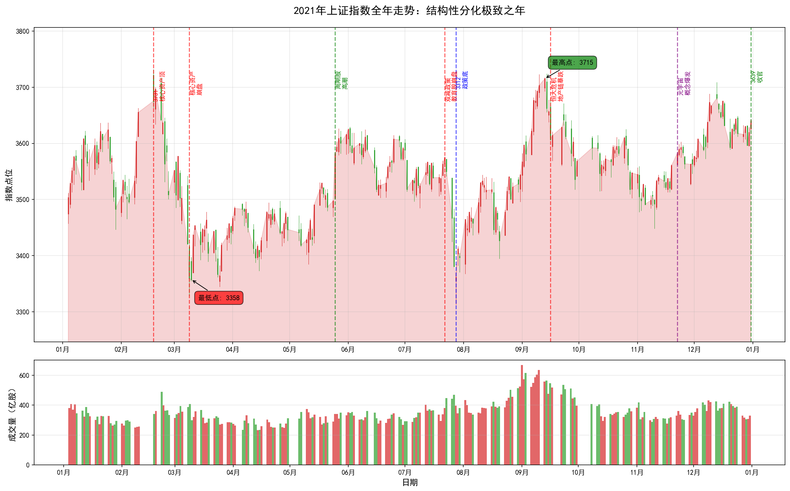
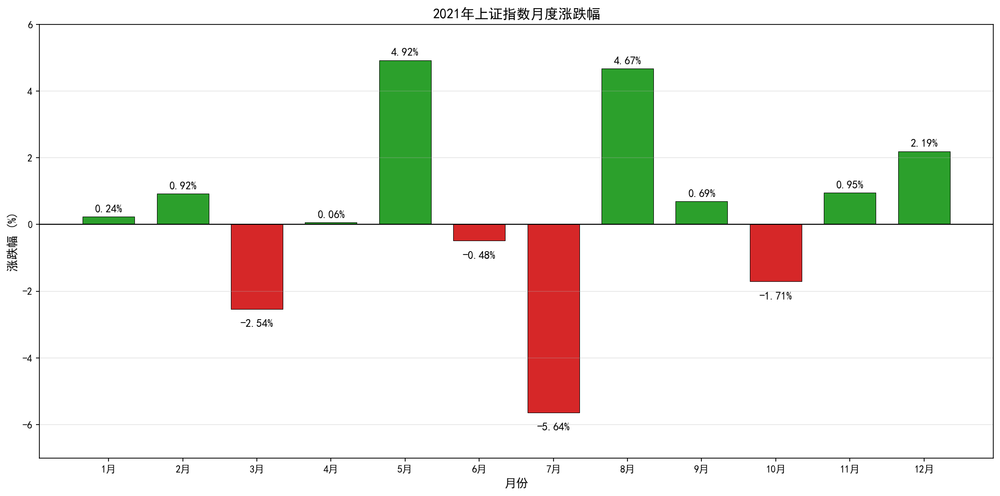
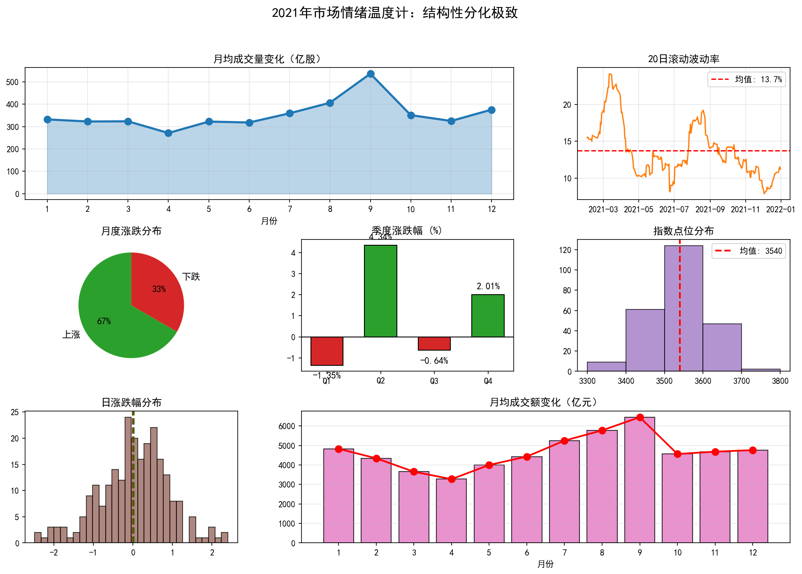

# 2021年A股年度复盘报告：结构性分化极致

> **报告期**：2021年1月1日 - 2021年12月31日  
> **报告主题**：结构性分化极致  
> **核心指数**：上证指数（000001.SH）  
> **撰写日期**：2026年4月6日

---

## 一、全年概览

### 1.1 核心数据速览

| 指标 | 数值 | 市场意义 |
|------|------|----------|
| **年初开盘** | 3474.68点 | 承接2020年核心资产行情 |
| **年末收盘** | 3639.78点 | 小幅上涨收官 |
| **全年涨幅** | **+4.75%** | 表面平淡，实则暗流涌动 |
| **全年振幅** | 12.65% | 波动幅度收窄 |
| **最高点** | 3731.69点（2月18日） | 核心资产泡沫顶点 |
| **最低点** | 3312.72点（7月28日） | 政策底确认 |
| **最大单日涨幅** | +2.40%（5月25日） | 周期股高潮 |
| **最大单日跌幅** | -2.49%（7月27日） | 教育股崩盘冲击 |
| **最大回撤** | 11.23% | 核心资产崩盘所致 |

### 1.2 年度走势图

*图表说明：全年K线走势图（红涨绿跌），标注关键事件节点，下方为成交量*

### 1.3 月度表现一览

| 月份 | 涨跌幅 | 关键事件 |
|------|--------|----------|
| 1月 | +0.24% | 核心资产最后疯狂 |
| 2月 | +0.92% | 春节后3731点见顶 |
| 3月 | -2.54% | 核心资产崩盘，抱团瓦解 |
| 4月 | +0.06% | 震荡筑底 |
| 5月 | **+4.92%** | 周期股大涨，煤飞色舞 |
| 6月 | -0.48% | 高位震荡 |
| 7月 | **-5.64%** | 双减政策，教育股崩盘 |
| 8月 | +4.67% | 政策底反弹 |
| 9月 | +0.69% | 周期股最后疯狂 |
| 10月 | -1.71% | 恒大危机发酵 |
| 11月 | +0.95% | 元宇宙概念爆发 |
| 12月 | +2.19% | 机构调仓，收官行情 |

---

## 二、全年走势深度解读

### 2.1 第一阶段：核心资产最后的疯狂（1-2月）

**时间跨度**：2021年1月4日 - 2月18日  
**指数区间**：3474点 → 3731点  
**阶段特征**：机构抱团极致 → 核心资产估值泡沫 → 3731点见顶

**深度解读**：

2021年开年，市场延续了2020年末的核心资产行情。机构抱团达到极致，"茅指数"成分股轮番创新高：

**核心资产的疯狂**：
- 茅台股价突破2600元，市值超3万亿
- 宁德时代市值突破1.5万亿，超越中石油
- 隆基股份、比亚迪等新能源龙头翻倍
- "茅指数"PE中位数超过60倍，历史罕见

**基金发行的疯狂**：
- 1月公募基金发行规模超5000亿，创历史新高
- 日光基频现，爆款基金一日售罄
- 90后、00后新基民跑步入场
- "坤坤"（张坤）等明星基金经理饭圈化

**但泡沫已经显现**：
- 核心资产估值透支未来3-5年业绩
- 机构持仓集中度达到历史极值
- 市场开始讨论"核心资产是否太贵"
- 2月18日春节后首个交易日，3731点成为全年最高点

**关键洞察**：
> 这一阶段的疯狂是2020年流动性宽松和机构抱团的极致演绎。但物极必反，当所有人都相信某个投资逻辑时，往往是风险最大的时候。3731点的见顶，标志着核心资产泡沫的破裂。

### 2.2 第二阶段：核心资产崩盘与抱团瓦解（3-4月）

**时间跨度**：2021年2月18日 - 4月30日  
**指数区间**：3731点 → 3446点  
**阶段特征**：核心资产暴跌 → 抱团瓦解 → 风格切换 → 震荡筑底

**深度解读**：

春节后，核心资产开始崩盘。这不是简单的调整，而是一场估值杀的浩劫：

**核心资产的雪崩**：
- 茅台从2600元跌至1900元，跌幅27%
- 宁德时代从692元跌至480元，跌幅30%
- 恒瑞医药从97元跌至60元，跌幅38%
- "茅指数"成分股平均跌幅超30%

**抱团基金的赎回潮**：
- 明星基金净值大幅回撤，张坤旗下基金回撤超20%
- 基民从"ikun"变"ikun黑"，大规模赎回
- 基金被迫卖出重仓股，形成负反馈
- 市场流动性从过剩转向紧张

**风格切换的尝试**：
- 资金从大盘蓝筹流向中小盘
- 中证500、中证1000跑赢沪深300
- 周期股、低估值板块开始受到关注
- 但风格切换并不顺畅，市场陷入震荡

**关键洞察**：
> 核心资产崩盘告诉我们：再好的公司，买贵了也是风险。估值是投资中最重要的锚，脱离估值谈成长是危险的。这一阶段的赎回潮也揭示了基金投资的"追涨杀跌"问题。

### 2.3 第三阶段：周期股高潮与煤飞色舞（5-6月）

**时间跨度**：2021年5月1日 - 6月30日  
**指数区间**：3446点 → 3591点  
**阶段特征**：周期股大涨 → 煤飞色舞 → 通胀预期 → 成交额破万亿

**深度解读**：

5月开始，周期股接棒成为市场主角。在全球通胀预期和碳中和政策推动下，煤炭、有色、钢铁、化工等板块轮番大涨：

**周期股的盛宴**：
- 煤炭板块涨幅超50%，中国神华、陕西煤业创新高
- 有色金属大涨，铜、铝、锂价格飙升
- 化工板块景气度上行，MDI、钛白粉涨价
- 钢铁板块受益于限产政策，宝钢股份大涨

**通胀预期的升温**：
- 美国CPI创多年新高，通胀担忧升温
- 国内PPI快速上行，工业企业利润改善
- 美联储开始讨论缩减购债（Taper）
- 全球大宗商品价格维持高位

**成交额的持续放大**：
- 5月25日，上证指数大涨2.4%，成交额破万亿
- 此后连续多日成交破万亿
- 量化交易规模快速扩张
- 市场活跃度达到年内高点

**关键洞察**：
> 周期股的大涨是通胀预期和碳中和政策共振的结果。但周期股的投资难度很大，需要把握节奏。6月后周期股开始调整，很多投资者高位站岗。

### 2.4 第四阶段：双减风暴与政策底确认（7月）

**时间跨度**：2021年7月1日 - 7月31日  
**指数区间**：3600点 → 3312点  
**阶段特征**：双减政策 → 教育股崩盘 → 中概股暴跌 → 政策底3312点

**深度解读**：

7月是2021年最黑暗的一个月。双减政策的出台，彻底改变了市场对政策风险的认知：

**7月24日 - 双减政策出台**：
- 中办、国办印发《关于进一步减轻义务教育阶段学生作业负担和校外培训负担的意见》
- 学科类培训机构一律不得上市融资
- 校外培训不得占用节假日、休息日
- 教育股遭遇灭顶之灾

**教育股的崩盘**：
- 好未来、高途、新东方等美股跌幅超90%
- A股教育板块连续跌停
- 海外中概股集体暴跌
- 外资恐慌性抛售中国资产

**7月27日 - 黑色星期二**：
- 上证指数跌2.49%，创年内最大单日跌幅
- 恒生科技指数跌8%，创历史最大单日跌幅
- 腾讯、阿里、美团等互联网巨头暴跌
- 市场恐慌情绪蔓延

**7月28日 - 政策底3312点**：
- 监管层喊话稳定市场
- 新华社发文称"中国资本市场发展的基础依然稳固"
- 市场触底反弹，3312点成为全年最低点

**关键洞察**：
> 双减政策的出台，标志着政策风险成为投资中必须考虑的重要因素。市场开始重新审视互联网、教育、地产等行业的政策风险。3312点的政策底告诉我们：在市场极度恐慌时，要相信政策维稳的决心。

### 2.5 第五阶段：震荡分化与结构性行情（8-10月）

**时间跨度**：2021年8月1日 - 10月31日  
**指数区间**：3312点 → 3547点  
**阶段特征**：政策底反弹 → 结构性分化 → 恒大危机 → 量化交易兴起

**深度解读**：

8月开始，市场从政策底反弹，但分化加剧。这一阶段的特点是：指数波动不大，但个股分化极致：

**新能源产业链的持续强势**：
- 宁德时代重回600元上方
- 比亚迪市值突破8000亿
- 光伏板块大涨，隆基股份、通威股份创新高
- 储能、锂矿等细分领域爆发

**周期股的二次冲顶与回落**：
- 9月周期股再次大涨，煤价创历史新高
- 但政策开始调控大宗商品价格
- 动力煤期货连续跌停
- 周期股大幅回落，高位站岗者众多

**恒大危机的发酵**：
- 9月恒大债务危机爆发
- 地产链股票暴跌，钢铁、水泥、建材承压
- 市场对系统性风险的担忧升温
- 地产行业进入寒冬

**量化交易的兴起**：
- 2021年被称为"量化元年"
- 量化私募规模突破万亿
- 市场波动加剧，散户抱怨"被割韭菜"
- 监管开始关注量化交易的影响

**关键洞察**：
> 这一阶段市场呈现极致的结构性分化。买对赛道（新能源）赚大钱，买错赛道（地产链）亏大钱。量化交易的兴起改变了市场生态，散户的生存空间被进一步压缩。

### 2.6 第六阶段：元宇宙概念与年末收官（11-12月）

**时间跨度**：2021年11月1日 - 12月31日  
**指数区间**：3547点 → 3639点  
**阶段特征**：元宇宙概念 → 妖股横行 → 机构调仓 → 3639点收官

**深度解读**：

年末市场热点散乱，元宇宙概念横空出世，妖股横行，机构为排名而战：

**元宇宙概念的爆发**：
- Facebook改名Meta，元宇宙概念全球火爆
- A股元宇宙概念股轮番涨停
- 中青宝、汤姆猫等股价翻倍
- 市场进入概念炒作阶段

**妖股的疯狂**：
- 九安医疗两个月涨超10倍
- 三羊马连续涨停，成妖股之王
- 次新股炒作盛行
- 投机氛围浓厚

**机构的排名战**：
- 公募基金年度排名战打响
- 为保排名，机构集中持仓新能源
- 宁德时代、比亚迪等被抱团推升
- 12月31日收于3639点，全年涨4.75%

**关键洞察**：
> 年末的元宇宙炒作和妖股横行，反映了市场在缺乏主线时的投机倾向。机构排名战则加剧了市场的抱团行为。3639点的收官，为2021年画上了一个平淡但不平凡的句号。

---

## 三、重大事件深度分析

### 3.1 核心资产崩盘：估值回归的惨痛教训

**事件回顾**：
- 2月18日，春节后首个交易日，3731点见顶
- 2-3月，核心资产连续暴跌，茅台跌27%，恒瑞跌38%
- 明星基金净值大幅回撤，基民大规模赎回
- 4月后，核心资产进入震荡整理期

**深度分析**：

**估值泡沫的形成**：
- 2020年流动性宽松，核心资产享受估值溢价
- 机构抱团推高估值，茅台PE突破60倍
- 市场形成"核心资产永远涨"的共识
- 新基民涌入，进一步推高估值

**估值回归的触发**：
- 美债收益率上行，压制高估值资产
- 通胀预期升温，流动性收紧担忧
- 核心资产业绩增速不及预期
- 机构持仓过于集中，流动性枯竭

**对投资者的启示**：
- 再好的公司，买贵了也是风险
- 估值是投资中最重要的锚
- 机构抱团不可持续，均值回归必然发生
- 基金投资要避免追涨杀跌

### 3.2 双减政策：政策风险的极致演绎

**事件回顾**：
- 7月24日，双减政策正式出台
- 学科类培训机构不得上市融资
- 好未来、高途、新东方等跌幅超90%
- 海外中概股集体暴跌，外资恐慌性抛售

**深度分析**：

**政策出台的背景**：
- 教育内卷严重，家长焦虑
- 资本无序扩张，加重教育负担
- 人口出生率下降，教育成本是重要原因之一
- 共同富裕目标下的政策调整

**对资本市场的冲击**：
- 教育板块市值蒸发超万亿
- 外资对中国资产的信心受挫
- 市场开始重新审视政策风险
- 互联网、地产等行业也受到波及

**投资策略的调整**：
- 政策风险成为投资的重要考量
- 避开政策敏感行业
- 关注政策鼓励的方向（新能源、高端制造）
- 投资要更加关注政策导向

### 3.3 碳中和与新能源：年度最强主线

**事件回顾**：
- 2020年9月，中国提出2030年碳达峰、2060年碳中和目标
- 2021年，碳中和成为贯穿全年的投资主线
- 新能源产业链（光伏、风电、电动车、储能）大涨
- 宁德时代、比亚迪、隆基股份等成为大牛股

**深度分析**：

**政策支持力度空前**：
- 碳中和写入政府工作报告
- 新能源装机目标大幅提升
- 电动车补贴政策延续
- 储能产业获得政策重点支持

**产业链的高景气度**：
- 光伏：硅料价格上涨，组件需求旺盛
- 电动车：销量爆发，渗透率快速提升
- 储能：政策强制配储，需求快速增长
- 锂资源：供需紧张，价格暴涨

**投资机会的把握**：
- 碳中和是长期赛道，值得持续关注
- 但要警惕估值过高和业绩不及预期的风险
- 产业链内部也有分化，需要精选个股
- 2021年的大涨透支了部分未来收益

### 3.4 量化交易兴起：市场生态的改变

**事件回顾**：
- 2021年被称为"量化元年"
- 量化私募规模突破万亿
- 量化交易占市场成交比例快速提升
- 散户抱怨"被割韭菜"

**深度分析**：

**量化交易的策略**：
- 市场中性：对冲市场风险，获取Alpha收益
- 指数增强：跟踪指数，获取超额收益
- CTA：趋势跟踪，做多波动率
- 高频交易：利用速度优势获取微利润

**对市场的影响**：
- 市场波动加剧，日内波动增大
- 板块轮动加快，热点持续性下降
- 散户追涨杀跌，容易被量化"收割"
- 市场有效性提升，Alpha获取难度加大

**投资者的应对**：
- 减少频繁交易，避免被量化"割韭菜"
- 坚持长期投资，忽略短期波动
- 定投指数基金，分享市场平均收益
- 提升研究能力，寻找真正的Alpha

---

## 四、外盘与商品市场回顾

### 4.1 全球股市：美股续创新高，中概股承压

| 市场 | 全年涨幅 | 核心特征 |
|------|----------|----------|
| **纳斯达克** | +21.4% | 科技股主导，FAANG续创新高 |
| **标普500** | +26.9% | 创历史新高，史上最佳年份之一 |
| **道琼斯** | +18.7% | 传统行业表现落后 |
| **德国DAX** | +15.8% | 欧洲经济复苏 |
| **日经225** | +4.9% | 表现相对落后 |
| **恒生指数** | -14.1% | 受中概股拖累，表现最差 |

**全球市场关键节点**：
- **1-2月**：散户逼空GameStop，华尔街震动
- **3-5月**：美债收益率上行，科技股承压
- **6-8月**：美联储讨论Taper，市场波动加剧
- **9-12月**：美股续创新高，中概股持续承压

### 4.2 大宗商品：通胀交易的高潮

**原油市场**：
- 年初50美元，年末75美元，涨幅50%
- 全球经济复苏，需求回升
- OPEC+控制产量，支撑油价
- 碳中和长期压制，但短期供需紧张

**铜等工业金属**：
- 铜价创历史高点，突破10000美元
- 新能源需求增长，供需紧张
- 全球供应链瓶颈，库存下降
- 通胀预期升温，资金涌入

**煤炭市场**：
- 国内煤价创历史新高
- 碳中和政策下，产能受限
- 供需严重失衡，价格暴涨
- 政策强力调控，期货跌停

---

## 五、策略与产品回顾

### 5.1 2021年的正确打开方式

**策略一：拥抱新能源主线**
- 宁德时代、比亚迪、隆基股份等
- 光伏、电动车、储能全产业链
- 核心逻辑：碳中和政策+高景气度
- 全年涨幅超50%，甚至翻倍

**策略二：周期股波段操作**
- 煤炭、有色、化工、钢铁
- 5-6月、9月两波行情
- 核心逻辑：通胀预期+供给侧改革
- 但需要及时止盈，否则高位站岗

**策略三：中小盘风格切换**
- 中证500、中证1000跑赢沪深300
- 专精特新、隐形冠军
- 核心逻辑：核心资产崩盘后的风格切换
- 全年中证500涨15.6%，沪深300跌5.2%

**策略四：量化中性策略**
- 市场中性产品收益稳健
- 指数增强产品超额收益明显
- 核心逻辑：利用量化模型获取Alpha
- 但门槛较高，普通投资者难以参与

### 5.2 2021年的错误示范

**错误一：死扛核心资产**
- 2月后仍持有茅台、恒瑞等
-  believing "核心资产永远涨"
- 结果：回撤30%以上

**错误二：追高周期股**
- 9月追高煤炭、有色
-  believing "煤价永远涨"
- 结果：政策调控后暴跌

**错误三：忽视政策风险**
- 持有教育、互联网股票
-  believing "大而不能倒"
- 结果：双减政策后暴跌90%

**错误四：追涨杀跌**
- 频繁交易，追逐热点
- 被量化交易"割韭菜"
- 结果：跑输指数，甚至亏损

---

## 六、市场众生相

### 故事一：核心资产信仰者的崩塌

**人物**：老刘，50岁，上海企业高管，价值投资信徒

**故事**：

"我信奉巴菲特的价值投资，2020年重仓茅台、恒瑞、中国平安，赚了不少钱。2021年初，茅台突破2600元，我不仅没有减仓，还追加了资金。

我当时的想法很简单：茅台是A股最好的公司，PE 60倍虽然贵，但用DCF算，合理估值应该到3000元。恒瑞是创新药龙头，长期看好。平安是保险龙头，估值便宜。

但春节后，市场给了我沉重一击。茅台从2600跌到1900，恒瑞从97跌到60，平安从90跌到65。我的账户从盈利30%变成亏损20%。

最让我难受的是3月份。那时候每天打开账户都在亏钱，我想割肉又不甘心，想加仓又不敢。最后我在茅台2000元的时候割了一半，现在回头看，割在了地板上。

2021年教会我：价值投资不是死扛，估值高了也要卖。再好的公司，买贵了也是风险。我现在学会了看估值，学会了止盈止损。

但我依然相信价值投资，只是会更加灵活。"

### 故事二：新能源赛道投资者的狂欢

**人物**：小陈，32岁，深圳程序员，2020年入市

**故事**：

"我是2020年入市的，一开始也是买核心资产，但2021年春节后亏了不少。3月份的时候，我开始研究新能源，发现这个赛道太香了。

我当时买了宁德时代、比亚迪、隆基股份。宁德时代成本400元，比亚迪成本150元，隆基成本80元。我的逻辑很简单：碳中和是国策，新能源是未来十年的主线。

6月份的时候，我的账户已经回本了。7月虽然市场大跌，但新能源跌得不多，很快又涨回去了。9月的时候，我的账户已经盈利50%了。

但我犯了一个错误：9月底追高买了一些锂矿股。10月政策调控周期股，锂矿股跌了不少，我把前面的利润回吐了一部分。

年末的时候，我清仓了锂矿股，保留了宁德时代和比亚迪的底仓。全年算下来，盈利大概40%。

2021年让我明白：赛道投资是对的，但要选准赛道，还要把握好节奏。新能源是长期赛道，但短期波动也很大，不能盲目追高。"

### 故事三：量化私募的崛起

**人物**：王博士，40岁，某量化私募创始人

**故事**：

"我是做量化投资的，2021年对我们来说是丰收的一年。我们的管理规模从50亿扩张到200亿，产品业绩也排在行业前列。

2021年为什么量化好做？第一，市场波动大，套利机会多；第二，散户交易活跃，提供了流动性；第三，风格切换频繁，我们的模型能捕捉到这些变化。

我们的策略主要是市场中性和指数增强。市场中性产品全年收益15%，最大回撤只有3%；指数增强产品超额收益30%，客户非常满意。

但我们也面临挑战。9月的时候，监管开始关注量化交易，市场传言要限制量化。我们的规模扩张也遇到了瓶颈，策略容量有限。

更重要的是，随着量化机构越来越多，Alpha获取难度越来越大。2022年可能不会像2021年这么好做了。

我觉得量化交易对市场的影响是双刃剑。一方面提高了市场有效性，另一方面也加剧了波动。散户确实很难和量化竞争，建议普通投资者少做短线，多做长线。"

### 故事四：教育股投资者的噩梦

**人物**：张女士，45岁，北京全职太太，海外账户投资中概股

**故事**：

"我是从2019年开始投资美股中概股的，主要买教育和互联网股票。好未来、新东方、腾讯、阿里，这些都是中国最好的公司，我觉得长期持有肯定能赚钱。

2020年疫情，在线教育火爆，好未来从40美元涨到90美元，我的账户赚了不少。2021年初，好未来回调到60美元，我觉得是买入机会，又加仓了。

但7月24日那天，我永远不会忘记。早上醒来看到双减政策的新闻，好未来盘前暴跌70%。我当时整个人都懵了，不敢相信这是真的。

开盘后，好未来继续跌，最后跌了95%。我的账户从盈利50万变成亏损100万。不仅是好未来，新东方、高途都一样暴跌。

更惨的是，腾讯、阿里这些互联网股票也跟着跌。外资恐慌性抛售中概股，我的账户一个月内亏了60%。

我现在终于明白，投资海外中概股，政策风险是最大的风险。中国的政策变化太快，外资根本理解不了。我以后不会再买中概股了，太可怕了。

2021年的教训是惨痛的，但我也学到了：投资要分散，不能把鸡蛋放在一个篮子里；要关注政策风险，特别是投资中国资产。"

### 故事五：周期股波段操作者

**人物**：老李，55岁，退休矿工，炒股20年

**故事**：

"我是老股民了，炒股20年，经历过2007年、2015年的大牛市。2021年，我觉得是周期股的大年，因为我懂煤炭这个行业。

5月份的时候，我看到煤价在涨，就买了中国神华、陕西煤业。那时候很多人看不起煤炭股，说那是'旧能源'，但我懂这个行业，知道供不应求。

6月，煤炭股大涨，我的账户盈利30%。但我没有卖，我觉得还能涨。7月市场大跌，煤炭股也回调了一些，但我没慌，因为我知道煤价还在涨。

9月，煤炭股再次大涨，中国神华创历史新高。我的账户盈利达到50%。但这一次，我开始警惕了，因为政策在调控煤价。

9月底，我把煤炭股全部清仓了。虽然卖早了一点，但躲过了10月的大跌。动力煤期货连续跌停，煤炭股暴跌，很多追高的人被套在山顶。

2021年我盈利40%，主要是靠煤炭股。我的体会是：做周期股要懂行业，要关注政策，要及时止盈。不能贪心，见好就收。"

---

## 七、2021年复盘启示

### 7.1 关于估值与风险

**启示一：估值是投资中最重要的锚**
- 核心资产崩盘是因为估值过高
- 再好的公司，买贵了也是风险
- 投资要关注估值，不能只看成长
- 均值回归是资本市场的铁律

### 7.2 关于政策风险

**启示二：政策风险是投资中必须考虑的重要因素**
- 双减政策改变了教育行业的命运
- 互联网、地产等行业也受到政策影响
- 投资要关注政策导向，避开政策敏感行业
- 政策鼓励的方向（新能源、高端制造）才是机会

### 7.3 关于结构性行情

**启示三：结构性分化是常态，选赛道比择时更重要**
- 2021年上证指数涨4.75%，但创业板涨12%，新能源涨50%
- 买对赛道赚大钱，买错赛道亏大钱
- 景气度投资、赛道投资成为主流
- 但也要注意估值，避免高位站岗

### 7.4 关于量化交易

**启示四：量化交易改变了市场生态**
- 散户追涨杀跌，容易被量化"收割"
- 市场波动加剧，热点持续性下降
- 普通投资者要少做短线，多做长线
- 定投指数基金是应对量化的有效方式

### 7.5 关于机构抱团

**启示五：机构抱团不可持续，均值回归必然发生**
- 2020年的核心资产抱团在2021年瓦解
- 机构排名战加剧了抱团行为
- 抱团瓦解时，跌幅往往超预期
- 投资要避免盲目跟风机构

### 7.6 关于周期股投资

**启示六：周期股投资难度大，需要把握节奏**
- 2021年周期股有两波行情，但波动剧烈
- 要及时止盈，否则高位站岗
- 要关注政策和供需变化
- 周期股不适合长期持有

### 7.7 关于2021年的历史意义

**启示七：2021年是分水岭，改变了很多东西**
- 核心资产泡沫破裂，估值回归
- 政策风险成为投资的重要考量
- 量化交易兴起，市场生态改变
- 碳中和成为长期主线

---

## 八、结语

2021年，A股用4.75%的涨幅，演绎了一场极致的结构性分化大戏。

这一年，3731点到3312点，再到3639点，指数波动不大，但个股分化极致。买对赛道（新能源）的人赚大钱，买错赛道（核心资产、教育、地产）的人亏大钱。

这一年，核心资产泡沫破裂，估值回归的教训惨痛；双减政策出台，政策风险的认知深刻；量化交易兴起，市场生态的改变深远。

这一年，有人死扛核心资产，回撤30%以上；有人拥抱新能源，盈利50%以上；有人追高周期股，高位站岗；有人被量化"收割"，追涨杀跌。

站在2026年回望，2021年给我们最大的启示是：**投资要关注估值，要关注政策，要选对赛道，要避免追涨杀跌**。结构性分化是常态，只有适应市场变化，才能在投资中立于不败之地。

2021年的故事已经结束，但市场的故事永远不会结束。愿每一位投资者都能从历史中汲取智慧，在未来的投资道路上行稳致远。

---

**报告撰写完成**  
**撰写日期**：2026年4月6日

---

## 附录：2021年市场情绪温度计

*图表说明：包含月均成交量、波动率、月度涨跌分布、季度涨跌幅、指数点位分布、日涨跌幅分布、月均成交额等7个维度的市场情绪指标*

---

## 参考数据

- 数据来源：Wind、东方财富Choice
- 数据统计区间：2021年1月1日 - 2021年12月31日
- 指数：上证指数（000001.SH）

---

*本报告仅供参考，不构成投资建议。市场有风险，投资需谨慎。*
