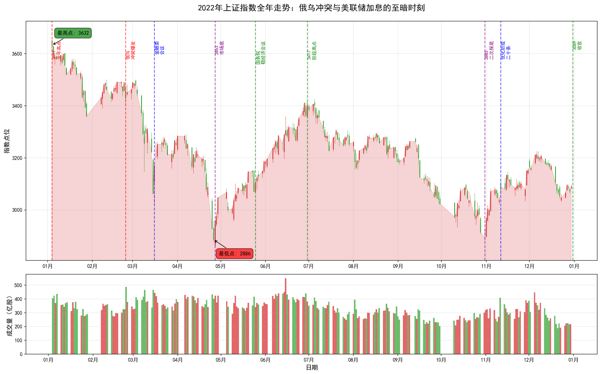
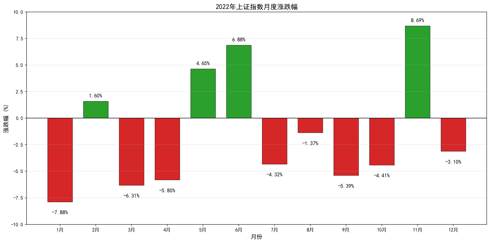
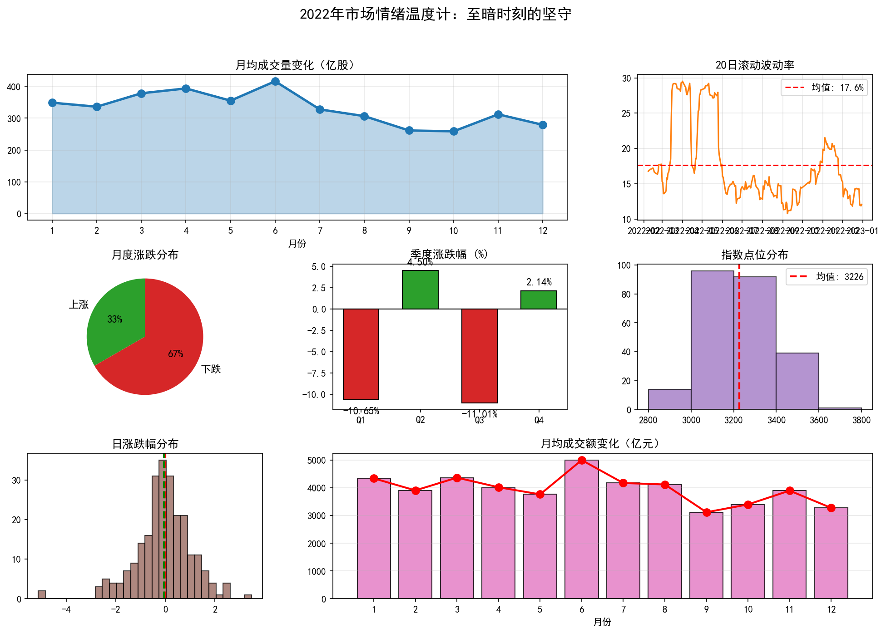

# 2022年A股年度复盘报告：俄乌冲突与美联储加息

> **报告期**：2022年1月1日 - 2022年12月31日  
> **报告主题**：俄乌冲突与美联储加息  
> **核心指数**：上证指数（000001.SH）  
> **撰写日期**：2026年4月6日

---

## 一、全年概览

### 1.1 核心数据速览

| 指标 | 数值 | 市场意义 |
|------|------|----------|
| **年初开盘** | 3649.15点 | 承接2021年末行情 |
| **年末收盘** | 3089.26点 | 全年收跌，年末小幅反弹 |
| **全年跌幅** | **-15.34%** | 全球主要市场最差表现之一 |
| **全年振幅** | 27.53% | 从3651点到2863点的剧烈波动 |
| **最高点** | 3651.89点（1月4日） | 全年首个交易日即见顶 |
| **最低点** | 2863.65点（4月27日） | 市场底确认 |
| **最大单日涨幅** | +3.48%（3月16日） | 金融委会议后反弹 |
| **最大单日跌幅** | -5.13%（4月25日） | 疫情封控冲击 |
| **最大回撤** | 21.58% | 创2018年以来最大回撤 |

### 1.2 年度走势图

*图表说明：全年K线走势图（红涨绿跌），标注关键事件节点，下方为成交量*

### 1.3 月度表现一览

| 月份 | 涨跌幅 | 关键事件 |
|------|--------|----------|
| 1月 | **-7.88%** | 全年首月暴跌，美联储收紧预期 |
| 2月 | +1.60% | 俄乌冲突爆发，市场震荡 |
| 3月 | -6.31% | 疫情扩散，外资撤离 |
| 4月 | -5.80% | 上海封控，2863点市场底 |
| 5月 | +4.65% | 稳经济政策出台，反弹开始 |
| 6月 | **+6.88%** | 疫后复苏，新能源领涨 |
| 7月 | -4.32% | 疫情反复，断贷风波 |
| 8月 | -1.37% | 高温限电，市场震荡 |
| 9月 | -5.39% | 美联储激进加息，汇率承压 |
| 10月 | -4.41% | 疫情反复，2885点二次探底 |
| 11月 | **+8.69%** | 优化防疫二十条，大反弹 |
| 12月 | -3.10% | 疫情过峰，市场震荡 |

---

## 二、全年走势深度解读

### 2.1 第一阶段：开年暴跌与俄乌冲突（1-2月）

**时间跨度**：2022年1月4日 - 2月28日  
**指数区间**：3651点 → 3462点  
**阶段特征**：全年首日见顶 → 美联储收紧预期 → 俄乌冲突爆发 → 市场恐慌

**深度解读**：

2022年开年即遭遇重创，全年首个交易日3651点成为全年最高点。此后一路下跌，几乎没有像样的反弹：

**美联储收紧预期的冲击**：
- 美国通胀创40年新高，美联储被迫转向鹰派
- 市场开始定价加息预期，10年期美债收益率快速上行
- 高估值成长股承压，纳斯达克大幅下跌
- 外资开始撤离新兴市场，A股北向资金持续流出

**1月暴跌7.88%**：
- 创2016年熔断以来最大单月跌幅
- 核心资产继续调整，新能源板块大跌
- 基金发行遇冷，市场流动性紧张
- 投资者信心降至冰点

**2月24日 - 俄乌冲突爆发**：
- 俄罗斯对乌克兰发动特别军事行动
- 全球市场剧烈震荡，原油、黄金大涨
- A股2月24日跌1.7%，但随后反弹
- 市场开始担忧地缘政治风险和全球通胀

**关键洞察**：
> 2022年开年的暴跌，标志着全球流动性拐点的到来。美联储从宽松转向紧缩，对全球风险资产形成系统性压制。俄乌冲突的爆发，更是雪上加霜。

### 2.2 第二阶段：疫情冲击与市场底2863（3-4月）

**时间跨度**：2022年3月1日 - 4月30日  
**指数区间**：3462点 → 3047点，最低2863点  
**阶段特征**：疫情扩散 → 上海封控 → 外资撤离 → 2863点市场底

**深度解读**：

3-4月是2022年最黑暗的时期。国内疫情扩散，上海封控，经济停摆，市场陷入极度恐慌：

**3月疫情扩散**：
- 深圳、上海等一线城市出现本土病例
- 防控措施升级，经济活动受限
- 市场开始担忧经济下行压力
- 3月14-15日连续大跌，市场恐慌情绪蔓延

**3月16日 - 金融委会议定海神针**：
- 国务院金融委召开专题会议
- 明确提出"积极出台对市场有利的政策"
- 关于中概股、平台经济、房地产等市场关切问题给出积极回应
- 当日上证指数暴涨3.48%，创年内最大单日涨幅

**4月上海封控**：
- 3月28日起，上海分区分批实施封控
- 4月全城静默，经济活动基本停滞
- 供应链中断，企业停工停产
- 市场担忧经济硬着陆

**4月25日 - 黑色星期一**：
- 上证指数暴跌5.13%，创年内最大单日跌幅
- 超4000只股票下跌，千股跌停
- 市场恐慌情绪达到顶点
- 北向资金单日净流出超100亿

**4月27日 - 2863点市场底**：
- 上证指数跌至2863点，较年初下跌21.6%
- 但当日收出长下影线，开始反弹
- 上海疫情出现拐点，封控政策松动预期
- 2863点成为全年最低点

**关键洞察**：
> 3-4月的暴跌是疫情冲击、外资撤离、流动性紧张共同作用的结果。2863点的市场底，是在极度恐慌中形成的。金融委会议的定调，为市场提供了政策底；而上海疫情的拐点，则确认了市场底。

### 2.3 第三阶段：稳经济政策与疫后复苏（5-6月）

**时间跨度**：2022年5月1日 - 6月30日  
**指数区间**：3047点 → 3398点  
**阶段特征**：稳经济政策密集出台 → 上海解封 → 疫后复苏 → 新能源领涨

**深度解读**：

5-6月是2022年最温暖的一段时光。政策暖风频吹，疫情得到控制，市场强劲反弹：

**5月25日 - 国务院稳经济会议**：
- 李克强总理召开全国稳住经济大盘电视电话会议
- 出台6方面33项稳经济措施
- 财政政策加码，货币政策宽松
- 市场信心大幅修复

**上海解封与疫后复苏**：
- 6月1日，上海全面恢复正常生产生活秩序
- 复工复产加速，供应链修复
- 消费、制造业数据快速改善
- 市场开始定价疫后复苏预期

**新能源产业链领涨**：
- 比亚迪市值突破万亿，股价创历史新高
- 宁德时代反弹超50%
- 光伏、储能板块大涨
- 新能源汽车销量超预期

**6月大涨6.88%**：
- 创2020年7月以来最大月度涨幅
- 两市成交额连续破万亿
- 北向资金大幅回流
- 市场从2863点反弹至3417点，涨幅19%

**关键洞察**：
> 5-6月的反弹告诉我们：政策底之后，市场底往往不远；疫情冲击是暂时的，经济韧性是长期的。新能源产业链成为反弹主线，体现了市场对高景气度赛道的追捧。

### 2.4 第四阶段：疫情反复与二次探底（7-10月）

**时间跨度**：2022年7月1日 - 10月31日  
**指数区间**：3417点 → 2893点  
**阶段特征**：疫情反复 → 断贷风波 → 高温限电 → 美联储激进加息 → 2885点二次探底

**深度解读**：

7-10月是2022年最煎熬的时期。疫情反复、地产风险、美联储加息、汇率贬值等多重利空叠加，市场再次探底：

**7月疫情反复与断贷风波**：
- 多地疫情反弹，防控政策收紧
- 房企暴雷引发断贷风波，地产链承压
- 7月社融数据断崖式下跌
- 市场担忧经济二次探底

**8月高温限电**：
- 极端高温天气，多地电力紧张
- 四川、重庆等地限电，工业企业停产
- 光伏、锂电等新能源板块也受到冲击
- 市场担忧供应链再次中断

**9月美联储激进加息**：
- 美联储连续加息75BP，联邦基金利率升至3%以上
- 美元指数突破114，创20年新高
- 人民币汇率跌破7.3，外资持续流出
- 全球风险资产承压，A股大跌

**10月疫情反复与2885点二次探底**：
- 国庆后疫情多点散发，防控措施升级
- 10月28日，上证指数跌至2885点
- 距离4月低点2863仅一步之遥
- 市场恐慌情绪再次升温

**关键洞察**：
> 7-10月的调整告诉我们：经济复苏不是一帆风顺的，疫情反复、地产风险、外部冲击都是潜在威胁。2885点的二次探底，验证了2863点的支撑有效性，也为11月的大反弹埋下了伏笔。

### 2.5 第五阶段：优化防疫与年末收官（11-12月）

**时间跨度**：2022年11月1日 - 12月31日  
**指数区间**：2893点 → 3089点  
**阶段特征**：优化防疫二十条 → 疫情过峰 → 大消费反弹 → 3089点收官

**深度解读**：

11-12月是2022年最具戏剧性的一段时期。防疫政策重大调整，市场剧烈波动，最终小幅收跌收官：

**11月11日 - 优化防疫二十条出台**：
- 国务院联防联控机制发布优化疫情防控二十条措施
- 取消次密接判定、缩短隔离时间、放宽入境限制
- 市场解读为防疫政策重大转向
- 当日上证指数大涨1.69%，港股暴涨

**11月大反弹8.69%**：
- 创2020年7月以来最大月度涨幅
- 大消费板块暴涨，旅游、酒店、航空涨停潮
- 地产链修复，金融股上涨
- 北向资金大幅回流，单月净流入超600亿

**12月疫情过峰**：
- 12月7日，"新十条"发布，防疫政策全面优化
- 各地疫情快速过峰，感染人数激增
- 短期经济活动受限，消费数据下滑
- 市场担忧疫情冲击，12月小幅回调

**3089点收官**：
- 12月31日，上证指数收于3089点
- 全年下跌15.34%，全球主要市场最差
- 但年末较4月低点反弹8%
- 为2023年的复苏行情埋下伏笔

**关键洞察**：
> 11-12月的行情告诉我们：政策转向是市场的最大变量。优化防疫二十条的出台，标志着三年疫情的转折点。虽然短期有阵痛，但中长期看，经济复苏的确定性大幅提升。

---

## 三、重大事件深度分析

### 3.1 俄乌冲突：改变世界的地缘政治事件

**事件回顾**：
- 2022年2月24日，俄罗斯对乌克兰发动特别军事行动
- 欧美对俄实施史上最严厉制裁
- 全球能源、粮食价格暴涨
- 地缘政治格局发生深刻变化

**对A股的影响**：
1. **能源价格暴涨**：原油突破130美元，煤炭、天然气大涨
2. **粮食安全担忧**：小麦、玉米价格飙升，农业股受关注
3. **通胀压力加大**：全球通胀高企，央行被迫收紧
4. **避险情绪升温**：黄金、美元上涨，风险资产承压

**投资策略的调整**：
- 关注能源安全相关板块（煤炭、油气、新能源）
- 关注粮食安全相关板块（种业、农业）
- 关注军工板块（地缘政治紧张）
- 回避高估值成长股（利率上行压制）

### 3.2 美联储激进加息：全球流动性拐点

**事件回顾**：
- 3月开始加息，全年加息7次，累计425BP
- 6月、7月、9月连续三次加息75BP
- 联邦基金利率从0%升至4.25%-4.5%
- 美元指数突破114，创20年新高

**对A股的影响**：
1. **外资撤离**：北向资金全年净流出，人民币汇率承压
2. **估值压缩**：高估值成长股大幅调整
3. **全球风险资产承压**：美股、欧股、新兴市场普遍下跌
4. **A股估值优势显现**：相对美股估值更具吸引力

**投资策略的调整**：
- 关注低估值价值股（银行、保险、地产）
- 关注高股息策略（红利指数）
- 回避高估值成长股（新能源、医药）
- 关注汇率对冲工具

### 3.3 上海封控：疫情冲击的至暗时刻

**事件回顾**：
- 3月28日起，上海分区分批实施封控
- 4月全城静默，持续近两个月
- 经济活动基本停滞，供应链中断
- 4月27日2863点市场底

**对A股的影响**：
1. **经济硬着陆担忧**：Q2 GDP仅增长0.4%
2. **供应链中断**：汽车、电子等行业停产
3. **消费断崖式下跌**：社零数据大幅负增长
4. **市场恐慌情绪蔓延**：2863点创年内低点

**投资策略的调整**：
- 关注疫情受益板块（线上经济、医药）
- 关注疫后复苏板块（消费、旅游）
- 回避供应链依赖度高的制造业
- 保持现金流，等待市场底确认

### 3.4 优化防疫政策：三年疫情的转折点

**事件回顾**：
- 11月11日，优化防疫二十条出台
- 12月7日，"新十条"发布，全面优化
- 各地疫情快速过峰
- 2023年1月8日起，正式调整为"乙类乙管"

**对A股的影响**：
1. **大消费板块暴涨**：旅游、酒店、航空、餐饮涨停潮
2. **医药板块分化**：新冠药、疫苗上涨，检测股下跌
3. **经济复苏预期升温**：2023年GDP增速预期上调
4. **外资大幅回流**：北向资金11月净流入超600亿

**投资策略的调整**：
- 重仓大消费板块（白酒、旅游、酒店）
- 关注医药板块结构性机会（创新药、医疗器械）
- 关注疫后复苏板块（航空、机场、影院）
- 布局2023年经济复苏主线

---

## 四、外盘与商品市场回顾

### 4.1 全球股市：加息风暴下的普跌

| 市场 | 全年涨幅 | 核心特征 |
|------|----------|----------|
| **纳斯达克** | -33.1% | 科技股暴跌，加息冲击最大 |
| **标普500** | -19.4% | 创2008年以来最差表现 |
| **道琼斯** | -8.8% | 相对抗跌 |
| **德国DAX** | -12.3% | 能源危机冲击 |
| **日经225** | -9.4% | 日元贬值，出口受益 |
| **恒生指数** | -15.5% | 受中概股和地产拖累 |

**全球市场关键节点**：
- **1-2月**：美联储收紧预期，美股开始调整
- **3-6月**：俄乌冲突+加息，全球市场剧烈波动
- **7-10月**：美联储激进加息，全球股市大跌
- **11-12月**：加息放缓预期，市场反弹

### 4.2 大宗商品：能源危机与通胀交易

**原油市场**：
- 年初75美元，年末80美元，全年波动剧烈
- 3月俄乌冲突后突破130美元
- OPEC+控制产量，支撑油价
- 全球经济衰退担忧压制需求

**天然气市场**：
- 欧洲天然气价格创历史新高
- 俄乌冲突导致供应中断
- 欧洲能源危机，工业生产成本飙升
- LNG出口国（美国、卡塔尔）受益

**煤炭市场**：
- 国内煤价维持高位
- 能源安全成为政策重点
- 煤炭股全年表现优异
- 中国神华、陕西煤业创新高

---

## 五、策略与产品回顾

### 5.1 2022年的正确打开方式

**策略一：高股息策略**
- 煤炭、银行、公用事业等高股息板块
- 中国神华、长江电力等全年正收益
- 核心逻辑：防御属性+估值修复
- 在熊市中提供了正收益

**策略二：能源安全主题**
- 煤炭、油气、新能源
- 俄乌冲突后能源价格暴涨
- 核心逻辑：地缘政治+能源转型
- 煤炭股全年涨幅超50%

**策略三：疫后复苏布局**
- 11月后布局大消费板块
- 旅游、酒店、航空大涨
- 核心逻辑：防疫政策优化
- 短期收益可观

**策略四：空仓或轻仓**
- 1-4月、7-10月空仓或轻仓
- 避免了大幅下跌
- 核心逻辑：控制回撤，保存实力
- 熊市中最好的策略

### 5.2 2022年的错误示范

**错误一：死扛成长股**
- 持有新能源、医药等高估值股票
- believing "长期主义"
- 结果：回撤30-50%

**错误二：追涨杀跌**
- 4月割肉，6月追高
- 10月割肉，11月追高
- 结果：反复被打脸

**错误三：忽视宏观风险**
- 忽视美联储加息风险
- 忽视疫情反复风险
- 结果：被动挨打

**错误四：过度交易**
- 频繁交易，试图抄底逃顶
- 交易成本侵蚀收益
- 结果：跑输指数

---

## 六、市场众生相

### 故事一：新能源投资者的过山车

**人物**：小陈，33岁，深圳程序员，2020年入市

**故事**：

"我是2020年开始买新能源的，2021年赚了不少。2022年初，我重仓宁德时代、比亚迪， believing 新能源是长期赛道。

但2022年一开年就不对劲。1月新能源板块大跌，我的账户亏了15%。我想着是正常调整，没卖。2月俄乌冲突，市场震荡，我的账户又亏了10%。

3-4月是最难熬的。上海封控，供应链中断，新能源车停产，宁德时代的股价从600跌到400。我的账户从盈利50万变成亏损30万。4月25日那天，我差点割肉，但最后还是忍住了。

5-6月反弹，我的账户回本了一些。但7月又开始跌，9月美联储激进加息，新能源再次大跌。到10月底，我的账户又亏了20%。

11月优化防疫政策出台，市场大反弹，但新能源涨得不多。12月疫情过峰，市场震荡，我的账户最终全年亏了15%。

2022年让我明白：再好的赛道，也有周期。长期主义不是死扛，要学会控制回撤。2023年我会更关注估值，更注重风险控制。"

### 故事二：高股息策略的坚守者

**人物**：老李，58岁，退休教师，股龄15年

**故事**：

"我炒股15年，经历过2008年、2015年的大跌，知道熊市要守。2022年初，我看到美联储要加息，就觉得成长股要调整，所以把大部分仓位换成了高股息股票。

我买了中国神华、长江电力、工商银行。这些股票股息率高，估值低，熊市里比较抗跌。

1-4月市场大跌，我的账户只跌了5%，跑赢了大盘。5-6月反弹，我的股票涨得不多，但我也满足了。7-10月市场再次大跌，我的账户又回撤了一些，但全年下来还是正收益。

11月优化防疫政策出台，大消费暴涨，我的高股息股票涨得不多，但我也不眼红。我知道自己的策略是防御性的，不是进攻性的。

2022年我盈利8%，虽然不多，但在熊市里已经很好了。我的体会是：熊市要守，不要想着赚大钱，先保住本金。高股息策略虽然慢，但稳。

2023年我会继续坚守高股息策略，但也会适当配置一些疫后复苏的股票。"

### 故事三：量化私募的困境

**人物**：王博士，42岁，某量化私募创始人

**故事**：

"2022年对我们量化私募来说是非常困难的一年。我们的管理规模从200亿缩水到150亿，产品业绩也普遍亏损。

为什么难做？第一，市场波动太大，模型适应不了。1-4月、7-10月两次大跌，我们的对冲策略都失效了。第二，风格切换太快，因子失效。价值、成长、周期轮动，我们的模型跟不上。第三，流动性紧张，冲击成本上升。市场下跌时，买盘稀少，交易成本大增。

我们的市场中性产品全年亏损5%，指数增强产品超额收益只有10%，都低于预期。很多客户赎回，我们压力很大。

但我们也学到了很多。2022年让我们明白，量化不是万能的，在极端行情下也会失效。我们需要改进模型，增加对宏观风险的考量，提高策略的适应性。

2023年我们会更谨慎，控制规模，优化策略。我相信量化投资长期还是有优势的，但需要度过这个困难期。"

### 故事四：疫后复苏的押注者

**人物**：张女士，45岁，北京全职太太，2021年底入市

**故事**：

"我是2021年底入市的，一开始买了一些核心资产，但2022年1月就亏了不少。2月俄乌冲突，市场震荡，我割肉了。

3-4月市场大跌，我不敢进场，一直空仓。5-6月反弹，我也错过了。7-10月市场再次大跌，我还是空仓。

10月底，我看到市场跌了很多，估值已经比较便宜了。而且我听说防疫政策可能要调整，就开始布局疫后复苏板块。

我买了中国中免、锦江酒店、南方航空。11月优化防疫二十条出台，这些股票暴涨。中国中免从150涨到220，锦江酒店从50涨到70，南方航空从6块涨到9块。

我的账户11月盈利30%，全年盈利15%。虽然前面空仓错过了反弹，但最后一个月的收益弥补了之前的损失。

2022年让我明白：投资要逆向思维，要在别人恐惧时贪婪。10月底市场最恐慌的时候，反而是最好的布局时机。2023年我会继续布局疫后复苏板块，相信经济会逐步恢复。"

### 故事五：外资基金经理的撤离与回归

**人物**：Michael，40岁，某外资资管机构中国区负责人

**故事**：

"2022年对我们外资机构来说是非常艰难的一年。我们管理的A股基金全年亏损20%，客户赎回压力巨大。

1-4月，我们持续减仓。美联储加息、俄乌冲突、上海封控，利空一个接一个。我们的仓位从90%降到50%。

5-6月反弹，我们没有及时加仓，错过了机会。7-10月再次大跌，我们进一步减仓，仓位降到30%。

10月底，我们看到市场估值已经很便宜了，而且防疫政策优化的预期越来越强，就开始逐步加仓。11月优化防疫二十条出台，我们大幅加仓，仓位回到80%。

12月市场震荡，我们的基金净值有所回撤，但全年亏损收窄到15%。

2022年让我明白：外资投资A股，不仅要研究公司，还要理解中国的政策。防疫政策、地产政策、监管政策，都会影响市场。2023年我们会更积极地配置中国资产，相信经济复苏会带来机会。"

---

## 七、2022年复盘启示

### 7.1 关于宏观风险

**启示一：宏观风险是投资中不可忽视的因素**
- 美联储加息、俄乌冲突、疫情反复，都是2022年大跌的原因
- 投资要关注宏观，不能只看公司基本面
- 在宏观风险暴露时，要控制仓位，保存实力

### 7.2 关于估值与风险

**启示二：高估值在熊市中是最脆弱的部分**
- 2022年高估值成长股跌幅最大
- 新能源、医药、科技等板块回撤30-50%
- 低估值价值股相对抗跌，甚至正收益
- 投资要关注估值，避免买贵

### 7.3 关于政策风险

**启示三：政策风险是A股投资的重要考量**
- 防疫政策、地产政策、监管政策都会影响市场
- 2022年10月底的低点，是政策预期转向的结果
- 投资要理解政策，顺应政策方向
- 政策底往往是市场底的前奏

### 7.4 关于逆向投资

**启示四：逆向投资是熊市中最好的策略**
- 4月底2863点、10月底2885点，都是逆向布局的良机
- 在别人恐惧时贪婪，在别人贪婪时恐惧
- 但要控制节奏，不要一次性满仓
- 逆向投资需要勇气和耐心

### 7.5 关于高股息策略

**启示五：高股息策略是熊市中的避风港**
- 2022年煤炭、银行等高股息板块正收益
- 高股息提供了安全边际和现金流
- 熊市中，防守比进攻更重要
- 高股息策略适合风险厌恶型投资者

### 7.6 关于能源安全

**启示六：能源安全是长期的投资主题**
- 俄乌冲突后，能源安全成为全球焦点
- 传统能源（煤炭、油气）和新能源都是机会
- 能源转型是长期趋势，但过程会有反复
- 能源板块值得长期关注

### 7.7 关于2022年的历史意义

**启示七：2022年是转折点，改变了很多东西**
- 全球流动性拐点，从宽松到紧缩
- 地缘政治格局变化，俄乌冲突重塑世界秩序
- 中国防疫政策优化，三年疫情走向终结
- 投资逻辑发生深刻变化，需要重新审视

---

## 八、结语

2022年，A股用-15.34%的跌幅，演绎了一场至暗时刻的坚守。

这一年，3651点到2863点，再到3089点，指数大幅波动，投资者经历了恐慌、绝望、希望、失望的反复折磨。

这一年，俄乌冲突爆发，改变了世界地缘政治格局；美联储激进加息，全球流动性拐点到来；上海封控，经济停摆；优化防疫，三年疫情走向终结。

这一年，有人死扛成长股，回撤50%；有人坚守高股息，正收益收官；有人逆向布局，在2863点、2885点抄底成功；有人追涨杀跌，反复被打脸。

站在2026年回望，2022年给我们最大的启示是：**宏观风险不可忽视，估值是投资的锚，逆向投资需要勇气，熊市中防守比进攻更重要**。

2022年的故事已经结束，但市场的故事永远不会结束。愿每一位投资者都能从历史中汲取智慧，在未来的投资道路上行稳致远。

---

**报告撰写完成**  
**撰写日期**：2026年4月6日

---

## 附录：2022年市场情绪温度计

*图表说明：包含月均成交量、波动率、月度涨跌分布、季度涨跌幅、指数点位分布、日涨跌幅分布、月均成交额等7个维度的市场情绪指标*

---

## 参考数据

- 数据来源：Wind、东方财富Choice
- 数据统计区间：2022年1月1日 - 2022年12月31日
- 指数：上证指数（000001.SH）

---

*本报告仅供参考，不构成投资建议。市场有风险，投资需谨慎。*
