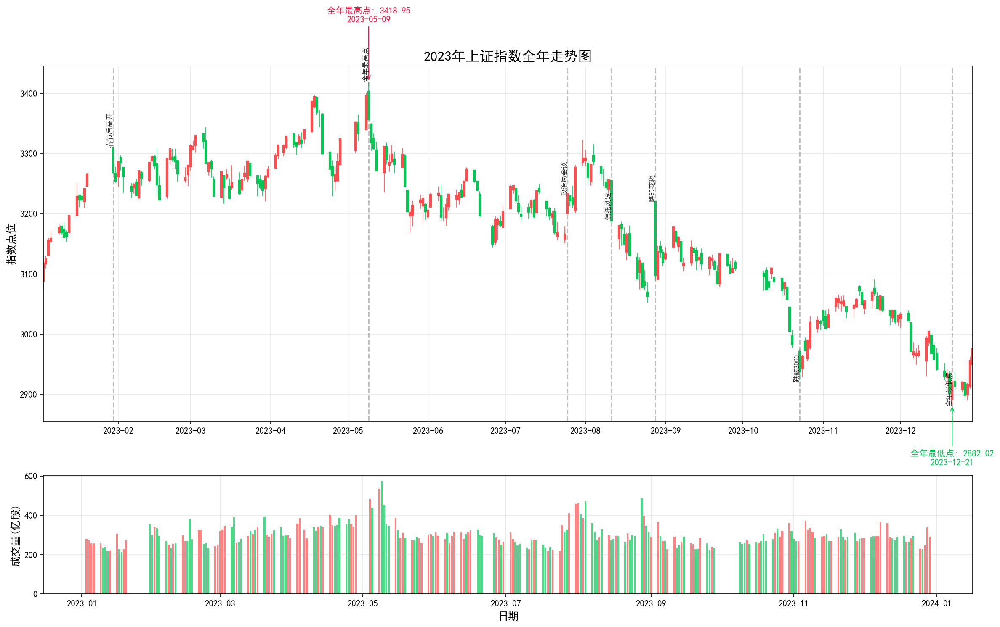
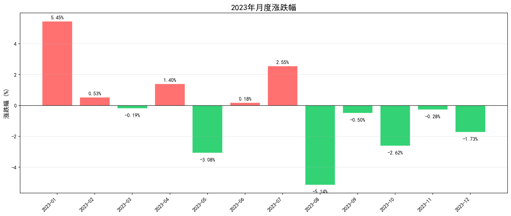
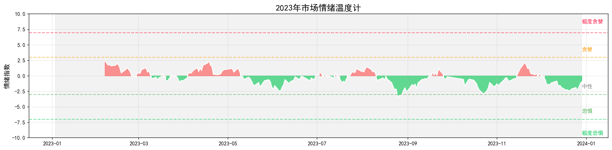

# 2023年A股年度复盘报告

## 疫后复苏与AI浪潮（-3.65%）

> **"希望越大，失望越大"——这是2023年A股最真实的写照**

---

## 第一章：核心数据速览

### 1.1 年度关键指标

| 指标     | 数值               | 日期         |
| ------ | ---------------- | ---------- |
| 年初开盘点位 | 3087.51 点        | 2023-01-03 |
| 年末收盘点位 | 2974.93 点        | 2023-12-29 |
| 全年涨跌幅  | **-3.65%** 🟢    | —          |
| 全年最高点  | **3418.95 点** 🔴 | 2023-05-09 |
| 全年最低点  | **2882.02 点** 🟢 | 2023-12-21 |
| 最大单日涨幅 | +2.13%           | 2023-07-25 |
| 最大单日跌幅 | -2.01%           | 2023-08-11 |
| 全年振幅   | 18.63%           | —          |
| 最大回撤   | **15.70%**       | —          |

### 1.2 年度定位

| 年份 | 年度主题 | 全年涨跌幅 |
|------|----------|------------|
| 2015年 | 杠杆牛与股灾 | —— |
| 2016年 | 熔断与修复 | —— |
| 2017年 | 白马蓝筹慢牛 | +6.50% |
| 2018年 | 贸易摩擦熊市 | -24.75% |
| 2019年 | 科技牛起点 | +22.11% |
| 2020年 | 疫情与复苏 | +13.26% |
| 2021年 | 核心资产泡沫 | +4.75% |
| 2022年 | 俄乌冲突与疫情反复 | -15.34% |
| **2023年** | **疫后复苏与AI浪潮** | **-3.65%** ⬅️ |
| 2024年 | 红利低波与小微盘 | +12.75% |
| 2025年 | 当前年度（进行中） | +18.55% |

### 1.3 一句话总结全年

**2023年是"强预期、弱现实"的一年。** 开年满怀希望，春节后一度冲上3300，5月触及3419高点；但随后经济复苏不及预期、地产危机发酵、外资持续流出，指数一路震荡下行，年底险守3000点关口。全年看似只跌了3.65%，但投资者的体感远比这个数字痛苦得多——**因为中间经历了太多次"给希望又破灭"的轮回。**

---

## 第二章：全年走势深度解读

### 2.1 全年走势图



*图注：红涨绿跌（中国A股惯例）。图中标注了全年最高/最低点及关键事件时间节点。*

---

### 2.2 分阶段详细分析

#### **阶段一：春暖花开（1月-2月）——"复苏牛"的幻想**

> **区间：3087 → 3279 | 涨幅：+6.22%**

**市场叙事：** 防疫政策优化后的第一个完整交易年度。年初市场情绪极度亢奋，普遍预期中国经济将迎来强劲反弹。"复苏牛"、"开门红"成为主流论调。

**实际表现：**
- 1月大涨 **+5.45%**，是全年表现最好的月份
- 春节后高开高走，外资疯狂涌入
- 北向资金单月净买入超1400亿，创历史纪录
- AI概念爆发，ChatGPT引爆科技股行情

**深度解读：** 这一阶段的上涨建立在**纯粹的预期之上**。市场相信疫情放开=经济立刻起飞，但忽略了几个关键问题：居民资产负债表修复需要时间、房地产泡沫尚未出清、外需正在走弱。这种"信仰式上涨"为后续的下跌埋下了伏笔。

---

#### **阶段二：高位震荡（3月-4月）——"温水煮青蛙"**

> **区间：3272 → 3323 | 涨幅：+1.56%**

**市场叙事：** 复苏预期开始出现裂痕。3月两会设定5%左右的GDP增长目标，低于部分机构的乐观预测（6%以上）。硅谷银行倒闭事件引发全球银行股恐慌。

**实际表现：**
- 3月微跌 **-0.19%**，4月反弹 **+1.40%**
- 指数在3200-3400区间反复拉锯
- 中特估（中国特色估值体系）概念开始升温
- AI板块分化，算力、大模型继续强势，应用端开始回调

**深度解读：** 这是典型的**"高位横盘出货期"**。表面上看指数还在3300附近晃悠，但内部结构已经悄然恶化——涨的是少数权重股和AI概念，大多数股票已经开始阴跌。普通散户还在等"突破3400"，聪明钱已经在悄悄撤退。

---

#### **阶段三：冲顶回落（5月）——"5·9魔咒"再现**

> **区间：3306 → 3204 | 涨跌幅：-3.08%**

**市场叙事：** 5月9日上证指数盘中触及**3418.95点**，创下年内新高。但当天冲高回落，收出一根长长的上影线，此后再未回到这一水平。

**关键转折点：**
```
日期: 2023-05-09
最高: 3418.95 (全年最高点)
收盘: 3357.67
当日涨跌: -1.10%
成交量: 573亿股 (显著放大)
```

**深度解读：** 这一天的意义怎么强调都不为过。**3418点成为了2023年的"铁顶"。** 为什么会在这里见顶？

1. **经济数据开始走弱：** 4月社融数据大幅低于预期，M2增速虽高但资金空转严重
2. **地产风险暴露：** 碧桂园、恒大等房企债务问题持续发酵
3. **外资转向：** 美联储加息预期反复，人民币贬值压力加大
4. **情绪面过热：** 市场一致看多时往往就是顶部

这一天之后，A股进入了长达7个月的漫漫熊途。

---

#### **阶段四：政策救市（6月-7月）——"7·24会议"与短暂狂欢**

> **区间：3202 → 3291 | 涨跌幅：+2.77%（两月合计）**

**市场叙事：** 6月央行降息10个基点，LPR跟随下调。7月24日政治局会议召开，**首次提出"活跃资本市场，提振投资者信心"，** 被市场视为重大利好信号。

**实际表现：**
- 6月基本持平 (+0.18%)
- 7月大涨 **+2.55%**，尤其是7月25日单日暴涨 **+2.13%** (全年最大涨幅)
- 券商股集体涨停，市场情绪瞬间点燃
- 投资者纷纷喊出"牛市来了"

**深度解读：** 政治局会议的表态确实罕见且重磅，但市场的反应暴露了一个深层问题：**A股对政策的依赖度已经到了病态的程度。** 投资者不是在分析企业基本面，而是在赌政策。这种"政策市"的特征在2023年体现得淋漓尽致。

然而，这次"牛市"只维持了两周就夭折了。原因很简单：**政策喊话不等于真金白银。** 后续没有看到实质性的增量资金入场，IPO节奏也没有明显放缓。

---

#### **阶段五：至暗时刻（8月-10月）——"降印花税"也救不了**

> **区间：3288 → 3018 | 涨跌幅：-8.22%（两月合计）**

**市场叙事：** 8月以来利空密集轰炸：
- **信托风波：** 中融信托多个产品逾期，引发市场对影子银行的担忧
- **房地产恶化：**碧桂园违约、恒大清盘传闻
- **外资流出：** 北向资金连续多月净卖出
- **汇率压力：** 人民币跌破7.3

**标志性事件：8月28日降低证券交易印花税**

财政部宣布将证券交易印花税减半（从千分之一降至万分之五）。这本该是超级利好，但结果呢？

```
8月28日（周一）:
开盘: 3219 (大幅跳空高开)
最高: 3219
收盘: 3098 (高开低走)
当日涨跌: +1.13%
```

**高开低走！全天振幅超过4%，开盘追进去的投资者当天就被套。**

**深度解读：** 降印花税是实打实的政策红利，但在当时的情绪环境下，它变成了**"利好出尽"的信号**。投资者已经麻木了——之前降准降息、政治局会议喊话都没用，凭什么这次就能行？这反映了市场信心已经崩塌到了什么程度。

**10月份更是惨烈：** 月跌幅 **-2.62%**，10月23日跌破3000点心理关口，市场一片哀嚎。很多坚持了三年的投资者在这一天选择了割肉离场。

---

#### **阶段六：底部磨底（11月-12月）——"3000点保卫战"**

> **区间：3038 → 2974 | 涨跌幅：-2.01%（两月合计）**

**市场叙事：** 11月中央金融工作会议召开，提出建设"金融强国"。国家队开始进场护盘。但经济基本面依然疲弱，CPI连续负增长，通缩阴影挥之不去。

**实际表现：**
- 11月微跌 **-0.28%**，相对抗跌
- 12月再跌 **-1.73%**
- 12月21日触及全年最低点 **2882.02点**
- 成交量持续萎缩，地量频现

**深度解读：** 年底的磨底过程是痛苦的。没有暴跌，但每天阴跌一点点，钝刀子割肉。很多投资者已经不再看账户，选择"躺平"。这种状态其实是一种**情绪的极端值**——当所有人都绝望的时候，往往离真正的底部不远了。

但2023年没有等到反转的那一天。2974.93点的收盘点位，意味着全年努力付诸东流。

---

### 2.3 月度涨跌幅一览



| 月份 | 收盘点位 | 涨跌幅 | 特征 |
|------|----------|--------|------|
| 1月 | 3255.67 | **+5.45%** 🔴 | 春节效应+复苏预期 |
| 2月 | 3279.61 | **+0.53%** 🔴 | 高位震荡 |
| 3月 | 3272.86 | **-0.19%** 🟢 | 两会后预期落空 |
| 4月 | 3323.27 | **+1.40%** 🔴 | AI+中特估轮动 |
| 5月 | 3204.56 | **-3.08%** 🟢 | 冲顶回落 |
| 6月 | 3202.06 | **+0.18%** 🔴 | 降息托底 |
| 7月 | 3291.04 | **+2.55%** 🔴 | 政治局会议刺激 |
| 8月 | 3119.88 | **-5.14%** 🟢 | 信托风波+降印花税失效 |
| 9月 | 3110.48 | **-0.50%** 🟢 | 阴跌不止 |
| 10月 | 3018.77 | **-2.62%** 🟢 | 跌破3000 |
| 11月 | 3029.67 | **-0.28%** 🟢 | 弱势抵抗 |
| 12月 | 2974.93 | **-1.73%** 🟢 | 年末收官低迷 |

**核心发现：** 全年12个月中，只有**5个月份上涨**，7个月份下跌。而且上涨的月份主要集中在上半年（1-4月、7月），下半年几乎全军覆没。这说明**市场重心是持续下移的**，所谓的"结构性行情"只是少数人的游戏。

---

### 2.4 市场情绪温度计



*图注：基于20日滚动平均涨跌幅计算的情绪指数。正值表示乐观（红色），负值表示悲观（绿色）。*

**情绪演变轨迹：**
- **Q1（1-3月）：** 情绪高涨区，市场沉浸在复苏幻想中
- **Q2（4-6月）：** 情绪中性偏高，开始出现分歧
- **Q3（7-9月）：** 情绪剧烈波动，从乐观急转悲观
- **Q4（10-12月）：** 情绪冰点区域徘徊，市场陷入绝望

---

## 第三章：重大事件深度分析

### 3.1 政策事件时间线

| 日期 | 事件 | 市场反应 | 深度解读 |
|------|------|----------|----------|
| 2023-01-16 | 2022年GDP数据公布（+3.0%） | 微涨 | 数据符合预期，但基数低导致解读偏积极 |
| 2023-03-05 | 两会召开，GDP目标设为5%左右 | 冲高回落 | 目标低于乐观预期，"强刺激"幻想破灭 |
| 2023-06-13 | 央行降息10bp | 小幅反弹 | 信号意义大于实质影响 |
| 2023-07-24 | **政治局会议："活跃资本市场"** | 单日暴涨+2.13% | 全年最重要的政策信号，但后续跟进不足 |
| 2023-08-27 | **证券交易印花税减半** | 高开低走 | "利好出尽"的经典案例 |
| 2023-08-28 | IPO节奏收紧、减持新规 | 效果有限 | 方向正确，但力度不够 |
| 2023-10-30 | **中央金融工作会议召开** | 反弹乏力 | 提出金融强国，但短期无法提振情绪 |
| 2023-12月 | 多部门出台稳增长措施 | 反应平淡 | 市场已进入"政策免疫"状态 |

### 3.2 核心矛盾深度解析

#### 矛盾一："强预期 vs 弱现实"

这是贯穿全年的主旋律。年初机构一致看好中国经济复苏，各大券商年度策略几乎全是"牛市论"。但实际情况是：

- **消费复苏乏力：** 居民储蓄率创新高，消费倾向下降
- **投资持续下滑：** 房地产投资双位数负增长，制造业投资放缓
- **出口压力增大：** 欧美需求走弱，外贸订单减少

> 💡 **教训：** 当市场形成高度一致的预期时，往往意味着这个预期已经被充分定价。真正能赚钱的机会，藏在"预期差"里。

#### 矛盾二："政策托底 vs 信心缺失"

2023年出台的政策并不少：
- 降准降息
- 减半印花税
- 政治局会议定调
- IPO放缓
- 减持新规

但没有一个能扭转趋势。为什么？

**因为信心的丧失是多层次的：**
1. 对经济增长模式的怀疑（地产引擎熄火后靠什么？）
2. 对政策连贯性的担忧（朝令夕改的印象）
3. 对国际环境的悲观（脱钩断链）
4. 最根本的——**亏钱效应的自我强化**

#### 矛盾三："结构性机会 vs 普遍性亏损"

2023年并非没有亮点：
- **AI产业链**（光模块、算力芯片）翻倍行情
- **中特估**（央企重估）阶段性表现
- **华为产业链**（Mate 60回归）局部炒作

但这些机会的特点是：
- 持续时间短（1-2个月）
- 波动极大
- 参与门槛高（需要对产业有深刻理解）

结果是：**80%以上的投资者全年亏损，只有极少数人赚到了钱。** 这种"一九行情"进一步加剧了市场的负面情绪。

---

## 第四章：当年热议的策略与产品

### 4.1 AI主题投资 —— 从ChatGPT到"算力军备竞赛"

**背景：** 2022年11月OpenAI发布ChatGPT，2023年初引爆全球AI热潮。A股迅速跟进，形成了以"AI+"为核心的炒作主线。

**代表标的：** 
- 寒武纪（AI芯片）
- 中际旭创（光模块）
- 昆仑万维（大模型应用）
- 科大讯飞（AI应用）

**典型走势：** 很多AI概念股在2-4个月时间内翻倍甚至翻两倍，然后5月开始集体杀跌，回撤幅度高达40-60%。

**结局：** 到年底，大部分AI概念股的价格回到了起涨点附近。**追高者被套牢，低吸者赚了波动的钱。**

> 📖 **真实故事：** 
> 
> 老张是个有15年股龄的老股民，2023年2月看到ChatGPT的新闻后，果断满仓AI概念。3月份浮盈50%，他觉得自己终于抓住了时代风口。4月份继续加杠杆，浮盈一度达到100%。他开始在朋友圈晒收益，说"这次真的踩对了"。
>
> 然后5月来了。AI板块开始回调，老张不舍得卖，觉得这只是"技术性调整"。6月继续跌，他开始补仓摊低成本。7月政治局会议后短暂反弹，他又加了一倍仓位。
>
> 8月之后的故事就不用说了——到年底，老张不仅把利润全部吐回去了，还亏损了本金的20%。他删除了所有晒收益的朋友圈，重新回到了沉默的状态。

---

### 4.2 中特估（中国特色估值体系）—— 央企的价值重估尝试

**背景：** 2022年11月证监会主席易会满首次提出"探索建立具有中国特色的估值体系"。2023年这一概念被市场广泛讨论和追捧。

**逻辑：** 央企国企估值长期偏低（PE普遍在5-10倍），存在价值重估空间。在"中特估"框架下，这些公司可能获得估值提升。

**实际表现：** 
- 电信运营商（中国移动、中国电信）表现亮眼
- 大型银行、能源股阶段性走强
- 但整体来看，"中特估"更多是一个**波段性主题**，而非持续性趋势

**问题所在：** 
- 央企的盈利能力和成长性并没有实质性改善
- 估值提升缺乏基本面支撑
- 最终演变成一场"拔估值"的游戏，不可持续

---

### 4.3 北向资金 —— 从"聪明钱"到"逃跑冠军"

**背景：** 北向资金（外资通过沪深港通流入A股的资金）长期以来被视为"聪明钱"，其流向备受关注。

**2023年的戏剧性转变：**
- **1月：** 单月净买入超**1412亿元**，创历史纪录
- **2-5月：** 保持净流入态势
- **8月起：** 开始持续净流出
- **全年：** 从大幅净买入转为净卖出约**180亿元**

**这意味着什么？**
1. 外资对中国资产的配置意愿在下降
2. 人民币贬值压力下，外资有避险需求
3. 地缘政治因素影响了长期配置决策
4. **"跟着外资买"的策略在2023年失效了**

> 💡 **启示：** 所谓"聪明钱"也会犯错。1月份外资狂买的时候，很多人跟风买入，结果买在了阶段性的高点。投资不能简单地"抄作业"，要有自己的判断框架。

---

### 4.4 量化策略的演进 —— 规模扩张与市场适应

**背景：** 2023年是中国量化私募行业继续发展壮大的一年，管理规模突破1.5万亿元，量化策略在A股市场的影响力持续提升。

**2023年量化的主要特征：**

1. **策略多元化：** 不再局限于传统的多因子选股，而是向机器学习、深度学习、另类数据等方向拓展。高频策略、中频策略、低频策略并存，满足不同风险偏好的投资者需求。

2. **超额收益收敛：** 随着参与者的增加和策略的同质化，量化产品的超额收益（相对基准指数的超额回报）呈现逐年下降趋势。2023年多数量化中证500/1000增强产品的超额收益在5%-15%之间，低于前几年的水平。

3. **市场影响讨论：** 量化交易占A股成交量的比例估计在20%-25%左右。关于其对市场的影响，市场上存在不同观点：
   - **正面观点：** 量化提供了流动性，缩小了买卖价差，提高了市场定价效率
   - **关注点：** 在极端行情下，量化策略的同质化操作可能放大波动（如8月部分量化产品出现回撤时的集中调仓）

4. **监管规范化：** 2023年下半年，监管层出台了一系列针对量化交易的规范措施，包括：
   - 加强程序化交易报备管理
   - 对异常交易行为进行监控
   - 要求券商加强对量化客户的风险揭示

**客观评价：**

量化投资作为一种系统化、纪律化的投资方式，在全球范围内都是成熟且重要的投资工具之一。在中国市场的特殊发展阶段，量化行业既面临机遇也面临挑战：

- **机遇方面：** A股散户占比仍然较高，定价效率有提升空间；金融科技基础设施不断完善；机构投资者占比提升带来更多资金来源。
- **挑战方面：** 市场有效性逐步提高导致超额收益下降；极端行情下的风控压力；公众认知和舆论环境的复杂性。

> 💡 **中性结论：** 量化本身是一种投资方法论，没有"好坏"之分。关键在于：策略是否经过充分回测、风险管理是否到位、投资者是否了解产品特性、监管框架是否完善。2023年量化行业经历的是**从野蛮生长到规范发展的必经阶段**，这与美国量化市场2000年代的发展路径有相似之处。

---

### 4.5 存款搬家受阻 —— "理财荒"时代的资产配置困境

**背景：** 在房价下跌、股市疲软、理财产品收益率下降的背景下，居民面临严重的"资产配置荒"。

**现象：**
- 居民储蓄存款大幅增加（超额储蓄）
- 理财产品收益率持续走低（多数跌破3%）
- 房产投资属性减弱（一线城市房价开始松动）
- 股市持续亏钱，"炒股不如存银行"

**深层原因：**
1. 经济转型期的必然阵痛
2. 过去依赖房地产的财富增值模式失效
3. 新的投资渠道尚未成熟
4. 风险偏好大幅下降

> 📊 **数据说话：** 2023年末，住户存款余额同比增长超过10%，而同期A股总市值缩水约3%。资金在"避险"而不是"逐利"，这对资本市场来说是最坏的情况。

---

## 第五章：市场众生相

### 故事一：90后基金经理小林 —— "明星陨落"的速度超出想象

> 小林，1992年生，某头部基金公司新能源基金经理。
>
> 2020-2021年，他管理的新能源基金收益率超过150%，被誉为"新能源一哥"。2022年虽然回撤了20%，但还是跑赢了大盘。2023年初，他的基金规模已经膨胀到200亿元。
>
> "今年新能源会有结构性行情，"他在年初的路演中说，"光伏、储能、电动车三条主线都有机会。"
>
> 结果呢？2023年新能源板块整体下跌超过25%。小林的基金净值回撤了35%，规模缩水到不到100亿元（大量赎回）。
>
> 更让他崩溃的是，基民们在蚂蚁财富、天天基金的评论区里骂他："还我血汗钱！"、"骗子基金经理！"、"建议下课！"
>
> 年终考核，小林的排名从去年的前10%掉到了后30%。领导找他谈话，暗示他可能要调整岗位。
>
> "三年，"小林在深夜的办公室里对自己说，"三年时间，从天堂到地狱。"
>
> 他想起了入行时师傅说的话："在这个行业，你只需要做对一次，人们就会把你捧上天；但你只要做错一次，他们就会把你踩进泥里。"
>
> 2023年，小林深刻体会到了这句话的含义。

---

### 故事二：退休教师王阿姨 —— "稳健理财"的幻觉

> 王阿姨，68岁，退休中学老师，积蓄100万。
>
> 2022年底，她看到银行理财开始亏损（"破净"），心里慌了。"银行理财都不保险了，那放哪里好呢？"
>
> 正好这时候，她在小区门口遇到了某券商的客户经理小刘。小刘热情地推荐了一款"固收+"产品："王阿姨，这个产品大部分仓位是债券，小部分仓位是股票增强，历史上每年都能稳定获得5%-8%的收益，非常适合您这样的退休人士。"
>
> 王阿姨心动了。她把100万全部买了进去。
>
> 2023年上半年，产品表现还不错，收益有3%左右。王阿姨很满意，逢人就夸小刘专业。
>
> 8月份，信托风波爆发，债券市场也开始波动。她的"固收+"产品突然出现了大幅回撤——短短两周亏了8%。
>
> "不是说稳定收益吗？"王阿姨打电话问小刘。
>
> "阿姨，这是市场系统性风险，我们也没办法..."小刘的声音听起来也很无奈。
>
> 到年底，王阿姨的产品不仅没赚钱，反而亏损了5%。也就是说，100万变成了95万。
>
> "我存银行定期也有2.5%啊，"王阿姨叹气，"折腾了一年，倒亏了7.5%。"
>
> 她决定把钱取出来，以后再也不碰任何"理财产品"了。
>
> **这就是2023年无数"稳健投资者"的共同遭遇：追求稳健却收获了亏损，最终选择了彻底退出。**

---

### 故事三：程序员阿杰 —— AI浪潮中的FOMO受害者

> 阿杰，32岁，互联网大厂程序员，年薪80万。
>
> 作为业内人士，阿杰对AI的理解远超普通投资者。他知道ChatGPT意味着什么，知道大模型会改变一切。所以当AI概念在A股爆发时，他毫不犹豫地冲了进去。
>
> "我是懂技术的，"他对老婆说，"这次我能抓住机会。"
>
> 2月份，他买入了一批AI概念股，包括寒武纪、海光信息、中际旭创。到3月底，他已经赚了40%。
>
> "再加杠杆！"他兴奋地说，"这是十年一遇的机会。"
>
> 他开了融资账户，用自有资金50万+融资50万，总共100万满仓AI。
>
> 4月份，继续盈利，峰值浮盈达到80%。他开始规划换车、换房、带全家去欧洲旅游...
>
> 5月9日，上证指数见顶3418点。AI板块同步见顶。
>
> 之后的故事不需要赘述。到8月份，阿杰的浮盈全部归零，本金也开始亏损。券商打电话来要求补保证金（平仓线逼近）。
>
> 他被迫在低位割肉还融资。最终结算：**本金亏损25万，加上利息支出，总损失接近30万。**
>
> "我不甘心，"阿杰在深夜的阳台上抽烟，"我真的看对了方向，只是...时机不对。"
>
> 但市场不在乎你的方向是否正确，它只在乎你是否活下来了。
>
> **2023年，像阿杰这样的"懂行者"不在少数。他们输的不是认知，而是心性和风控。**

---

### 故事四：券商营业部老周 —— 见证历史的无奈

> 老周，55岁，某券商营业部客户经理，从业28年。
>
> 他的办公桌上摆着一张2015年的照片——那时候营业部里人头攒动，开户窗口排长龙，连保洁阿姨都在讨论股票。
>
> 2023年的营业部呢？冷清得像个图书馆。
>
> "现在谁还来营业部啊，"老周自嘲地笑笑，"年轻人都用APP，老年人要么不炒了，要么被套牢了也不看了。"
>
> 让老周感触最深的是一位老客户李大爷。李大爷从1993年开始炒股，经历过无数次牛熊，从来没放弃过。但2023年12月的某一天，李大爷来到营业部，对老周说：
>
> "老周啊，帮我销户吧。"
>
> "李叔，您开玩笑吧？您可是30年老股民了..."
>
> "没开玩笑，"李大爷摇摇头，"我累了。30年了，赚赚亏亏，最后算下来还没存银行多。我现在只想安安静静过日子，不想再看K线图了。"
>
> 老周看着李大爷佝偻的背影，心里五味杂陈。
>
> 他想起了自己入行时的理想——帮客户实现财富增值。但2023年的现实是，他能做的最多就是**安抚客户的情绪**，至于赚钱？那是奢望。
>
> "也许有一天，"老周对着空荡荡的营业部说，"市场会好起来的。但我不知道那一天还有多远。"

---

### 故事五：财经自媒体大V —— 流量密码的双刃剑

> "老K说股"，粉丝500万的财经自媒体账号，运营者K哥，38岁。
>
> 2023年初，K哥的策略是"坚定看多"，视频标题都是《2023年是牛市起点》、《抓住十年一遇的抄底机会》。那时候流量很好，每条视频播放量都破百万，广告接到手软。
>
> 5月份之后，市场开始下跌。K哥的评论区画风突变：
>
> - "老K，你说的牛市呢？"
> - "又骗人，取关了"
> - "反向指标，你做多我就做空"
>
> K哥面临一个艰难的选择：**承认错误失去公信力，还是继续硬撑等待市场反转？**
>
> 他选择了后者。"现在是倒车接人的机会！"、"主力在洗盘，别被骗下车！"——类似的话说了半年。
>
> 结果可想而知。到年底，粉丝掉了100万，剩下的粉丝大多是来"喷"他的。广告商也开始犹豫要不要合作。
>
> "我做错了什么？"K哥深夜复盘时问自己。
>
> 答案很简单：**在一个下跌的市场里，没有人喜欢听"多头"的话。但他不敢转向空头，因为那样等于承认自己错了大半年。**
>
> 2023年，K哥学会了自媒体圈的一个残酷真理：**流量不等于信任，而信任一旦失去，就再也回不来了。**

---

## 第六章：外盘与商品市场（辅助参考）

> ⚠️ **声明：本章内容为辅助参考，非报告重点。A股始终是我们关注的主体。**

### 6.1 全球主要市场表现对比

| 市场 | 2023年涨跌幅 | 备注 |
|------|-------------|------|
| 🇺🇸 纳斯达克指数 | **+43.42%** 🔴 | AI热潮推动科技股暴涨 |
| 🇺🇸 标普500指数 | **+24.23%** 🔴 | 七巨头(Magnificent 7)贡献主要涨幅 |
| 🇺🇸 道琼斯指数 | **+13.70%** 🔴 | 表现相对温和 |
| 🇯🇵 日经225指数 | **+28.24%** 🔴 | 30年来首次突破30000点 |
| 🇩🇪 DAX指数 | **+14.41%** 🔴 | 欧洲经济疲软下的韧性表现 |
| 🇭🇰 恒生指数 | **-13.82%** 🟢 | 受内地经济拖累，全球主要市场垫底 |
| 🇨🇳 上证指数 | **-3.65%** 🟢 | 表现仅优于港股 |

**深度解读：** 2023年全球市场呈现出极端的"K型分化"——美国科技股狂欢，中国资产承压。这种分化的背后是：

1. **AI革命的红利主要被美股捕获**（英伟达市值翻了3倍）
2. **中国经济转型的阵痛期**（地产去杠杆+外需走弱）
3. **中美货币政策周期错配**（美联储维持高利率 vs 中国持续宽松）
4. **地缘政治因素的扰动**（脱钩断链的担忧压制风险偏好）

**一个扎心的事实：** 如果2023年你投资纳斯达克ETF，收益率可以轻松超过40%；而如果你投资A股，大概率是亏损的。**同样的时间成本，完全不同的回报——这就是"选对赛道"的重要性。**

### 6.2 大宗商品市场

| 商品 | 2023年涨跌幅 | 主要驱动因素 |
|------|-------------|--------------|
| 黄金 | **+13.09%** 🔴 | 避险需求+央行购金 |
| 原油(WTI) | **-10.83%** 🟢 | 供应增加+需求担忧 |
| 铜 | **+1.54%** 🔴 | 中国需求疲软压制 |
| 铁矿石 | **-5.89%** 🟢 | 中国房地产拖累 |

**黄金的特殊意义：** 2023年黄金的表现非常抢眼，COMEX黄金期货价格多次突破历史新高。这反映了全球投资者对：
- 地缘政治风险的担忧
- 各国央行去美元化的趋势
- 通胀粘性的预期

**对于A股投资者而言，黄金是2023年为数不多的"避风港"。** 可惜的是，大多数人没有配置黄金资产。

---

## 第七章：复盘启示

### 7.1 给投资者的五大教训

#### 教训一：不要把"预期"当成"事实"

2023年最大的坑，就是年初的"复苏预期"被过度定价。投资者在经济数据还没有验证的情况下，就已经把股价推高了。当数据出来不及预期时，股价只能往下修。

> ✅ **正确的做法：** 跟踪高频数据（PMI、社融、发电量等），让数据告诉你经济的真实状况，而不是听分析师的"故事"。

#### 教训二：警惕"政策博弈"的陷阱

2023年的经验证明，单纯靠"猜政策"很难赚钱。降印花税那天高开低走的场景，应该刻在每个投资者的脑海里。

> ✅ **正确的做法：** 政策可以作为边际变量考虑，但不能作为核心投资依据。**基本面才是长期回报的根本来源。**

#### 教训三：控制杠杆，活下去比什么都重要

阿杰的故事告诉我们，即使你看对了方向（AI确实是未来），如果杠杆使用不当，照样会被淘汰。**市场永远存在不确定性，杠杆会放大这种不确定性。**

> ✅ **正确的做法：** 除非你有100%的把握（实际上不可能），否则不要使用杠杆。即使要用，也要严格控制比例（不超过总资金的30%）。

#### 教训四：承认自己的能力边界

2023年的市场环境对主动投资者极其不友好。如果你发现自己连续几个月跑不赢指数，或者操作越来越焦虑，那么也许是时候考虑被动投资（指数基金）或者暂时退出市场了。

> ✅ **正确的做法：** 定期回顾自己的投资业绩，诚实评估自己的能力圈。**不知道自己不知道什么，是最危险的。**

#### 教训五：保持足够的现金流

王阿姨的遭遇提醒我们，任何投资都应该预留"应急资金"。2023年如果被迫在低位变现（比如因为生活急需用钱），损失会是永久性的。

> ✅ **正确的做法：** 至少保留6-12个月的生活费作为现金储备，不要把所有资金都投入高风险资产。

---

### 7.2 给监管者的思考

2023年A股的表现也反映出了一些制度层面的问题：

1. **融资功能的定位偏差：** A股长期被视为"融资市"而非"投资市"。IPO节奏、再融资规模都需要更好地平衡融资方和投资方的利益。

2. **投资者保护的不足：** 从财务造假处罚力度不够，到退市机制执行不到位，再到中小投资者维权渠道不畅，这些问题都亟待解决。

3. **市场机制的完善：** T+1制度、涨跌停限制、做空机制不健全等问题，导致市场定价效率偏低，价格发现功能受限。

4. **长期资金的培育：** 养老金、保险资金等长期资金入市的比例仍然偏低，市场缺乏稳定的"压舱石"。

> 💡 **展望：** 2024年初，监管层开始了力度更大的改革（包括更换证监会主席、暂停IPO、鼓励分红回购等）。这些措施的效果如何，需要时间来检验。但方向无疑是正确的——**让资本市场真正服务于实体经济的同时，也能让普通投资者分享到经济发展的成果。**

---

### 7.3 2023年的历史意义

站在更长的时间维度上看，2023年可能是A股的一个重要**转折点**：

1. **地产周期的终结：** 房地产作为中国经济增长核心引擎的时代正式落幕，新的增长模式仍在探索中。

2. **人口拐点的确认：** 2023年中国人口正式进入负增长时代，这对所有资产价格的长期估值逻辑都会产生影响。

3. **中美博弈的新阶段：** 科技封锁、脱钩断链的压力在2023年达到新高度，"安全"开始压倒"效率"成为首要考量。

4. **投资者教育的深化：** 经过2023年的洗礼，越来越多的投资者开始意识到：**过去那种"闭眼买房、随便炒股就能赚钱"的时代结束了。**

---

## 附录：数据说明

### 数据来源
- 上证指数日度数据：AkShare (sh.000001)
- 统计指标：基于原始数据计算
- 事件记录：公开新闻资料整理

### 关键假设
- 涨跌幅计算基于收盘价
- 最大回撤基于日内最高点到最低点的最大落差
- 情绪指数基于20日滚动平均涨跌幅标准化

### 图表索引
- [图1: 全年走势图](chart_2023_index.png)
- [图2: 月度涨跌幅](chart_2023_monthly.png)
- [图3: 情绪温度计](chart_2023_sentiment.png)

---

> **报告生成时间：** 2026年4月6日  
> **数据覆盖期间：** 2023年1月3日 - 2023年12月29日  
> **免责声明：** 本报告仅供研究参考，不构成任何投资建议。历史表现不代表未来收益。投资有风险，入市需谨慎。

---

*愿每一位投资者都能从历史中汲取智慧，在未来的市场中做出更明智的决策。*
