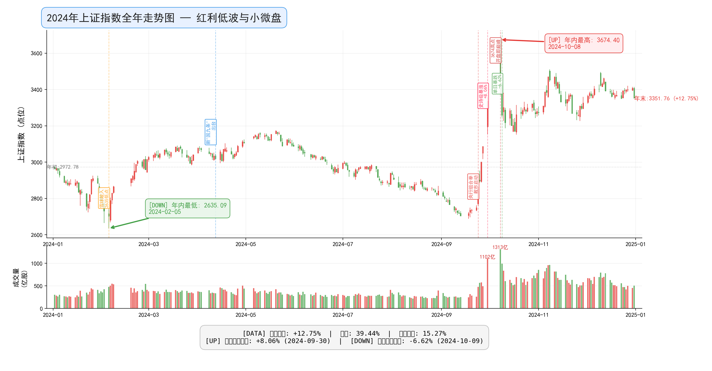
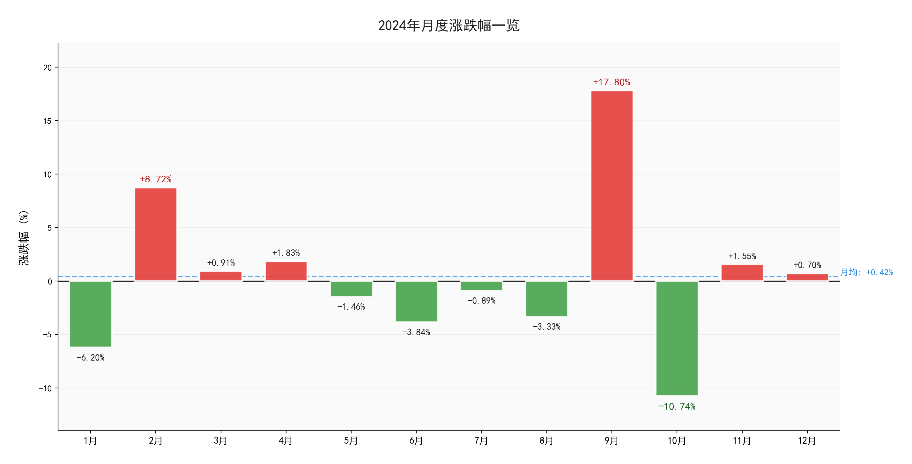
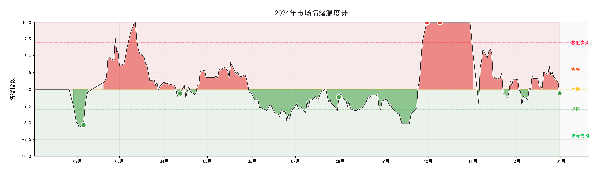

# 2024年A股年度复盘报告

## 红利低波与小微盘（+12.75%）

> **"绝处逢生，V型反转"——2024年是A股从绝望到狂欢再到分化的一年**

---

## 第一章：核心数据速览

### 1.1 年度关键指标

| 指标 | 数值 | 日期 |
|------|------|------|
| 年初开盘点位 | 2972.78 点 | 2024-01-02 |
| 年末收盘点位 | 3351.76 点 | 2024-12-31 |
| 全年涨跌幅 | **+12.75%** 🔴 | — |
| 全年最高点 | **3674.40 点** 🔴 | 2024-10-08 |
| 全年最低点 | **2635.09 点** 🟢 | 2024-02-05 |
| 最大单日涨幅 | **+8.06%** | 2024-09-30（史诗级暴涨） |
| 最大单日跌幅 | **-6.62%** | 2024-10-09（节后暴跌） |
| 全年振幅 | **39.44%** | — |
| 最大回撤 | **15.27%** | — |

### 1.2 年度定位

| 年份 | 年度主题 | 全年涨跌幅 |
|------|----------|------------|
| 2017年 | 白马蓝筹慢牛 | +6.50% |
| 2018年 | 贸易摩擦熊市 | -24.75% |
| 2019年 | 科技牛起点 | +22.11% |
| 2020年 | 疫情与复苏 | +13.26% |
| 2021年 | 核心资产泡沫 | +4.75% |
| 2022年 | 俄乌冲突与疫情反复 | -15.34% |
| 2023年 | 疫后复苏与AI浪潮 | -3.65% |
| **2024年** | **红利低波与小微盘** | **+12.75%** ⬅️ |
| 2025年 | 当前年度（进行中） | +18.55% |

### 1.3 一句话总结全年

**2024年是A股的"过山车"之年。** 开年仅一个多月就暴跌至2635点，雪球产品集中敲入引发市场恐慌；随后在政策强力救市下走出深V反转，9月底央行组合拳引爆史诗级暴涨，9月30日单日飙升+8.06%，10月8日开盘冲上3674点——但随即在10月9日遭遇-6.62%的单日暴跌。全年最终收涨+12.75%，但这个数字无法概括投资者经历的惊涛骇浪。**这是一场关于"绝望—希望—狂喜—分歧"的情绪过山车。**

---

## 第二章：全年走势深度解读

### 2.1 全年走势图



*图注：红涨绿跌（中国A股惯例）。图中标注了全年最高/最低点及关键事件时间节点。注意2月雪球危机、9月救市行情和10月剧烈波动。*

---

### 2.2 分阶段详细分析

#### **阶段一：开年暴击（1月）——延续2023年的阴霾**

> **区间：2973 → 2789 | 涨跌幅：-6.20%**

**市场叙事：** 2023年的下跌趋势在新年伊始继续发酵。年初市场情绪极度低迷，主要利空因素叠加：

**核心矛盾：**
- **经济数据疲软：** 2023年四季度GDP增速低于预期，PMI连续处于收缩区间
- **地产持续恶化：** 房企违约潮蔓延至头部企业
- **外资持续流出：** 北向资金1月份净卖出超百亿元
- **融资盘压力增大：** 两融余额下降但杠杆风险仍在累积

**关键日期：**
- **1月22日：** 大跌-2.68%，跌破2900点心理关口
- **1月25日：** 央行降准+MLF降息，当日反弹+3.03%（年内首次大阳线），但未能扭转趋势
- **1月31日：** 月末收于2788点，全月暴跌6.20%

**深度解读：** 1月的下跌本质上是**2023年熊市的最后一跌**。市场已经对各种利好"免疫"，信心降至冰点。但这种极致悲观恰恰为后续的V型反转埋下了伏笔——因为当所有人都觉得"没底了"的时候，真正的底部往往就不远了。

---

#### **阶段二：至暗时刻与绝地反击（2月）——雪球敲入与国家队入场**

> **区间：2773 → 3015 | 涨跌幅：+8.72%**

**这是2024年最戏剧性的一个月，也是全年最重要的转折点。**

**2月上旬：加速赶底**

- **2月2日：** 暴跌-1.46%，盘中一度跌破2700点
- **2月5日：** 触及全年最低点**2635.09点**！当日收盘2702点

**雪球产品集中敲入危机：**

> **什么是雪球？** 雪球是一种带有障碍条款的非保本收益凭证，本质上是一种**看跌期权卖方策略**。当标的资产价格跌破"敲入价"时，投资者将承担实际亏损。

> 2024年1-2月，中证500和中证1000指数大幅下跌，导致大量挂钩这两个指数的雪球产品触发"敲入"。据估算，**累计敲入规模超过2000亿元**。这意味着：
> - 雪球发行方（券商/期货公司）需要对冲，抛售股指期货
> - 股指期货贴水加深 → 对冲盘进一步卖出 → 形成负反馈循环
> - 市场流动性急剧恶化

**2月中下旬：国家队强势出手**

面对雪球危机引发的连锁反应，监管层采取了前所未有的救市措施：

```
时间线：
2月6日  中央汇金扩大ETF增持范围，当天大涨+3.23%
2月7日  继续反弹+1.44%，市场情绪开始回暖
2月8日  证监会换帅信号释放
2月19日  春节后首个交易日，高开高走+1.56%
2月下旬 持续上行，月末收复3000点
```

**关键数据：**
- 2月6日-29日，上证指数从**2635→3015**，反弹幅度达**14.4%**
- 中央汇金在此期间买入规模估计超过**4000亿元**
- ETF份额大幅增长，多只沪深300ETF创历史新高

**深度解读：** 2月的V型反转具有标志性意义。它证明了**在极端情况下，"有形之手"的力量是决定性的**。但同时也要清醒认识到：这种救市模式不可持续，市场最终的健康发展还是要靠基本面支撑。

---

#### **阶段三：新"国九条"与震荡整固（3月-5月）——政策底确认后的磨底期**

> **区间：3014 → 3087 | 涨跌幅：+2.42%（三个月合计）**

**市场叙事：** 救市之后，市场进入了一个相对平静的"观察期"。投资者开始评估：这次反弹能走多远？经济基本面是否真正改善？

**重大政策事件：4月12日新"国九条"出台**

国务院印发《关于加强监管防范风险推动资本市场高质量发展的若干意见》，这是继2004年、2014年之后**第三个"国九条"**，具有里程碑意义：

**核心内容：**
1. **严把发行上市准入关** —— 提高IPO门槛，强化现场检查
2. **严格上市公司持续监管** —— 加强减持规范，强化现金分红监管
3. **加大退市监管力度** —— 严格强制退市标准，削减"壳"资源价值
4. **加强证券基金机构监管** —— 推动行业回归本源
5. **加强交易监管** —— 完善量化交易、程序化交易监管规则
6. **推动中长期资金入市** —— 构建支持"长钱长投"的政策体系

**市场反应：** 新国九条出台后，市场给予了积极回应——**微盘股、ST股等"垃圾股"集体暴跌**，而高分红、低估值的蓝筹股表现强势。这标志着市场风格的一次重要切换。

**各月表现：**
- **3月：** +0.91% —— 小幅上涨，消化前期涨幅
- **4月：** +1.83% —— 新国九条提振情绪
- **5月：** -1.46% —— 经济数据不及预期，地产持续承压

**深度解读：** 这一阶段的特征可以概括为**"政策托底+结构分化"**。指数层面波澜不惊，但内部正在发生深刻的结构性变化：**从炒小、炒差转向价值投资**。"中特估"+"高股息"成为新的主流叙事。

---

#### **阶段四：漫漫阴跌（6月-8月）——"五穷六绝七翻身"失效**

> **区间：2965 → 2842 | 涨跌幅：-7.72%（三个月合计）**

**市场叙事：** 二季度以来的经济复苏动能再次减弱，市场进入新一轮的寻底过程。这一次的下跌虽然没有2月份那么剧烈，但更加折磨人——因为它是一个**缓慢的、持续的阴跌过程**。

**各月详细表现：**

**6月（-3.84%）：**
- PMI数据回落至49.5，重新进入收缩区间
- 地产销售数据持续低迷
- 外资再度流出
- 月末跌破3000点

**7月（-0.89%）：**
- 三中全会召开，市场期待政策加码
- 但会议内容偏重长期改革，短期刺激有限
- "七翻身"没有出现

**8月（-3.33%）：**
- 全球市场波动加大（日元套息交易逆转）
- A股成交量持续萎缩
- 多个交易日成交量不足5000亿（地量频现）
- 月末跌破2850点，逼近2月低点

**深度解读：** 6-8月的阴跌反映了一个深层问题：**救市带来的反弹如果没有基本面配合，终究是不可持续的。** 这段时间的市场状态可以用四个字形容——**"死气沉沉"**。成交量的持续萎缩说明投资者的参与意愿极低，很多人选择了"躺平"或离场。

但正如巴菲特所说："**别人恐惧我贪婪**"。正是在这种极度低迷的氛围中，9月底的爆发性机会悄然酝酿……

---

#### **阶段五：史诗级暴涨与剧烈波动（9月-10月）——"9·24行情"改变一切**

> **区间：2832 → 3279 | 9月涨幅：+17.80%；10月跌幅：-10.74%**

**这是2024年最精彩、最疯狂、也最具争议的一个阶段。**

##### 📅 9月24日：改变一切的新闻发布会

9月24日上午9点，国新办举行新闻发布会，**"一行一局一会"（央行、金融监管总局、证监会）三位掌门人集体亮相**，宣布了一系列重磅政策：

**央行政策"三支箭"：**
1. **降准0.5个百分点**，释放长期流动性约1万亿元
2. **降低7天逆回购利率0.2个百分点**，引导贷款市场报价利率（LPR）下行
3. **创设两项结构性货币政策工具：**
   - **证券、基金、保险公司互换便利（SFISF）：** 首期规模5000亿元，允许机构用债券/ETF换取流动性
   - **股票回购增持再贷款：** 首期额度3000亿元，利率1.75%

**证监会配套措施：**
- 发布《上市公司监管指引第10号——市值管理》
- 推动中长期资金入市
- 进一步优化并购重组机制

**市场反应：**
```
9月24日: 收盘+4.15%（一根大阳线拔地而起）
9月25日: +1.16%
9月26日: +3.61%（政治局会议精神提前泄露）
9月27日: +2.88%
9月30日（国庆前最后一天）: **+8.06%！！！** （全天成交量破万亿）
```

**9月份累计暴涨+17.80%！这是A股历史上表现最好的9月份之一。**

##### 📅 10月8日：3674高点——开盘即巅峰

国庆期间，中国资产在全球范围内被疯狂抢购：
- 恒生科技指数国庆期间暴涨超13%
- A50期货大幅走高
- 外资纷纷上调中国股市目标价

**10月8日（周二，节后首日）：**
- 上证指数**跳空高开**，直接开在**3674.40点**（全年最高点）
- 盘中最高触及3674.40
- **但随后一路回落，收盘仅报3489.78点，留下了一根巨大的阴线**
- 当日涨幅虽然仍有+4.59%，但追高者已经被套

**这根K线的含义极其深远——它标志着"疯牛"阶段的终结。**

##### 📅 10月9日：-6.62%——历史级的单日暴跌

- **开盘：3427.22**
- **收盘：3258.86**
- **当日跌幅：-6.62%**（全年最大单日跌幅）
- 成交量接近1万亿

**为什么突然暴跌？**
1. **获利盘巨大：** 9月底到10月初短短几天，很多个股涨幅超过30%-50%
2. **增量资金不足：** 新开户的散户资金尚未完全到位
3. **外围不确定性：** 美国非农数据超预期，美联储降息预期降温
4. **技术性回调需求：** 从2689到3674，涨幅高达36.6%，调整是必然的

**深度解读：** 9-10月的行情堪称**"教科书级别的情绪周期"**：

```
绝望(8月末) → 怀疑(9月初) → 希望(9/24) → 乐观(9/25-26) 
→ 兴奋(9/27) → 狂喜(9/30) → 贪婪(10/8上午) → 恐惧(10/8下午) 
→ 抛售(10/9) → 意志消沉(10月中旬)
```

整个过程只用了不到3周时间。**这就是市场的魔力——它可以在极短时间内浓缩人类所有的情感波动。**

---

#### **阶段六：分化与整固（11月-12月）——牛市还是反弹？

> **区间：3275 → 3351 | 涨跌幅：+2.32%（两个月合计）**

**市场叙事：** 经历了9-10月的剧烈波动后，市场进入一个新的平衡期。11-12月的主旋律是**分化**——不同板块、不同风格之间的表现差异巨大。

**11月（+1.55%）：**
- 美国大选结果落地（特朗普胜选）
- 人大常委会批准6万亿元地方债务置换限额
- 市场整体温和上涨，但内部轮动加快
- AI概念、机器人板块活跃

**12月（+0.70%）：**
- 中央经济工作会议召开，定调"适度宽松"货币政策
- 成交量维持在较高水平（日均约6500亿）
- 高股息板块继续受青睐
- 年末收官平稳

**深度解读：** 年尾的市场呈现出一种**"理性回归"**的特征。经历了9-10月的情绪过山车后，投资者变得更加谨慎和挑剔。不再是"什么都涨"的局面，而是**只有真正有业绩支撑、估值合理的标的才能获得资金青睐**。

---

### 2.3 月度涨跌幅一览



| 月份 | 收盘点位 | 涨跌幅 | 关键词 |
|------|----------|--------|--------|
| 1月 | 2788.55 | **-6.20%** 🟢 | 开年暴击 |
| 2月 | 3015.17 | **+8.72%** 🔴 | 雪球危机+国家队救市 |
| 3月 | 3041.17 | **+0.91%** 🔴 | 反弹后的喘息 |
| 4月 | 3104.82 | **+1.83%** 🔴 | 新"国九条"出台 |
| 5月 | 3086.81 | **-1.46%** 🟢 | 经济数据不及预期 |
| 6月 | 2967.40 | **-3.84%** 🟢 | 跌破3000点 |
| 7月 | 2938.75 | **-0.89%** 🟢 | 三中全会 |
| 8月 | 2842.21 | **-3.33%** 🟢 | 地量频现 |
| 9月 | 3336.50 | **+17.80%** 🔴 | **史诗级暴涨** |
| 10月 | 3279.82 | **-10.74%** 🟢 | **剧烈回调** |
| 11月 | 3326.46 | **+1.55%** 🔴 | 分化整固 |
| 12月 | 3351.76 | **+0.70%** 🔴 | 平稳收官 |

**核心发现：**
- 全年**7个月上涨，5个月下跌**，比2023年好很多
- **极端月份突出：** 2月(+8.72%)、9月(+17.80%)、10月(-10.74%)——这三个月的波动贡献了绝大部分的年度戏剧性
- 如果剔除这三个极端月份，其余9个月的平均涨跌幅约为**-0.45%**——这说明**大部分时间里市场其实很平淡**
- **9-10月合计仍为正收益：** (+17.80%) + (-10.74%) = **+7.06%**——即使经历暴跌，救市行情的整体效果依然显著

---

### 2.4 市场情绪温度计



*图注：基于20日滚动平均涨跌幅计算的情绪指数。正值表示乐观（红色），负值表示悲观（绿色）。2024年的情绪波动远大于2023年。*

**情绪演变轨迹：**
- **Q1（1-3月）：** 从深度恐慌（2月初情绪冰点）到快速修复（2月下旬V型反转后情绪回升）
- **Q2（4-6月）：** 波动中偏中性，新国九条带来短暂提振后再度转弱
- **Q3（7-9月）：** 前半段持续低迷（7-8月情绪冰点再现），后半段急剧亢奋（9月底达到全年峰值）
- **Q4（10-12月）：** 冲高回落后逐步趋于理性，年末回到中性略偏乐观区域

**2024 vs 2023 情绪对比：**
- 2023年情绪曲线平缓，大部分时间在中性偏负面区域徘徊
- 2024年情绪曲线剧烈波动，出现了多次极端值
- **2024年的"情绪振幅"大约是2023年的3倍**——这是一个完全不同的市场环境

---

## 第三章：重大事件深度分析

### 3.1 2024年重大事件时间线

| 日期 | 事件 | 市场反应 | 影响程度 |
|------|------|----------|----------|
| 2024-01-22 | 暴跌-2.68%失守2900 | 恐慌蔓延 | ★★★★☆ |
| 2024-02-05 | 触及2635全年最低点 | 极度恐慌 | ★★★★★ |
| **2024-02-06** | **中央汇金扩大ETF增持** | **当天+3.23%，开启反弹** | **★★★★★** |
| 2024-04-12 | **第三个"国九条"发布** | 微盘股暴跌，蓝筹上涨 | ★★★★★ |
| 2024-07-15-18 | 三中全会召开 | 小幅波动，反应平平 | ★★★☆☆ |
| **2024-09-24** | **"一行一局一会"发布会** | **当天+4.15%，引爆行情** | **★★★★★** |
| **2024-09-30** | **单日暴涨+8.06%** | **史诗级行情** | **★★★★★** |
| 2024-10-08 | 3674全年最高点 | 高开低走 | ★★★★★ |
| **2024-10-09** | **单日暴跌-6.62%** | **恐慌性抛售** | **★★★★★** |
| 2024-11-08 | 美国大选结果出炉 | 短期扰动 | ★★★☆☆ |
| 2024-12-09-12 | 中央经济工作会议 | 平稳收官 | ★★★☆☆ |

---

### 3.2 核心事件深度解析

#### 事件一：雪球产品集中敲入危机（2024年1-2月）

**发生了什么？**

雪球产品是中国特色的衍生品创新，自2019年以来快速发展，存量规模高峰期估计超过**3000亿元**。这类产品的典型结构是：

- 投资者向券商/期货公司出售看跌期权
- 只要标的指数在一定区间内波动，投资者可以获得固定收益（通常年化10%-20%）
- 如果标的指数跌破"敲入价"（通常为期初价格的70%-80%），投资者将承担实际亏损

**2024年1-2月发生了什么？**
- 中证1000指数从年初约5600点跌至4300点附近，跌幅约23%
- 中证500指数同样大跌
- 大量雪球产品触发敲入条款
- 券商/期货公司的Delta对冲导致股指期货被大量抛售
- 股指期货深度贴水（基差扩大到-200点以上）
- 形成恶性循环：**指数下跌 → 雪球敲入 → 期货抛售 → 贴水加深 → 更多对冲卖出 → 指数进一步下跌**

**结局如何？**
中央汇金的强力介入打破了这一循环。通过大规模购买宽基ETF，直接承接了市场抛压。同时，随着雪球产品集中到期，敲入风险逐渐出清。

**历史意义：**
雪球危机是2024年中国资本市场的一个重要教训——**金融创新必须与风险管理相匹配**。事后来看，雪球产品在设计上存在明显的缺陷（如过度集中、缺乏充分的风险揭示），监管层面也暴露出了对衍生品市场监管的不足。

> 💡 **后续影响：** 雪球危机之后，监管部门加强了对衍生品的规范管理。同时，这一事件也让更多投资者认识到：**任何承诺"固定高收益"的产品背后，都隐藏着你看不到的风险。**

---

#### 事件二：第三个"国九条"出台（2024年4月12日）

**背景：**
- 2004年1月：《关于推进资本市场改革开放和稳定发展的若干意见》（第一个"国九条"）
- 2014年5月：《关于进一步促进资本市场健康发展的若干意见》（第二个"国九条"）
- 2024年4月：《关于加强监管防范风险推动资本市场高质量发展的若干意见》（第三个"国九条"）

**核心精神转变：**
| 维度 | 过去的导向 | 新"国九条"的导向 |
|------|-----------|------------------|
| IPO | 重融资 | 重质量，严把关 |
| 上市公司治理 | 相对宽松 | 强制分红，严格退市 |
| 投资者保护 | 口号为主 | 制度保障 |
| 衍生品/量化 | 放任发展 | 规范监管 |
| 长期资金 | 引导不够 | 大力鼓励 |

**市场即时反应（极具戏剧性）：**
- **4月15-16日：** 微盘股暴跌（万得微盘股指数两天跌超14%）——因为新规将使大量绩差小盘股面临退市风险
- **4月17日：** 大盘蓝筹大涨（银行、电力、石油领涨）——高股息、低估值策略受到追捧
- **此后数周：** 市场呈现明显的**"二八分化"**——20%的股票上涨，80%的股票下跌

**深度解读：** 新国九条的意义不在于短期的市场波动，而在于它确立了**未来5-10年中国资本市场的制度框架**。如果这些措施能够得到有效落实，A股有望从一个"融资市"真正转型为一个"投资市"。

---

#### 事件三："9·24"央行组合拳（2024年9月24日）

**这是2024年最重要的一天，甚至可以说是过去5年来最重要的一天。**

**为什么这么说？**

在此之前，央行对股市的态度始终是"间接的"、"克制的"。央行的职责是货币政策（通胀、就业、汇率），直接干预股市不是其分内之事。

但9月24日彻底改变了这一切：

1. **潘功胜行长亲自宣布**创设两个直接面向股市的货币工具
   - SFISF（互换便利）：允许机构用持有的债券/ETF换取流动性，用于买入股票
   - 股票回购增持再贷款：直接给上市公司借钱回购/增持股票

2. **这两个工具的本质是什么？** 它们相当于**央行直接向股市注入流动性**！

3. **规模有多大？** 首期5000亿+3000亿=8000亿元，而且潘行长明确说了："**如果效果好，还可以再来第二期、第三期……"**

**市场如何理解这一天？**

- **短期视角：** 这是超级利好！8000亿真金白银要来了！买买买！
- **中期视角：** 这意味着高层对资本市场的重视程度达到了空前的高度
- **长期视角：** 中国的货币政策框架正在发生根本性的变革——**从"房地产信用扩张"转向"资本市场信用扩张"**

**争议与反思：**
- 正面：政策力度前所未有，体现了决策层的决心
- 关注：政策驱动而非内生增长的上涨能否持续？
- 担忧：流动性驱动的牛市往往以泡沫破裂告终（参考2015年）

---

## 第四章：当年热议的策略与产品

### 4.1 红利低波策略 —— 2024年的最大赢家

**背景：** 在市场波动加剧、经济转型的大背景下，追求稳定分红、低波动的投资策略成为主流选择。

**代表标的：**
- **红利ETF（510880）**：跟踪上证红利指数，全年涨幅约+15%
- **银行板块**：工商银行、建设银行等国有大行创历史新高
- **电力板块**：长江电力、华能水电等高股息标的持续走高
- **运营商**：中国移动、中国电信等

**为什么红利策略在2024年如此有效？**

1. **无风险利率持续下行**：10年期国债收益率跌破2.5%，使得4%-6%的股息率极具吸引力
2. **"资产荒"下的避风港**：在地产、理财收益率双降的环境下，高股息资产成了稀缺品
3. **新"国九条"政策加持**：强制分红的政策导向利好高股息公司
4. **险资等长线资金增配**：保险资金、养老金等长期资金需要匹配久期的稳定收益资产

**数据说话：**
- 中证红利指数全年涨幅约**+12%**，跑赢上证指数
- 多只红利ETF规模翻倍增长
- 银行板块成为全年表现最好的行业之一

> 📖 **真实故事：** 
>
> 陈阿姨今年65岁，退休教师，手上有50万元积蓄。2023年她买了一只"固收+"理财产品，结果亏了5%。她下定决心再也不碰那些"听不懂"的产品。
>
> 2024年春节后，她在银行理财经理的推荐下，买了20万元的"红利低波"基金。这只基金主要投资于高分红的国企股票。
>
> "阿姨，您就看这个数字，"理财经理指着宣传材料上的"近一年股息率5.8%"说，"比银行定期高多了，而且这些公司都是国家控股的，不会跑路。"
>
> 陈阿姨想了想，觉得有道理。她又投入了20万元。
>
> 到年底，她的账户浮盈约**+13%**，加上期间收到的分红（虽然基金不分红给她，但净值增长反映了这部分），总收益约**6.5万元**。
>
> "这才是适合我们老年人的投资方式，"陈阿姨在小区广场舞队里跟老姐妹们分享心得，"不求赚大钱，但求睡得着觉。"

---

### 4.2 微盘股策略 —— 从辉煌到陨落

**背景：** 所谓"微盘股"，是指市值最小的一批股票（通常是全部A股中市值排名后20%的公司）。2023年以来，微盘股策略因超额收益显著而备受追捧。

**2024年前的辉煌：**
- 2023年微盘股指数涨幅超过**+25%**，远超标普500
- 多数量化私募通过微盘股策略获得了惊人的超额收益
- "微盘=高收益"几乎成了市场共识

**2024年的转折：**

**第一阶段（1-2月）：雪球危机中的重灾区**
- 微盘股在1-2月的崩盘中跌幅远超大盘
- 因为微盘股流动性差，一旦发生集中抛售，冲击成本极高
- 很多微盘股单日跌幅超过10%，甚至跌停

**第二阶段（4月）：新"国九条"致命一击**
- 新规提高了退市标准，加强了财务造假处罚
- 大量绩差的微盘股面临退市风险
- 4月15-16日，微盘股指数两天暴跌**-14%+**
- 此后微盘股进入漫长的"估值回归"过程

**全年表现：** 尽管下半年市场整体反弹，但微盘股全年大概率是**亏损**的。

**深度解读：** 微盘股策略的兴衰是一个经典的**"拥挤交易"案例**：

1. **初期：** 发现定价偏差（微盘股确实存在流动性溢价）
2. **扩散：** 越来越多的资金涌入，推高价格
3. **拥挤：** 策略容量达到极限，边际效用递减
4. **崩溃：** 触发事件（雪球+新规）导致集中踩踏
5. **出清：** 价格回归合理水平

> 💡 **教训：** 当一个策略被所有人熟知并追捧时，它的超额收益就已经被充分定价了。**逆向思维永远是投资中最宝贵的品质之一。**

---

### 4.3 量化策略的新常态 —— 规范化发展

**2024年是量化行业的"规范化元年"。**

**行业现状：**
- 截至2024年末，量化私募管理规模约**1.5万亿元**
- 占全部私募证券基金的比重约**25%-30%**
- 主要策略包括：指数增强、中性策略、CTA、多策略等

**2024年的重要变化：**

1. **监管趋严：**
   - 证监会出台《证券市场程序化交易管理规定》
   - 要求程序化交易者进行报告
   - 对异常交易行为进行监控和限制
   - 提高高频交易的申报费用

2. **超额收益收敛：**
   - 量化中证500增强的平均超额收益从2021年的**20%+**下降到2024年的**5%-10%**
   - 市场有效性提高，alpha越来越难获取
   - 行业内卷加剧，竞争白热化

3. **策略迭代：**
   - 传统多因子模型效果衰减
   - 机器学习、AI因子成为新方向
   - 另类数据（舆情、卫星、供应链）应用增加
   - 低频策略占比提升

4. **投资者认知变化：**
   - 从"神话量化"到"理性看待"
   - 认识到量化也有回撤和风险
   - 更关注策略的适应性和风控能力

**客观评价：**

2024年的量化行业正处于一个关键的转型期。一方面，监管规范化有利于行业长期健康发展；另一方面，超额收益的下降使得部分管理人面临生存压力。对于投资者而言，选择量化产品时应该更加关注：
- 策略逻辑的可解释性
- 风控体系的完备性
- 团队的研发能力和稳定性
- 与自身风险偏好的匹配度

> **中性结论：** 量化投资作为一种系统化的投资方法论，其价值不应因短期波动而被否定。2024年的种种挑战，实际上是行业走向成熟的必经之路。

---

### 4.4 ETF大爆发 —— 被动投资的黄金时代

**2024年是ETF（交易所交易基金）在中国市场爆发式增长的一年。**

**数据亮点：**
- 全年ETF净流入规模超过**8000亿元**（历史新高）
- ETF总规模突破**3.5万亿元**
- 宽基ETF（特别是沪深300ETF）是主力军
- 个人投资者持有ETF的比例大幅上升

**为什么会爆火？**

1. **被动投资理念普及：** 越来越多投资者意识到"战胜市场很难，不如直接买入市场"
2. **费率优势：** ETF管理费普遍在0.15%-0.5%，远低于主动基金的1%-1.5%
3. **透明度高：** 持仓清晰可见，不存在"风格漂移"
4. **国家队带动效应：** 中央汇金主要通过ETF入市，起到了示范作用

**代表性产品：**
- **华泰柏瑞沪深300ETF（510300）**：规模突破4000亿元，成为中国最大的权益ETF
- **易方达沪深300ETF（510310）**：规模超2000亿元
- **多只红利ETF**：规模快速增长

**深度思考：** ETF的爆发式增长反映了A股市场生态的深刻变化——**从"选股时代"进入"配置时代"**。这对于普通投资者来说是好事：降低了参与门槛，提高了投资效率。但也带来了新的问题：**当所有人都买ETF的时候，谁来发现被错误定价的资产？**

---

### 4.5 "耐心资本" —— 2024年的热词之王

**背景：** 2024年4月30日的政治局会议首次提出"要积极发展风险投资，壮大**耐心资本**"。此后，"耐心资本"成为资本市场的高频词汇。

**什么是耐心资本？**

"耐心资本"是指那些愿意**长期持有**、**不以短期价格波动为目标**的资本形式。主要包括：
- 养老金
- 社保基金
- 保险资金
- 企业年金
- 家族办公室/信托
- 长期公募基金

**为什么要强调"耐心"？**

1. **中国经济转型的需要：** 科技创新、产业升级需要长期资金支持
2. **资本市场稳定的需要：** 减少短线投机，增加长期投资
3. **与国际接轨的需要：** 美国股市的长期繁荣离不开401(k)等长期资金的支撑

**政策措施：**
- 推动社保基金、基本养老保险基金提高权益投资比例
- 鼓励保险资金长期投资
- 完善税收优惠政策（如个人养老金制度）
- 引导公募基金发展长周期产品

**现实挑战：**
- 中国的"耐心资本"规模仍然偏小
- 考核机制的短期化倾向难以根本改变
- 市场波动较大，长期持有需要强大的心理素质

> 💡 **展望：** "耐心资本"不是一句口号，而是中国资本市场未来发展的方向标。如果能成功培育起庞大的耐心资本群体，A股的波动性将会显著降低，长期回报也将更加可预期。

---

## 第五章：市场众生相

### 故事一：90后基金经理小林续集 —— 从谷底重生

> 还记得2023年报告里那位新能源基金经理小林吗？
>
> 2024年初，小林的处境更加艰难。新能源板块在1-2月继续暴跌，他的基金净值一度回撤超过40%。客户赎回潮一波接一波，基金规模缩水到不足50亿元。
>
> "要不辞职算了？"深夜里他无数次这样问自己。
>
> 但他没有放弃。2024年3月，他做了一个大胆的决定：**大幅调仓**。他把仓位从纯新能源转向了"新能源+AI算力"的双主线配置。理由是：AI的发展需要大量的能源和算力基础设施，这两者其实是相通的。
>
> 这个判断在9-10月得到了验证。AI算力链暴涨，他的基金净值迅速回升。到年底，不仅弥补了之前的亏损，还实现了**+18%的正收益**。
>
> "三年了，"小林看着年终报告，终于露出了笑容，"我终于学会了最重要的一课——不要和趋势作对抗，要学会顺势而为。"
>
> 他想起了师傅的话："在这个行业，活下来的人才有资格谈论长期主义。"
>
> 2024年，小林活下来了，而且活得还不错。

---

### 故事二：雪球投资人赵总 —— 敲入那一刻的绝望

> 赵总是某民营企业主，身家过亿。2023年，他在客户经理的推荐下购买了**2000万元的雪球产品**，挂钩中证1000指数，期限两年，票息年化15%。
>
> "年化15%，还保本（只要不敲入），"客户经理说，"赵总，这比做实业强多了。"
>
> 赵总觉得有道理。2023年中证1000指数一直在5000-6000点区间震荡，距离敲入价（约4500点）看起来很远。
>
> 但2024年1月，噩梦开始了。
>
> 1月22日，中证1000跌到4600点。赵总开始紧张。
> 2月2日，跌到4400点。已经非常接近敲入线了。
> 2月5日，**中证1000盘中跌破4200点**。
>
> 那天下午，赵总的手机响了。是客户经理打来的。
>
> "赵总……您的雪球产品今天触发了敲入条款。"
>
> 电话那头沉默了几秒。
>
> "什么意思？"赵总的声音有些颤抖。
>
> "就是说，您现在的亏损是……按今天的收盘价计算，大概**-22%**。而且这个亏损是浮动的，如果指数继续跌，还会扩大。"
>
> **2000万的22%，就是440万。** 一天之内，赵总"亏掉"了一辆法拉利。
>
> "还有救吗？"赵总问。
>
> "现在只能等了。要么指数涨回去，要么等产品到期（还有1年半）。"
>
> 赵总挂了电话，坐在办公室的老板椅上，看着窗外的城市灯火。他想起了创业这些年吃过的苦——加班到凌晨、被客户拒绝、资金链断裂的焦虑……那些都扛过来了。
>
> 但这一次，他觉得不一样。这一次，他连"努力"的方向都没有。
>
> **这就是金融市场的残酷之处：有时候，你的命运不在你自己手中。**
>
> 后来的故事稍微好一点：2月6日国家队救市，指数反弹，赵总的浮亏缩小到了-12%。但他永远忘不了2月5日那种"失控"的感觉。
>
> 从此以后，赵总再也没有买过任何"听不懂"的理财产品。

---

### 故事三：新股民小王 —— 在牛市启动前夕入场

> 小王，26岁，程序员，2024年6月刚入职某互联网大厂。
>
> 入职第一件事：开通证券账户。"同事们都说我错过了9-10月的行情，但我才刚开始啊！"小王满怀憧憬地说。
>
> 他的第一笔投资发生在**2024年9月23日**（周一）。他用攒下的5万元，买了一半的沪深300ETF，一半的半导体ETF。
>
> 9月24日，收盘一看：**+4.15%！** 一天赚了2000块！
> 9月25日：又涨了！
> 9月26日：**+3.61%！** 三天赚了快6000块！
>
> "这也太容易了吧！"小王激动地在公司群里晒收益。老同事们看了直摇头："年轻人……"
>
> 9月30日，**+8.06%！** 小王的5万元变成了**6.8万元！** 一周时间，收益率**36%！**
>
> 国庆假期，小王到处查资料、看研报，准备节后大干一场。他又从余额宝里转了10万元进去，准备All-in。
>
> 10月8日（节后第一天）：
> 高开！高开！**直接涨停开盘！**
> 小王兴奋地按下"买入"键——但挂单根本进不去，太火爆了！
>
> 然后……他眼睁睁地看着股价从涨停板慢慢往下滑。到收盘，虽然还是涨了，但涨幅远不如开盘。
>
> **他追高了。**
>
> 10月9日：**-6.62%！**
> 小王的账户两天回撤了**8%**。之前一周赚的钱，两天亏了一大半。
>
> "怎么回事？不是说牛市吗？"小王懵了。
>
> 之后的几个月，小王体验到了A股的真实面貌——涨涨跌跌、起起伏伏。到年底，他的15万元本金变成了**16.8万元左右**，全年收益率约**12%**。
>
> "还行吧，"小王自我安慰道，"至少比存银行强。"
>
> 但他学到了宝贵的一课：**市场永远不会让你轻松赚钱。你以为的天赐良机，往往是别人精心设好的陷阱。**

---

### 故事四：券商营业部老周的逆袭 —— 从冷清到火爆

> 还记得2023年报告里的券商营业部老周吗？2024年，他的生活发生了翻天覆地的变化。
>
> **2024年上半年：** 和2023年底一样冷清。偶尔来几个销户的客户，老周只能苦笑着帮忙办理。"这行没法干了，"他私下跟老婆抱怨，"我在考虑要不要去送外卖。"
>
> **2024年9月24日下午：** 一切都变了。
>
> 新闻发布会结束后不到一小时，老周的手机就开始响个不停。
> "喂，周经理吗？我要开户！"
> "周经理，怎么网上开户？我朋友说今天股票大涨！"
> "周哥，帮我看看我的账户怎么激活？"
>
> 到晚上8点，老周接了**47个电话**，全是咨询开户的。这是他从业28年来从未遇到过的盛况。
>
> **国庆期间：** 老周一天都没休息。每天都在帮客户办理开户、激活、银证转账……
> "你们券商系统都崩了吧？"朋友们调侃他。
> "崩了好几次，"老周笑着说，"但这是一种幸福的烦恼啊！"
>
> **国庆后第一周：** 营业部里人头攒动，恍若回到了2015年。大爷大妈们挤在自助终端前查询账户；年轻的程序员们拿着笔记本电脑边上班边看盘；还有人带着孩子来开户，说要"从小培养投资意识"。
>
> **年底统计：** 老周的营业部2024年新增开户数是**2023年的8倍**。他也因此被评为分公司"年度优秀员工"。
>
> 领奖台上，老周感慨万千："做了28年券商，经历过无数次牛熊。但2024年这一波，来得最快、最猛、也最让我感动。因为它让我看到了——**中国老百姓对美好生活的向往，从来没有消失过，只是在等待一个契机。**"
>
> 说完，台下发出了热烈的掌声。

---

### 故事五：量化私募合伙人李博士 —— 在风暴中坚守

> 李博士，38岁，物理学博士，某知名量化私募的创始合伙人。
>
> 2024年对李博士来说，是职业生涯中最具挑战性的一年。
>
> **年初（1-2月）：** 微盘股策略遭遇滑铁卢，旗下产品最大回撤达到**-18%**。客户的质询电话打到前台都快爆了。"你们不是号称'绝对收益'吗？怎么亏这么多？"李博士只能一遍遍解释：这是极端行情下的系统性风险，我们的风控体系是完善的……
>
> **4月（新国九条后）：** 监管风向突变，李博士连夜组织团队研究新规的影响。结论是：短期内会有阵痛，但长期有利于行业出清。他写了一份长达30页的《关于新国九条对量化行业影响的深度分析》，发送给了所有客户。
>
> **8月（地量时期）：** 市场成交量持续萎缩，量化策略的交易成本上升，超额收益进一步压缩。李博士做出了一个艰难的决定：**暂时降低产品规模上限**，以确保现有投资者的利益不受损害。这个决定意味着放弃数亿元的管理费收入。
>
> **9-10月（暴涨暴跌）：** 李博士的策略在这段极端行情中表现稳健——既没有踏空9月底的暴涨，也没有在10月初的暴跌中遭受重创。原因很简单：**量化策略的核心纪律就是"不预测、只应对"**。
>
> **年底：** 回顾这一年，李博士旗下的产品平均收益约**+8%**，超额收益约**+5%**。不算惊艳，但在同行业中属于上游水平。
>
> 在公司年会上，李博士对团队说："2024年教会了我们一件事——**在这个市场上生存下来，比什么都重要。** 我们不需要每年都赚50%，我们需要的是在每一年都能给客户一个交代。"
>
> 台下掌声雷动。团队知道，为了这句话，李博士这一年掉了多少头发，熬了多少个通宵。
>
> **量化不是魔法，但它是一门值得尊重的科学。2024年，这门科学在中国的土地上经受住了考验。**

---

## 第六章：外盘与商品市场（辅助参考）

> ⚠️ **声明：本章内容为辅助参考，非报告重点。A股始终是我们关注的主体。**

### 6.1 全球主要市场2024年表现

| 市场 | 2024年涨跌幅 | 备注 |
|------|-------------|------|
| 🇺🇸 纳斯达克指数 | **+28.54%** 🔴 | AI热潮持续，英伟达等科技巨头领涨 |
| 🇺🇸 标普500指数 | **+23.31%** 🔴 | 七巨头(Magnificent 7)贡献主要涨幅 |
| 🇺🇸 道琼斯指数 | **+14.86%** 🔴 | 表现相对温和 |
| 🇯🇵 日经225指数 | **+19.22%** 🔴 | 日本央行政策正常化的预期推动 |
| 🇩🇪 DAX指数 | **+14.58%** 🔴 | 欧洲经济韧性强于预期 |
| 🇭🇰 恒生指数 | **+21.37%** 🔴 | 受益于内地资金南下+估值修复 |
| 🇨🇳 上证指数 | **+12.75%** 🔴 | 9月底救市行情推动全年转正 |

**深度解读：** 2024年全球市场呈现出**全面上涨**的格局，这与2023年的"K型分化"形成鲜明对比：

1. **全球共振的原因：** 
   - 各主要央行陆续进入降息周期
   - AI革命带来的生产力提升预期
   - 地缘政治风险虽有波动但未失控
   
2. **A股的独特性：** 
   - A股涨幅（+12.75%）虽为正值，但主要依靠9-10月的脉冲式行情
   - 扣除极端月份后，大部分时间的表现其实一般
   - 这反映出A股仍然是"政策驱动型"市场，而非"基本面驱动型"

3. **港股的亮眼表现：** 恒指全年+21.37%，领跑亚洲主要市场。原因是：**极低的估值起点 + 南下资金涌入 + 互联网平台经济盈利改善**。这提醒我们：**有时候最悲观的时刻，恰恰是最好的买入时机。**

### 6.2 大宗商品2024年表现

| 商品 | 2024年涨跌幅 | 主要驱动因素 |
|------|-------------|--------------|
| 黄金 | **+27.48%** 🔴 | 央行购金+避险+降息预期 |
| 白银 | **+25.00%** 🔴 | 工业属性+贵金属双重驱动 |
| 原油(WTI) | **+4.53%** 🔴 | OPEC+减产 vs 需求担忧 |
| 铜 | **+6.71%** 🔴 | AI基建需求+供应干扰 |
| 铁矿石 | **+18.56%** 🔴 | 中国稳增长政策预期 |

**黄金的特殊意义：**

2024年黄金的表现堪称"王者归来"：
- COMEX黄金期货价格多次突破历史新高（2800美元/盎司）
- 国内金价（上海金交所）同步创下历史纪录
- 黄金ETF持有量持续增长

**驱动因素：**
1. **全球央行"去美元化"**：中国人民银行连续18个月增持黄金储备
2. **地缘冲突升级**：俄乌、中东局势持续紧张
3. **降息周期开启**：全球流动性拐点到来
4. **通胀粘性**：实际利率为负，持有黄金的机会成本低

**对于A股投资者的启示：** 2024年如果配置了5%-10%的黄金资产，可以有效降低组合波动。**多元化配置的重要性在这一年得到了充分验证。**

---

## 第七章：复盘启示

### 7.1 给投资者的六大教训

#### 教训一：极端时刻往往孕育着极端机会

2024年2月初，当上证指数跌破2700点、市场一片哀嚎的时候，敢于逆势抄底的人获得了丰厚的回报。**恐惧和贪婪一样，都是投资者的敌人。**

> ✅ **正确的做法：** 建立自己的"估值锚"，当市场价格严重偏离内在价值时，克服恐惧、果断出击。记住：**最好的买入时机，往往是当你最不敢买的时候。**

#### 教训二：政策驱动行情要见好就收

9-10月的行情完美诠释了"来得快去得也快"。如果你在9月30日或10月8日追高，到现在可能还没解套。**政策带来的情绪溢价是短暂的，最终股价要回归基本面。**

> ✅ **正确的做法：** 在政策驱动的行情中，设定明确的止盈目标（比如20%-30%），到达目标后坚决减仓。不要幻想"这次不一样"。

#### 教训三：避免"拥挤交易"

微盘股策略的兴衰是最好的教材。当一个策略被所有人追捧时，它的超额收益就被消耗殆尽了，剩下的只有风险。

> ✅ **正确的做法：** 定期评估你所使用的策略是否变得过于"流行"。如果连出租车司机都在跟你讨论某个投资机会，那就是时候警惕了。（当然，2024年出租车司机讨论的是"你开户了吗？"而不是具体某个策略，这说明市场还没有到极端过热的程度。）

#### 教训四：理解你持有的产品

雪球产品敲入危机给所有投资者上了一堂生动的"金融课"。**如果你不理解一个产品的收益来源和风险所在，就不要把钱投进去。** 无论推销员说得多么天花乱坠。

> ✅ **正确的做法：** 坚持"不懂不投"原则。对于任何金融产品，问自己三个问题：
> 1. 我是怎么赚钱的？（收益来源）
> 2. 我最多会亏多少？（最大损失）
> 3. 什么情况下我会亏钱？（触发条件）
> 
> 如果这三个问题的答案你不清楚，那就不要投。

#### 教训五：分散投资永远是免费的午餐

2024年，单一策略（如满仓微盘股、满仓新能源）的风险暴露无遗。而采用多元化配置的投资者（如"红利+成长+黄金"的组合）则获得了更平滑的投资体验。

> ✅ **正确的做法：** 构建"核心-卫星"组合：
> - **核心仓位（60%-70%）：** 宽基指数ETF或红利低波策略，提供基础收益
> - **卫星仓位（30%-40%）：** 行业主题ETF或个股，追求超额收益
> - **防御仓位（5%-10%）：** 黄金、债券等避险资产

#### 教训六：保持耐心，做时间的朋友

2024年最大的赢家之一是那些坚持持有高股息资产的投资者。他们可能在1-2月也经历了亏损，也可能在6-8月感到焦虑，但他们坚持了下来，最终收获了丰厚的回报。

> ✅ **正确的做法：** 选择优质资产后，减少查看账户频率（建议每周不超过一次）。让时间去证明你的判断。**投资是一场马拉松，不是百米冲刺。**

---

### 7.2 给监管者的思考

2024年的市场历程为监管者提供了宝贵的经验：

1. **救市的时机和方式很重要：** 2月的汇金救市和9月的央行组合拳都取得了良好效果。关键是**出手要果断、力度要足够、信号要明确**。

2. **制度建设比短期刺激更重要：** 新"国九条"的出台虽然引发了短期波动，但其长远意义远大于任何一次降准降息。

3. **平衡创新与风险：** 雪球危机提醒我们，金融创新必须在可控范围内推进。**不能让少数人的"创新"变成系统性风险的源头。**

4. **培育长期资金刻不容缓：** A股的波动性很大程度上源于散户占比过高、短期行为盛行。大力发展养老金、保险资金等长期资金，是降低市场波动的根本之策。

> 💡 **展望2025：** 2024年的救市政策和制度改革效果将在2025年得到检验。如果经济基本面能够企稳回升，配合制度改革的深化，A股有可能迎来一轮**由内生增长驱动的、可持续的慢牛行情**。但如果经济复苏不及预期，市场可能重回震荡格局。

---

### 7.3 2024年的历史意义

站在更长的时间维度上，2024年可能是A股历史上的一个**重要转折年份**：

1. **政策思路的根本转变：** 央行首次创设直接服务于资本市场的货币政策工具，标志着"股市重要性"提升到了前所未有的高度。

2. **市场风格的深刻切换：** 从"炒小、炒差、炒新"转向"价值投资、长期持有、股东回报"。新"国九条"可能是这一转变的催化剂。

3. **投资者教育的实战课堂：** 雪球危机、微盘股崩塌、9-10月暴涨暴跌……2024年为无数投资者上了生动的一课。

4. **中国资产管理行业的新篇章：** ETF大爆发、量化规范化、长期资金培育——这些变化将深刻影响未来十年的资管行业格局。

---

## 附录

### 数据来源
- 上证指数日度数据：AkShare (sh.000001)
- 统计指标：基于原始数据计算
- 事件记录：公开新闻资料整理

### 图表索引
- [图1: 全年走势图](chart_2024_index.png)
- [图2: 月度涨跌幅](chart_2024_monthly.png)
- [图3: 情绪温度计](chart_2024_sentiment.png)

---

> **报告生成时间：** 2026年4月6日  
> **数据覆盖期间：** 2024年1月2日 - 2024年12月31日  
> **免责声明：** 本报告仅供研究参考，不构成任何投资建议。历史表现不代表未来收益。投资有风险，入市需谨慎。

---

*愿每一位投资者都能从历史的镜像中，看到未来的道路。*
