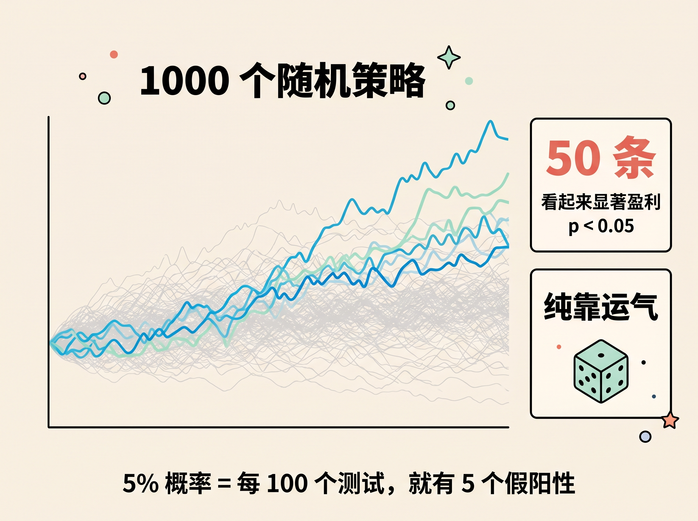
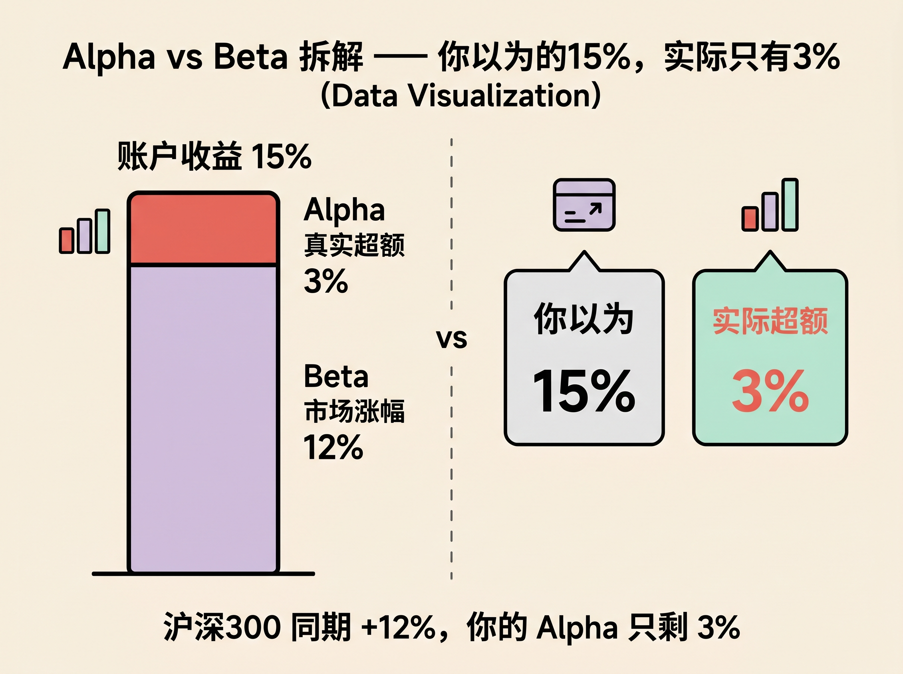
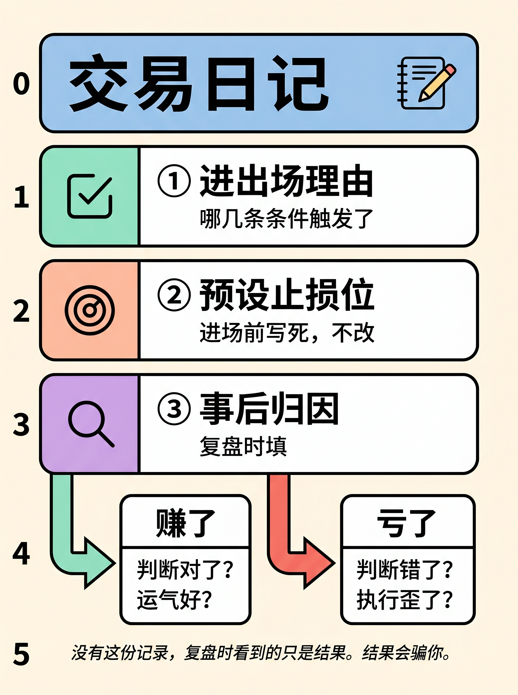

## 
### 导语

2022 年底，我第一次把自己的策略算*消失*了。

我一直以为我读懂了 López de Prado 那本书的第八章——**Bonferroni 校正，p 值除以测试次数**，逻辑没什么难的。直到我真正自己动手算之后。

那段时间攒了大概 70 多组参数组合，挑了几个「比较靠谱」的策略。其中一个动量策略，回测 Sharpe 约 1.2，p 值 0.031，刚过 5% 的显著性门槛。

做完校正：有效显著性门槛应该是 0.05 ÷ 70 ≈ 0.0007，我的 p 值 0.031，差了 40 多倍。**策略消失了。**

---

我当时的反应不是「好，我知道下一步怎么做了」。我把另外几个策略也算了一遍。结果类似。

那种感觉很安静。有点像某个你一直以为赚了的账单，突然对了账，发现其实没赚。

这就是 S2 的核心问题：*你的策略是信号，还是你从大量测试里挑出来的幸运儿？*

### 多重比较陷阱

让电脑随机生成 1000 个策略跑历史数据，有 50 个会「显著盈利」（p < 0.05）。纯靠运气，不需要任何洞察——统计上本来就有 5% 的概率出假阳性（López de Prado, 2018）。
##

你自己写的策略也是这样筛出来的。区别只在于：你测试了多少个「感觉不错」的想法，才留下现在这几个。

如果你测了 100 个想法，其中期望本来就有 5 个是纯噪声——你优先挑了回测曲线最好看的，等于从噪声里挑了最能骗自己的那几个。这是筛选偏差，和能力关系不大。

修正方法直接：**显著性门槛 0.05 ÷ 测试次数 N**。测了 100 个，有效策略的 p 值得低于 0.0005。绝大多数「看起来不错」的策略，在这个门槛下会消失。

---

### Alpha 自评

今年账户涨了 15%，大盘同期涨 12%。

---

**把策略收益率和沪深 300 做线性回归，截距 α 才是你扣掉市场涨幅之后剩的部分**。这个例子里是 3%，不是账户显示的 15%。

这 3% 有没有通过多重比较校正？如果你同期测试过多个策略，大概率也需要校正。校正完还显著——那才是值得认真对待的信号。

*我把这套做完之后，发现过去很长时间叫做「盘感」的东西，相当大一部分是 Beta*。这个结论不好受，但它是 S2 最重要的输出。

（做完 Alpha 拆解，我一直没想通一件事：怎么判断一个策略「已经够好了」，我自己也没有完美答案。我的做法是拿样本外数据单独验证，但这又带来新的多重比较问题。先往下说，以后有机会单独讲。）

---

### 交易日记

每笔交易记三件事：进出场理由（条件清单里哪几条触发了）、预设止损位、事后归因。

归因分两种：赚了，是判断对了还是运气好？亏了，是判断错了还是执行歪了？

---

没有这份记录，复盘时看到的只是结果。结果会骗你。

S2 卡住大多数人的地方，数学从来都不是主要原因——大学概率统计就够了。

主要原因是：把自己测试过的策略数量诚实地算出来，然后去看校正后的 p 值，这件事太容易让人想放弃了。

下一篇是 S3：工具链，比你想的短很多。

---

## 学术文献引用

- López de Prado, M. M. (2018). *Advances in Financial Machine Learning*. Wiley. Chapter 8: Testing Set Overfitting, pp. 105–. （DSR 缩水夏普比率、多重比较下的虚假策略定理）
- Wasserman, L. (2004). *All of Statistics: A Concise Course in Statistical Inference*. Springer. Chapters 10–13. CMU 免费 PDF 可获取.（多重假设检验、Bonferroni 校正）
- 张晓燕, 张欣然 等（2024）. 散户交易行为与市场预测能力研究. *Journal of Financial and Quantitative Analysis*. 清华大学五道口金融学院.

---
### 标题候选

1. **【数据导向】** 随机生成 1000 个策略，有 50 个会「显著盈利」——你写的前 10 个大概就在里面
2. **【具体场景】** 我把自己的策略做了多重比较校正，p 值从 0.031 变成了……消失
3. **【提问式】** 你的策略通过多重比较检验了吗？大多数人没算过这个数字

**推荐标题 2**——具体数字 + 「消失」的冲击感，符合数据冲击型 hook，同时带个人经历，系列感强。标题 1 是备选，数字更大但读者代入感略弱。

---
### 配图建议

- **封面**：深色底，大字「你的策略，对账之后还剩多少？」或「p = 0.031 → 消失」
- **图 1**：Python 截图——模拟 1000 个随机策略，画出 50 条「显著盈利」曲线（彩色高亮），其余策略灰色背景。用真实代码跑出来，可信度远高于示意图
- **图 2**：Alpha vs Beta 拆解——柱状图，一根柱拆分为「市场涨幅（Beta）」和「超额（α）」，配文「你以为的 15% vs 实际的 3%」
- **图 3**（可选）：交易日记模板截图，手写或 Notion 截图，真实感优先

---
### 预估字数

正文约 680 字。

---  

### 发布时机建议 

- **最佳**：P 1 发布后第 5 天，工作日晚 21:00–22:30
- **操作**：正文末尾或评论置顶 P 1 链接；图 1 的 Python 模拟图先跑出来，这是本篇最高价值的原创内容，读者截图保存率高

---

### 小红书正文

## 正文

我以前一直以为，普通人做量化，最难的是数学。后来发现不是。真正难的是纪律。

有一次我把一个自己挺喜欢的动量策略重新算了一遍。Sharpe 大概 1.2，p 值 0.031，乍看刚好过线。问题是，在它之前，我已经试过 70 多组参数。把这些都算进去，再做一次 Bonferroni 校正，门槛直接变成 0.0007。那一刻我有点发懵。策略没变，市场也没变，只是我终于肯把前面的试错一起算进来了。然后它就没了。

这件事后来一直卡在我心里。因为它逼着我承认一件很难受的事：很多时候，我们不是找到了信号，只是在一堆噪声里挑中了最好看的那条曲线。

再往后，我开始逼自己做两件事。第一，把自己到底试过多少想法记下来。第二，把账户收益拆开看。账户涨了 15%，大盘涨了 12%，那你真正该解释的，其实是剩下那 3%。这个账一对，很多原来被我叫作「盘感」的东西，就没那么神秘了。

还有交易日记。我现在每笔都记：为什么进，为什么出，止损放哪，事后到底是判断对了，还是只是运气好。我也不是每次都愿意记，亏钱那几笔尤其不想看。但不记，过几天就会开始替自己改写历史。

有个问题我到现在也没完全想通：一个策略到底怎样才算「够好了」？我没有标准答案。只是越来越确定，第一步不是继续给曲线做美化，而是先把账对清楚。

所以我现在会把 S 2 叫作「纪律关」。不是因为它技术上最难，而是它最容易让人对自己失望。你得肯把那些不好看的数字也算出来，肯承认自己最喜欢的策略，可能根本不存在。
